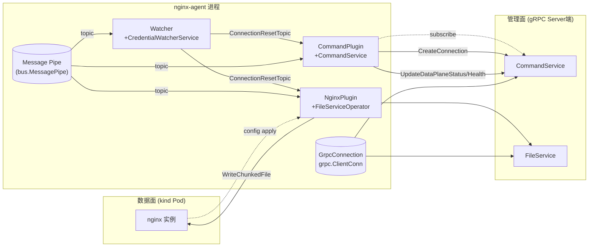
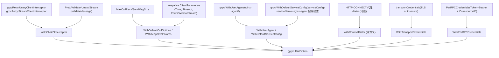
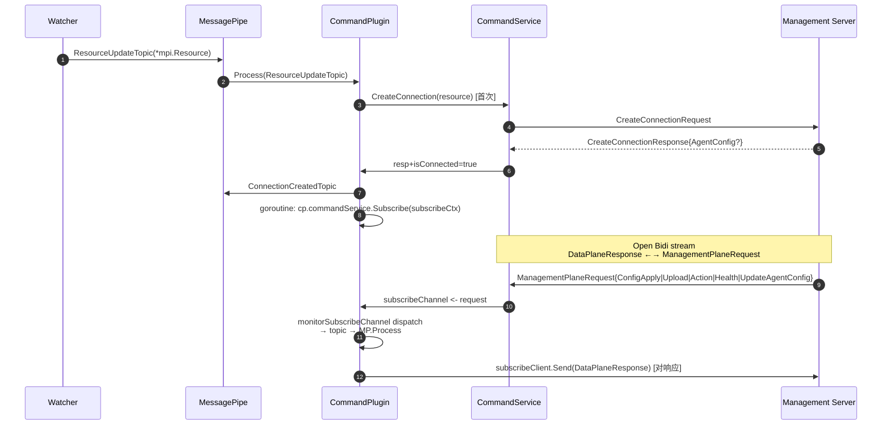
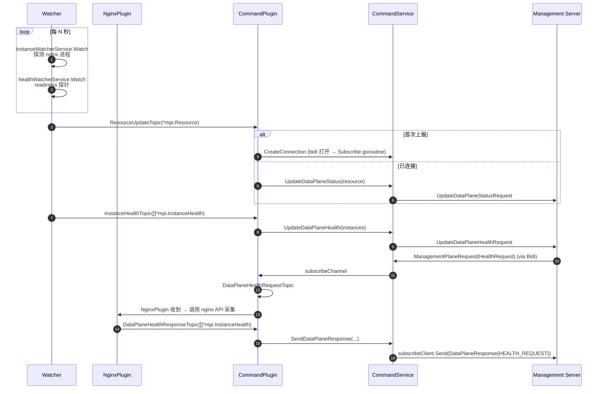
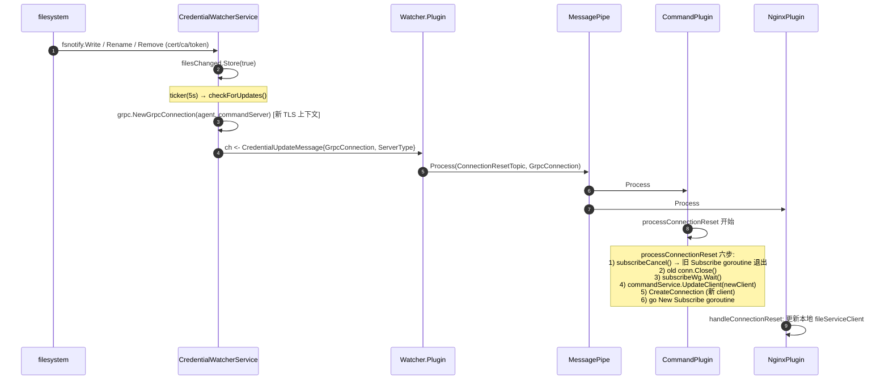
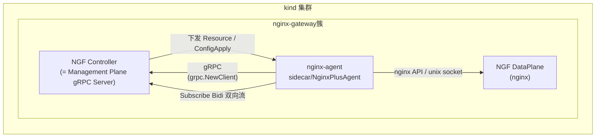

> [!abstract] 摘要
> 本文以 `nginx-agent v3` 源码为唯一事实依据，完整追踪 Agent 启动 → gRPC 连接初始化 → 双向流订阅 → 文件分发 → 凭据热重载触发的连接重建全链路；并以 kind 部署 NGINX Gateway Fabric (NGF) 为实例说明真实运行拓扑；最后归纳出一套可复用、可迁移到其他项目的"gRPC 客户端长连接治理范式"。

---

## 目录

1. [[#1. 核心结论]]
2. [[#2. 角色与拓扑]]
3. [[#3. 启动到 gRPC 初始化的完整路径]]
4. [[#4. Agent 配置层与 gRPC 相关字段]]
5. [[#5. gRPC 连接建立：NewGrpcConnection + DialOptions]]
6. [[#6. MPI 两大服务接口]]
7. [[#7. 双向流订阅模型 Subscribe]]
8. [[#8. 资源发现 / 状态上报循环]]
9. [[#9. 文件服务的 Unary 与流式 RPC]]
10. [[#10. 凭据热重载触发的连接动态重建 ConnectionResetTopic]]
11. [[#11. 双管理面：Command 与 Auxiliary]]
12. [[#12. kind 上的 NGF 实例]]
13. [[#13. 可移植到其它项目的经验]]
14. [[#14. 关键代码位置速查表]]
15. [[#15. 给读者]]
16. [[#参考]]

---

## 1. 核心结论

> [!summary] 一句话总结
> F5 NGINX Agent 把 gRPC 客户端拆成 **三个层次**：一层薄封装 (`internal/grpc.GrpcConnection`) 管连接、一层服务 (`internal/command.CommandService` 与 `internal/file.FileServiceOperator`) 管 RPC 调用与 backoff、一层业务编排 (`CommandPlugin` / `NginxPlugin`) 管双向流订阅与 topic 编排；连接对象的"重建"通过 message bus 的 `ConnectionResetTopic` 在 plugin 间解耦传播，使得 **凭据热更新不需重启进程即可切换底层连接**——是这套架构最值得借鉴的设计。

整套机制基于 **3 个不动点**：

1. **消息总线 (Message Pipe)** 撕开了 plugin 之间的直接依赖，gRPC 的所有副作用都体现为 `bus.Message{Topic, Data}` 在 plugin 间流转。
2. **单一 `*grpc.ClientConn`** 通过 `GrpcConnectionInterface` 抽象暴露两个细粒度的服务客户端 (`CommandServiceClient`、`FileServiceClient`)，避免业务层持有裸连接。
3. **指数退避 + 双行为**：unary RPC 失败按 `Client.Backoff` 退避；长时间未连接时把 `MaxElapsedTime` 改成 `0`（永不放弃），实现"启动初期允许无限重试，稳态期允许快速失败"两种语义共用同一套 helper。

---

## 2. 角色与拓扑



| 角色 | 文件 | 职责 |
|---|---|---|
| `App` | `internal/app.go` | Agent 入口；加载 config、构造 message pipe、注册 plugins、运行 |
| `plugin manager` | `internal/plugin/plugin_manager.go` | `LoadPlugins` 按 agent 配置选择性装载 gRPC 相关 plugin |
| `GrpcConnection` | `internal/grpc/grpc.go` | 薄封装 `grpc.ClientConn`，对外暴露两个 ServiceClient |
| `CommandPlugin` | `internal/command/command_plugin.go` | 订阅 topic，编排 `CreateConnection` / `Subscribe` / 状态上送 / 响应回送 |
| `CommandService` | `internal/command/command_service.go` | `CommandServiceClient` 的具体调用方；退避与队列都在这里 |
| `NginxPlugin` | `internal/nginx/nginx_plugin.go` | 处理 config apply/upload，调用 `FileServiceClient` 拉取远端配置 |
| `FileServiceOperator` | `internal/file/file_service_operator.go` | 文件上传/下载的具体实现 |
| `Watcher.CredentialWatcherService` | `internal/watcher/credentials/credential_watcher_service.go` | 监视 TLS cert/token 文件变化，触发连接重建 |
| `MessagePipe` | `internal/bus/message_pipe.go` | 装载 plugins、按 topic 分发消息 |
| `MPI Proto` | `api/grpc/mpi/v1/*.proto` | 客户端 stub 与服务端 stub (`*_grpc.pb.go`) 全由 `buf generate` 生成 |

---

## 3. 启动到 gRPC 初始化的完整路径

> [!sequence] 启动序列
> cobra `run` → `App.Run` → 解析配置 → `bus.NewMessagePipe` → `plugin.LoadPlugins` → `addCommandAndNginxPlugins` → `grpc.NewGrpcConnection`(`grpc.NewClient`) → 装载 `NginxPlugin`/`CommandPlugin` → 来源 `Watcher.Document+InstanceWatcher` 触发 `ResourceUpdateTopic` → `CommandPlugin` 调用 `CreateConnection` → 启动 Bidi Subscribe goroutine → 装载 `Collector`/`Watcher` 插件 → 启动 messagePipe → 业务进入稳态。

```
cmd/agent/main.go
   └─ internal.NewApp(commit,version)
       └─ App.Run(ctx)
           ├─ config.Init(version,commit)         // 注册 cobra run hook
           └─ config.RegisterRunner(func{...})     // cobra Execute 时执行
              ├─ config.RegisterConfigFile()
              ├─ config.ResolveConfig()             // viper + 默认值 → *config.Config
              ├─ bus.NewMessagePipe(100, agentConfig)
              ├─ plugin.LoadPlugins(ctx, agentConfig)
              │    ├─ addCommandAndNginxPlugins()
              │    │    ├─ IsCommandGrpcClientConfigured()
              │    │    ├─ grpc.NewGrpcConnection(ctx, agentConfig, agentConfig.Command)
              │    │    ├─ command.NewCommandPlugin(cfg, conn, model.Command)
              │    │    └─ nginx.NewNginx(cfg, conn, model.Command, manifestLock)
              │    ├─ addAuxiliaryCommandAndNginxPlugins()  // 同上但用 AuxiliaryCommand
              │    ├─ addCollectorPlugin()
              │    └─ addWatcherPlugin()
              ├─ messagePipe.Register(queueSize, plugins)  // 注册所有插件
              └─ messagePipe.Run(ctx)
                    └─ 依次 plugins.Init(ctx, pipe)
                        ├─ CommandPlugin.Init:
                        │    └─ cp.commandService = NewCommandService(conn.CommandServiceClient())
                        │    └─ go cp.monitorSubscribeChannel(ctx)  // 监听 subscribeChannel
                        └─ Watcher.Init:
                             └─ go watcher Watch goroutines (instance/health/credential)
```

### 两段式启动设计意图

- **静态 plugin 注册** 在 `LoadPlugins` 阶段决定"要不要有 gRPC"，因为只有配置了 `command.server` 才创建连接。这样在 `kind NGF` 环境中可能仅启用 AuxiliaryCommand、在 NGINX One Console 环境中则同时启用两个。
- **运行时 `Init`** 在 message pipe 启动后回调，允许 plugin 持有 `MessagePipeInterface` 引用，从而把"消息"和"业务"耦合点放在通用顶层而不是构造函数里。

> [!info] 关键代码位置
> - 入口 `internal/app.go:32` — `App.Run` 注册 cobra run hook
> - 注册点 `internal/app.go:54` — `messagePipe.Register(defaultQueueSize, plugin.LoadPlugins(ctx, agentConfig))`
> - 装载判断 `internal/config/types.go:407-427` — `Is*GrpcClientConfigured()` 决定是否构造连接

`internal/app.go:32-67`：

```go
func (a *App) Run(ctx context.Context) error {
    config.Init(a.version, a.commit)
    config.RegisterRunner(func(_ *cobra.Command, _ []string) {
        // ... 加载配置 ...
        messagePipe := bus.NewMessagePipe(defaultMessagePipeChannelSize, agentConfig)
        err := messagePipe.Register(defaultQueueSize, plugin.LoadPlugins(ctx, agentConfig))
        if err != nil { return }
        messagePipe.Run(ctx)
    })
    return config.Execute(ctx)
}
```

`internal/plugin/plugin_manager.go:41-65`：

```go
func addCommandAndNginxPlugins(ctx, plugins, agentConfig, manifestLock) []bus.Plugin {
    if agentConfig.IsCommandGrpcClientConfigured() {
        newCtx := context.WithValue(ctx, logger.ServerTypeContextKey,
            slog.Any(logger.ServerTypeKey, model.Command))
        grpcConnection, err := grpc.NewGrpcConnection(newCtx, agentConfig, agentConfig.Command)
        if err != nil { slog.WarnContext(...) }
        else {
            commandPlugin := command.NewCommandPlugin(agentConfig, grpcConnection, model.Command)
            nginxPlugin   := nginx.NewNginx(agentConfig, grpcConnection, model.Command, manifestLock)
            plugins = append(plugins, commandPlugin, nginxPlugin)
        }
    }
    return plugins
}
```

---

## 4. Agent 配置层与 gRPC 相关字段

`internal/config/types.go` 与 `internal/config/flags.go` 共同定义了所有与 gRPC 客户端相关的 YAML / 命令行 flag：

| 字段 (YAML 路径) | Go 类型 | 说明 |
|---|---|---|
| `command.server.{host,port,type}` | `ServerConfig` | 必填且 `type == "grpc"` 才创建连接 |
| `command.auth.{token,tokenpath}` | `AuthConfig` | per-RPC bearer token 来源 |
| `command.tls.{cert,key,ca,server_name,skip_verify}` | `TLSConfig` | 客户端双向 TLS |
| `command.server.proxy.url` | `Proxy` | HTTP CONNECT 隧道，跨代理连管理面 |
| `auxiliary_command` | `Command` | 第二个管理面，**只读** |
| `client.grpc.{max_message_size, max_message_send_size, max_message_receive_size}` | `GRPC` | gRPC message 上限 |
| `client.grpc.keepalive.{time,timeout,permit_without_stream}` | `Keepalive` | 客户端 keepalive 参数 |
| `client.grpc.response_timeout` | `time.Duration` | 每次 unary RPC 的 ctx 超时 |
| `client.backoff.{initial_interval,max_interval,max_elapsed_time,randomization_factor,multiplier}` | `BackOff` | 统一退避设置 |
| `client.file_download_timeout` | `time.Duration` | `ChunkedFile` 整体超时（独立于单 RPC） |
| `features` | `[]string` | 开关 `FeatureConfiguration`/`FeatureMetrics`/`FeatureAPIAction`/`FeatureFileWatcher` |

`internal/config/types.go:303-327`（节选）：

```go
Command struct {
    Server *ServerConfig `yaml:"server" mapstructure:"server"`
    Auth   *AuthConfig   `yaml:"auth"   mapstructure:"auth"`
    TLS    *TLSConfig    `yaml:"tls"    mapstructure:"tls"`
}
ServerConfig struct {
    Proxy *Proxy     `yaml:"proxy" mapstructure:"proxy"`
    Type  ServerType `yaml:"type"  mapstructure:"type"` // 必须为 "grpc"
    Host  string     `yaml:"host"  mapstructure:"host"`
    Port  int        `yaml:"port"  mapstructure:"port"`
}
TLSConfig struct {
    Cert, Key, Ca, ServerName string
    SkipVerify bool
}
```

> [!tip] 配置加载方式
> 通过 viper（`internal/config/config.go:161` `resolveAuxiliaryCommand`）将 `viperInstance.GetString/GetInt/GetBool` 拿到结构，再合入 `Config.AuxiliaryCommand`。所有路径既可来自 `nginx-agent.conf` YAML，也支持 `NGINX_AGENT_COMMAND_SERVER_HOST=...` 这类环境变量覆盖（viper 自动绑定 Env）。

---

## 5. gRPC 连接建立：NewGrpcConnection + DialOptions

### 5.1 连接对象

`internal/grpc/grpc.go:43-72`：

```go
type (
    GrpcConnectionInterface interface {
        CommandServiceClient() mpi.CommandServiceClient
        FileServiceClient()    mpi.FileServiceClient
        Close(ctx context.Context) error
    }
    GrpcConnection struct {
        commandConfig *config.Command
        conn          *grpc.ClientConn
        mutex         sync.Mutex
    }
)
```

业务层只看到 `GrpcConnectionInterface`，永远拿不到裸 `*grpc.ClientConn`。这是非常关键的"控制反转"，它让 gRPC 调用可被 mock（用 `counterfeiter` 生成的 `FakeGrpcConnectionInterface`），同时为 `connection reset` 可能替换 conn 而不打扰调用方打下基础（`fake_grpc_connection_interface.go` 即由它生成）。

### 5.2 建连主流程

`internal/grpc/grpc.go:73-103`：

```go
func NewGrpcConnection(ctx, agentConfig, commandConfig) (*GrpcConnection, error) {
    if commandConfig == nil || commandConfig.Server == nil ||
       commandConfig.Server.Type != config.Grpc {
        return nil, errors.New("invalid command server settings")
    }
    grpcConnection := &GrpcConnection{commandConfig: commandConfig}
    serverAddr := serverAddress(ctx, commandConfig)
    info := host.NewInfo()
    resourceID, err := info.ResourceID(ctx)   // 用于 per-RPC 认证 ID

    grpcConnection.mutex.Lock()
    grpcConnection.conn, err = grpc.NewClient(serverAddr,
        DialOptions(agentConfig, commandConfig, resourceID)...)
    grpcConnection.mutex.Unlock()
    return grpcConnection, nil
}
```

- 这里用的是 **`grpc.NewClient`**（grpc-go ≥1.64 推荐用法，懒连接、零阻塞）；
- 拼地址逻辑 `serverAddress`（`internal/grpc/grpc.go:410+`）只负责把 host:port 拼成 `dns://...` 之类；
- `host.NewInfo().ResourceID(ctx)` 拿到主机唯一标识，作为 per-RPC 凭据 ID 字段，便于服务端做"哪台机器的哪个 agent 在上报"标注。

### 5.3 DialOptions 拼装

`DialOptions`（`internal/grpc/grpc.go:166-237`）按层次把以下组件拼进 `[]grpc.DialOption`：



`serviceConfig` 只用了极简内容（`internal/grpc/grpc.go:62-66`）：

```go
serviceConfig = `{
    "healthCheckConfig": { "serviceName": "nginx-agent" }
}`
```

> [!note] 这意味着
> 单条 `*grpc.ClientConn` 的所有 RPC 都享受同一组客户端 retry/validator 拦截器、同一组 keepalive 与 message 大小、同一份 TLS；`command` 与 `auxiliary_command` 是 **两条独立 `GrpcConnection`**，互不影响。

### 5.4 退避与超时的两种语义

`internal/command/command_service.go` 中可见两套截然不同的退避用法：

| 场景 | 行为 | 代码 |
|---|---|---|
| 稳态 unary RPC (UpdateDataPlaneStatus/Health, SendDataPlaneResponse) | 使用 `Client.Backoff`（`MaxElapsedTime != 0`）→ 在 MaxElapsedTime 内有限重试 | `command_service.go:119-122、155-158、180-183` |
| 创建连接 `createConnectionCall` 与启动期 UpdateOverview | 临时改写 `MaxElapsedTime = 0` → **永不放弃** | `command_service.go:31 const createConnectionMaxElapsedTime = 0` 与 `:275-281` |
| 接收消息 `ReceiveLoop` | 使用改写过的 settings，结合 subscribe ctx，断流则回 `createConnectionCall` | `command_service.go:197-218、440-493` |

> [!warning] 设计提示
> 把 `MaxElapsedTime` 当作"是否可控"开关是常见作法，但必须配合 **ctx 超时** 防止某个 RPC 永久挂起——这就是每次 unary RPC 都通过 `context.WithTimeout(ctx, cfg.Client.Grpc.ResponseTimeout)` 包一层的原因（`command_service.go:103、419、600`）。

---

## 6. MPI 两大服务接口

`api/grpc/mpi/v1/*.proto` 生成出完整服务端+客户端 stub。两者挂在同一条 `*grpc.ClientConn` 上，但语义完全不同。

### 6.1 CommandServiceClient (Unary + Bidi)

`api/grpc/mpi/v1/command_grpc.pb.go:49-108`：

```go
type CommandServiceClient interface {
    CreateConnection(ctx, in *CreateConnectionRequest, opts...) (*CreateConnectionResponse, error)
    UpdateDataPlaneStatus(ctx, in *UpdateDataPlaneStatusRequest, opts...) (*UpdateDataPlaneStatusResponse, error)
    UpdateDataPlaneHealth(ctx, in *UpdateDataPlaneHealthRequest, opts...) (*UpdateDataPlaneHealthResponse, error)
    // bidi: DataPlaneResponse → ManagementPlaneRequest
    Subscribe(ctx, opts...) (grpc.BidiStreamingClient[DataPlaneResponse, ManagementPlaneRequest], error)
}
```

| RPC | 类型 | 触发时机 |
|---|---|---|
| `CreateConnection` | unary | Agent 收到第一次 `ResourceUpdateTopic` 时由 `CommandPlugin.createConnection` 发起 |
| `UpdateDataPlaneStatus` | unary | agent 实例清单变动 (instanceWatcher 发现新 nginx 实例) |
| `UpdateDataPlaneHealth` | unary | healthWatcher 周期上报 |
| `Subscribe` | bidi | `CreateConnection` 成功后由独立 goroutine 打开，全程接受管理面指令 |

### 6.2 FileServiceClient (Unary + Unary + ServerStream + ClientStream)

`api/grpc/mpi/v1/files_grpc.pb.go:45-59`：

```go
type FileServiceClient interface {
    GetOverview(ctx, in *GetOverviewRequest, opts...)  (*GetOverviewResponse, error)
    UpdateOverview(ctx, in *UpdateOverviewRequest, opts...) (*UpdateOverviewResponse, error)
    GetFile(ctx, in *GetFileRequest, opts...)          (*GetFileResponse, error)
    UpdateFile(ctx, in *UpdateFileRequest, opts...)    (*UpdateFileResponse, error)
    // server-streaming: chunked download
    GetFileStream(ctx, in *GetFileRequest, opts...)    (grpc.ServerStreamingClient[FileDataChunk], error)
    // client-streaming: chunked upload
    UpdateFileStream(ctx, opts...)                     (grpc.ClientStreamingClient[FileDataChunk, UpdateFileResponse], error)
}
```

> [!info] 为什么要四种 RPC？
> - 小文件用 unary `GetFile/UpdateFile`，握手开销小、调试友好；
> - 大配置 / nginx-plus bundle 用流式 `GetFileStream/UpdateFileStream`，分块 `FileDataChunk` 极大放宽了对单条消息大小的限制；
> - `GetOverview/UpdateOverview` 先于具体文件握手交互，做差量比对，决定还需要哪些文件——`FileServiceOperator.UpdateOverview`（`file_service_operator.go:129-241`）就是这套握手总入口；
> - proto 注释明确：配置 max message size 应 = `maxFileSize + sizeof(SHA256) = maxFileSize + 64`，防止 protobuf 序列化时含 hash 超长（`files_grpc.pb.go:42-44`）。

---

## 7. 双向流订阅模型 Subscribe

### 7.1 触发链



### 7.2 关键代码：CommandPlugin.createConnection

`internal/command/command_plugin.go:186-220`：

```go
func (cp *CommandPlugin) createConnection(ctx, resource *mpi.Resource) {
    createConnectionResponse, err := cp.commandService.CreateConnection(ctx, resource)
    if err != nil { slog.ErrorContext(ctx, "Unable to create connection", "error", err) }
    if createConnectionResponse != nil {
        subscribeCtx, cp.subscribeCancel = context.WithCancel(ctx)
        cp.subscribeWg.Add(1)
        go func() {
            defer cp.subscribeWg.Done()
            cp.commandService.Subscribe(subscribeCtx)
        }()
        cp.messagePipe.Process(ctx, &bus.Message{
            Topic: bus.ConnectionCreatedTopic, Data: createConnectionResponse,
        })
        if createConnectionResponse.GetAgentConfig() != nil {
            cp.messagePipe.Process(ctx, &bus.Message{
                Topic: bus.ConnectionAgentConfigUpdateTopic,
                Data:  createConnectionResponse.GetAgentConfig(),
            })
        }
    }
}
```

- `subscribeWg` 用来在连接重置时确保旧 Subscribe goroutine **完全退出** 后才创建新的，避免双流冲击服务端 UUID 跟踪；
- `createConnectionResponse.GetAgentConfig()` 可由服务端在握手阶段下发新配置 (CommandServer / MetricsServer / FileServer / Features / Log / AuxiliaryCommand / MessageBufferSize / Labels)，注入回 `AgentConfigUpdateTopic`，被 `NginxPlugin.Reconfigure`、`Watcher.Reconfigure`、`Collector.Reconfigure` 等所有实现 `bus.Plugin.Reconfigure(ctx, *config.Config)` 的插件消费——这就是 **服务端运行时下发配置** 的钩子。

### 7.3 接收循环 + 错误处理

`internal/command/command_service.go:440-493`：

```go
func (cs *CommandService) receiveCallback(ctx) func() error {
    return func() error {
        if cs.connectionResetInProgress.Load() { return nil }     // ① 重置期间不打扰
        cs.subscribeClientMutex.Lock()
        if cs.subscribeClient == nil {
            if cs.commandServiceClient == nil {
                cs.subscribeClientMutex.Unlock()
                return errors.New("command service client is not initialized")
            }
            var err error
            cs.subscribeClient, err = cs.commandServiceClient.Subscribe(ctx)  // ② 懒打开
            if err != nil { ... return cs.handleSubscribeError(...) }
        }
        cs.subscribeClientMutex.Unlock()
        request, recvError := cs.subscribeClient.Recv()                    // ③ 阻塞读
        if recvError != nil {
            cs.subscribeClientMutex.Lock()
            cs.subscribeClient = nil                                       // ④ 清掉并触发重建
            cs.subscribeClientMutex.Unlock()
            return cs.handleSubscribeError(ctx, recvError, "receive message from subscribe stream")
        }
        if cs.isValidRequest(ctx, request) {
            switch request.GetRequest().(type) {
            case *mpi.ManagementPlaneRequest_ConfigApplyRequest:
                cs.queueConfigApplyRequests(ctx, request)                  // ⑤ 同实例串行队列
            default:
                cs.subscribeChannel <- request                              // ⑥ 丢给 plugin 编排
            }
        }
        return nil
    }
}
```

`handleSubscribeError`（`:495-507`）会立即调用 `createConnectionCall` ——即"**流断了，就当作需要重新握手**"。

### 7.4 串行化的 ConfigApply 队列

`queueConfigApplyRequests`（`:509-526`）+ `handleConfigApplyResponse`（`:325-402`）构成一个 per-InstanceID FIFO 队列：

- 同一实例的 ConfigApply 请求进入 `configApplyRequestQueue[instanceID]`；
- 只有队首发出执行；
- 收到响应后，丢弃当前队首并把当前响应 info 复用到前面被阻塞的请求；
- 如果队列里还有未处理项，把队尾再丢回 `subscribeChannel`，让 plugin 顺序处理。

> [!tip] 为什么按 instance 队列化
> 管理面下发 ConfigApply 可能并发而来（用户快速点击），但 nginx 配置加载是排他的；一旦 cfg 应用失败会影响后续应用的语义。把串行化下沉到 agent 端，省一份对管理面的协调代码。

### 7.5 Plugin 内的消息分发

收到 `subscribeChannel` 后由 `CommandPlugin.monitorSubscribeChannel`（`command_plugin.go:344-403`）做协议层分发：

```go
switch message.GetRequest().(type) {
case *mpi.ManagementPlaneRequest_ConfigUploadRequest:    → ConfigUploadRequestTopic
case *mpi.ManagementPlaneRequest_ConfigApplyRequest:     → ConfigApplyRequestTopic (需 model.Command)
case *mpi.ManagementPlaneRequest_HealthRequest:          → DataPlaneHealthRequestTopic
case *mpi.ManagementPlaneRequest_ActionRequest:          → APIActionRequestTopic   (需 model.Command)
case *mpi.ManagementPlaneRequest_UpdateAgentConfigRequest: → AgentConfigUpdateTopic (需 model.Command)
}
```

注意 `Auxiliary` 类型的 command server **没有 ConfigApply / Action / UpdateAgentConfig 权限**——这三个分支在 `monitorSubscribeChannel` 直接通过 `handleInvalidRequest` 拒绝并回 `COMMAND_STATUS_FAILURE`。这就是下文"双管理面"的"主/读"模型基础。

---

## 8. 资源发现 / 状态上报循环



群体性要点：

- 上送与接收共用同一条 bidi stream —— Agent 既用 `subscribeClient.Send` 回送业务响应，又用 `subscribeClient.Recv` 读取管理面指令；线程间由 `subscribeClientMutex` 保护。
- CreateConnection 一次握手建立后，**不再重复**调用，除非 `processConnectionReset`/`handleSubscribeError` 重新触发。
- `Manage` 与 `Observe` 完全解耦：Watcher 只负责发 Resource/Health 事件，Command 只负责把这些转成 RPC，Nginx 只负责执行 ConfigApply/Upload。

---

## 9. 文件服务的 Unary 与流式 RPC

### 9.1 调用约定

| 场景 | 调用 | 说明 |
|---|---|---|
| 上报本地 file overview | `client.UpdateOverview(req)` | 含 file list + hash |
| 拉取对端所需 file overview | `client.GetOverview(req)` | 仅 metadata |
| 下载小文件 | `client.GetFile(req)` | 单次返回 `FileContents{hash+bytes}` |
| 上传小文件 | `client.UpdateFile(req)` | 单次带 `File{meta+contents}` |
| 下载大文件 | `client.GetFileStream(req)` | server-stream，分 `FileDataChunk`  |
| 上传大文件 | `client.UpdateFileStream(...)` | client-stream，分 `FileDataChunk`  |

`internal/file/file_service_operator.go:243-281` 的 `ChunkedFile` 是分块下载实现：

```go
func (fso *FileServiceOperator) ChunkedFile(ctx, file *mpi.File, tempFilePath, expectedHash string) error {
    grpcCtx, cancel := context.WithTimeout(ctx, fso.agentConfig.Client.FileDownloadTimeout)
    defer cancel()
    stream, err := fso.client().GetFileStream(grpcCtx, &mpi.GetFileRequest{
        MessageMeta: {...}, FileMeta: file.GetFileMeta(),
    })
    if err != nil { return fmt.Errorf("error getting file stream for %s: %w", ...) }
    headerChunk, err := stream.Recv()                              // 先读 header（权限/大小）
    if err != nil { return err }
    err = fso.fileOperator.WriteChunkedFile(ctx, tempFilePath,
        file.GetFileMeta().GetPermissions(), headerChunk.GetHeader(), stream)
    if err != nil { return err }
    return fso.ValidateFileHash(ctx, tempFilePath, expectedHash)   // SHA256 校验
}
```

> [!important] 文件流协议设计要点
> 头块与数据块同走 `FileDataChunk`，但**第一块解码成 header**（带权限；后续块视为纯字节）；下载完成后用 `ValidateFileHash` 与 overview 中预声明的 SHA256 比对，若不一致报错。这避免单独 RPC 取 header，且把校验从协议层移到应用层，便于扩展（如未来加签名）。文件写入权限恢复自 header，避免出现 root-owned 文件导致 nginx 启动失败。

### 9.2 UpdateOverview 的"双层重试"模式

`internal/file/file_service_operator.go:129-241`：

- 用 `backoff.RetryWithData` 包 `client.UpdateOverview`；
- 如果 `!isConnected`，把 `MaxElapsedTime` 改 `0` —— 启动期允许无限等待 Connect 完成；
- 收到响应后比较 overview files 与本地差异 `delta := files.ConvertToMapOfFiles(...)`，若 `delta != 0` 调 `updateFiles` → 调 `UpdateFile`/`ChunkedFile` → **递归** 再发一次 `UpdateOverview`（iteration+1）直到对端认可或超过 `maxAttempts`。

这是非常典型的"Server-as-source-of-truth, agent syncs to match"模式，避免了管理面下发与本地落地之间的状态分裂。

---

## 10. 凭据热重载触发的连接动态重建 ConnectionResetTopic

> [!important] 最值得借鉴的设计
> 文件证书 / token 发生变化（K8s Secret 轮转、Cert-Manager 续签）后，agent **不重启进程**就能换底层 `*grpc.ClientConn`。

### 10.1 触发链



### 10.2 关键代码：CredentialWatcherService.checkForUpdates

`internal/watcher/credentials/credential_watcher_service.go:164-195`：

```go
func (cws *CredentialWatcherService) checkForUpdates(ctx, ch chan<- CredentialUpdateMessage) {
    if cws.filesChanged.Load() {
        // ... 取 commandServer ...
        conn, err := grpc.NewGrpcConnection(newCtx, cws.agentConfig, commandServer)
        if err != nil { cws.filesChanged.Store(false); return }
        ch <- CredentialUpdateMessage{
            CorrelationID:  logger.CorrelationIDAttr(newCtx),
            ServerType:     cws.serverType,
            GrpcConnection: conn,
        }
        cws.filesChanged.Store(false)
    }
}
```

凭证路径 `credentialPaths()` 来自 `command.auth.tokenpath` 与 `command.tls.{cert,key,ca}`，对 Auxiliary 服务器使用 `agentConfig.AuxiliaryCommand` 同路径。

### 10.3 CommandPlugin.processConnectionReset

`internal/command/command_plugin.go:295-341`：

```go
func (cp *CommandPlugin) processConnectionReset(ctx, msg) {
    newConnection, _ := msg.Data.(grpc.GrpcConnectionInterface)
    cp.subscribeMutex.Lock(); defer cp.subscribeMutex.Unlock()
    // 顺序非常关键：先 cancel 旧 stream，再 close 旧 conn，再 wait 旧 goroutine
    if cp.subscribeCancel != nil { cp.subscribeCancel() }
    if err := cp.conn.Close(ctx); err != nil { ... }
    cp.conn = newConnection
    cp.subscribeWg.Wait()
    err := cp.commandService.UpdateClient(ctxWithMetadata, newConnection.CommandServiceClient())
    if err != nil { return }
    subscribeCtx, cp.subscribeCancel = context.WithCancel(ctxWithMetadata)
    cp.subscribeWg.Add(1)
    go func(){ defer cp.subscribeWg.Done(); cp.commandService.Subscribe(subscribeCtx) }()
}
```

> [!note] 注释里给出了顺序约定
> "Cancel the old subscribe stream and close the old connection first, so the server removes the connection from its tracker before we call CreateConnection with the same UUID in UpdateClient. Without this ordering, the server would track the UUID from CreateConnection and then immediately remove it when the old stream exits."
>
> 这是双向流重连的**协议一致性**要求：服务端用 stream 上下文跟踪 UUID，Agent 端要先让旧 stream 关闭，才能用同一 UUID 重新建链。

### 10.4 NginxPlugin 的联动

`internal/nginx/nginx_plugin.go:131-133 + handleConnectionReset`（227 行附近）：

```go
case bus.ConnectionResetTopic:
    if logger.ServerType(ctxWithMetadata) == n.serverType.String() {
        n.handleConnectionReset(ctxWithMetadata, msg)
    }
```

`handleConnectionReset` 会用 `newConnection.FileServiceClient()` 替换本插件的 `FileServiceOperator` 客户端，然后 set `isConnected=true`、再触发一次 Resource 上送——这样后续 ConfigUploadRequest 用的是新 TLS 通道。

> [!success] 设计精髓
> `ConnectionResetTopic` 把"换 grpc.ClientConn"这件事抽象成了一个 topic，**所有依赖 gRPC 连接的插件** 都可以订阅，而 `CommandPlugin` 的核心逻辑（先 cancel→close→wait→rebuild）写在唯一一处。新增插件只要实现"收到 ConnectionResetTopic 时换一份新 ServiceClient"，代价极低。

---

## 11. 双管理面：Command 与 Auxiliary

NGINX Agent 允许同时连接 **两个** 管理面。

| 通道 | 配置字段 | Agent 端类型 (`model.ServerType`) | 权限 |
|---|---|---|---|
| 主命令通道 | `command.{server,auth,tls}` | `model.Command` | 完整：`ConfigApply` / `APIAction` / `UpdateAgentConfig` |
| 辅助（只读）通道 | `auxiliary_command.{server,auth,tls}` | `model.Auxiliary` | **只能收到** `ConfigUpload` / `HealthRequest` |

> [!note] 读到这里就能解释 NGF 部署
> NGF 控制面 / nginx-agent sidecar 环境中，如果只想让管理面读取 NGINX 配置与上报 metrics，不希望管理面执行 ConfigApply，就让 `auxiliary_command` 启用、`command` 关闭。看到 `monitorSubscribeChannel` 的拒绝分支就能精确断言：辅助通道收到 ConfigApply 会被立即拒回 `COMMAND_STATUS_FAILURE "Unable to process request. Management plane is configured as read only."`。

### 11.1 两套独立 Conn / Plugin 实例

`internal/plugin/plugin_manager.go:67-91`：

```go
func addAuxiliaryCommandAndNginxPlugins(ctx, plugins, agentConfig, manifestLock) []bus.Plugin {
    if agentConfig.IsAuxiliaryCommandGrpcClientConfigured() {
        newCtx := context.WithValue(ctx, logger.ServerTypeContextKey,
            slog.Any(logger.ServerTypeKey, model.Auxiliary))
        auxGRPCConnection, err := grpc.NewGrpcConnection(newCtx, agentConfig, agentConfig.AuxiliaryCommand)
        ...
        auxCommandPlugin := command.NewCommandPlugin(agentConfig, auxGRPCConnection, model.Auxiliary)
        readNginxPlugin  := nginx.NewNginx(agentConfig, auxGRPCConnection, model.Auxiliary, manifestLock)
        plugins = append(plugins, auxCommandPlugin, readNginxPlugin)
    }
}
```

- 主 + 辅助一共可有 **四个 plugin 实例**：两个 `CommandPlugin`（不同 `commandServerType`）、两个 `NginxPlugin`；
- 所有 topic 消息通过 `logger.ServerTypeContextKey` "染色" —— plugin 处理消息时先检查 `logger.ServerType(ctx) == cp.commandServerType.String()`，避免主通道事务误处理辅助通道；
- `CredentialWatcherService` 也是按 `serverType` 启动两份独立 watcher，每份只关心对应 `Command` 的 cert/token 文件。

> [!tip] 多实例 plugin 染色法
> 这套"用 ctx value 标记消息所属 server，并在 plugin 内 dispatch 时做 guarding"是可以直接搬到任何"同一消息多种语义副本"系统的模式。比给每个 plugin 单独定义一份 topic 更省事，同时减少 topic 数量爆炸。

---

## 12. kind 上的 NGF 实例

### 12.1 拓扑（以你当前 kind 集群为例）



> 该拓扑对应：`command.server.host=ngf-ctrl-svc.<ns>.svc` / `port=<grpc-port>` / `type=grpc`。Agent 不实现服务端、只作客户端；NGF controller 实现 `CommandServiceServer` + `FileServiceServer`（参考 `test/mock/grpc/` 中的 mock 即可解释其结构）。

### 12.2 关键验证点

| 检查 | 现象 / 命令 |
|---|---|
| Agent 已建立连接 | 日志 `"Connection created"` + `CreateConnection` 响应；`messagePipe.Process(ConnectionCreatedTopic)` |
| Subscribe 已开启 | `command_service.receiveCallback` 持续 Recv，无 `"subscribe client is not initialized"` 日志 |
| 主管理面 vs 辅助管理面 | `auxiliary_command` 配置存在则会有两个 `CommandPlugin`：`Info().Name = "command"` 和 `"auxiliary-command"` |
| 凭证热更新 | K8s Secret 续签后 5s 内 `Credential watcher has detected changes` → `ConnectionResetTopic` → `"Command plugin connection reset finished successfully"` |
| ConfigApply 串行化成功 | 同 instance 多次下发 → `configApplyRequestQueue[<instanceId>]` 长度变化；最终 `subscribeChannel` 收尾 |
| 文件分块下载完成 | `File header chunk received` + 后续 `WriteChunkedFile` + `ValidateFileHash` 通过 |

> 建议你在本地 kind 集群中备一份 `nginx-agent.conf`（可以从 `examples/configs/nginx-agent.conf` 或 `default.pgo` 生成的 binary 默认值中拷贝出来）将 `command.server.host/port` 指向 NGF 控制面 service，然后 `kubectl -n <ns> logs deploy/nginx-agent -c nginx-agent -f` 对照上面的日志关键词验证。

---

## 13. 可移植到其它项目的经验

> [!success] 一句话提炼
> 这套代码示范了 **"先分层、再触发动态重连"** 的 gRPC 客户端工程方法，把库选择问题、连接生命周期问题、RPC 调用语义问题、文件流式问题、配置热重载问题分别用不同层处理——每一层都可单独迁移到新项目。

### 13.1 抽象层分解（推荐您新项目也照样切分）

| 层 | 命名建议 | 职责 | NGINX Agent 对应 |
|---|---|---|---|
| `Connection` | `pkg/grpc/conn.go` | 仅持 `*grpc.ClientConn`、暴露 `Close()` 与各 ServiceClient 工厂方法；用接口暴露以便 mock | `internal/grpc.GrpcConnection / GrpcConnectionInterface` |
| `DialOptions` | `pkg/grpc/dialopts.go` | 集中拼装 interceptor / TLS / keepliave / max-msg-size / service-config / per-RPC cred；用函数 + 切片而非构造参数列表 | `DialOptions(...)` |
| `Service` | `pkg/<domain>/service.go` | 仅持 ServiceClient + backoff 配置；所有 unary RPC 都包 `context.WithTimeout`；订阅/接收循环也在这层 | `internal/command.CommandService` |
| `Operator` | `pkg/<domain>/operator.go` | 高级编排（如分块下载、双 RPC 协议） | `internal/file.FileServiceOperator` |
| `Plugin` | `internal/<domain>_plugin.go` | 与外部事件 / 业务规则耦合、订阅 topic、决定调用哪个 service method | `CommandPlugin` / `NginxPlugin` |

### 13.2 直接可复用的 7 条经验

1. **暴露 ServiceClient 接口而不是裸 conn** —— 业务层永远只看到 `CommandServiceClient()`，这样 conn 替换对业务零打扰。
2. **统一退避 + 双语义开关** —— 同一份 `BackOff` 类型，仅在 `MaxElapsedTime` 上做"`0` 表示永不放弃"的约定，业务调用代码不变；同时 ctx 单次 RPC 超时永远单设。
3. **流断即重连** —— `Recv` 失败立即清空 `subscribeClient`、置 `isConnected=false`，并发起 `CreateConnection` 重连；模型上把"接收失败"视作"必须重连"的信号，比 grpc-go 自带重试更直观可控。
4. **订阅消息分发用 channel + goroutine separation** —— `Recv` 永远在 `Subscribe` goroutine，分发在 `monitorSubscribeChannel` goroutine；两者通过 `subscribeChannel` 解耦，避免分发慢阻塞接收。
5. **同实例请求串行化（per-InstanceID FIFO 队列）** —— 当目标侧真正排他的资源（如 nginx reload）时，把串行化下沉到客户端可显著简化服务端逻辑。
6. **ctx value "染色" 多管理面副本** —— 同一份 plugin 代码可装载多实例（一个 plugin 类 + N 个 instance + N 个颜色），靠 ctx value 在 dispatch 时判断；不需要为每种管理面写不同的 plugin。
7. **凭据热重载用 fsnotify + topic** —— 凭据文件改动 → ticker 5s 内重建一条 conn → 走 message bus `ConnectionResetTopic` 分发给所有依赖 conn 的插件做"老关、新开、wait"。所有 plugin 共享一份 ConnectionReset 处理模板，新增 plugin 只需实现 `handleConnectionReset`。

### 13.3 与常见反模式对比

| 反模式 | 这套代码的解法 |
|---|---|
| 业务直接调 `grpc.Dial`，到处持 `*grpc.ClientConn` | `GrpcConnection` + `GrpcConnectionInterface`；测试用 `FakeGrpcConnectionInterface` |
| 重连逻辑写在每个调用点 | `connectionResetInProgress` 原子 + `handleSubscribeError` 集"打旗→重连→恢复"于一处 |
| 退避每次手写 | `internal/backoff.WaitUntil/WaitUntilWithData/Context` 封装 cenkalti/backoff/v4 |
| 大文件用单 RPC | `GetFileStream/UpdateFileStream` + `FileDataChunk` + 单独 header chunk + 写块 + 校验 SHA256 |
| 凭据更新要求重启进程 | fsnotify 监听 → 5s 节流 → 新 conn → `ConnectionResetTopic` |
| 双管理面搞两套代码 | 复用同一 `CommandPlugin` 类，通过 `model.ServerType` + topic 染色区分主辅通道 |
| proto 消息没校验 | `protovalidate` + 自定义 `UnaryClientInterceptor`/`StreamClientInterceptor` 与 wrappedStream 双侧 validate |

### 13.4 升级道路（如果你移植时想进一步现代化）

- `grpc.NewClient` 已经是懒连接，可保留；如对重连时延有要求，可改用 xDS-style name resolver 或带 identity-aware DNS Resolver。
- 凭据热重载目前 watcher 用 5s ticker；如要更紧可改 fsnotify push；但要注意重连本身耗时较长可能影响吞吐。
- per-RPC cred 当前是两字段 (`Token`、`ID`)，可与 OTel baggage / W3C traceparent 合并，让 trace context 一并经 gRPC metadata 上送。
- 文件流没有 client-side backpressure，对超大文件可考虑加流控（每块 ack 后再下一块）。

---

## 14. 关键代码位置速查表

| 主题 | 文件 | 行号 | 关键符号 |
|---|---|---|---|
| Agent 入口 | `internal/app.go` | 32-67 | `App.Run` |
| Plugin 装载 | `internal/plugin/plugin_manager.go` | 28-91 | `LoadPlugins / addCommandAndNginxPlugins / addAuxiliaryCommandAndNginxPlugins` |
| gRPC 连接封装 | `internal/grpc/grpc.go` | 43-103 | `GrpcConnectionInterface / NewGrpcConnection` |
| DialOptions | `internal/grpc/grpc.go` | 166-237 | `DialOptions` |
| 证书/Token per-RPC | `internal/grpc/grpc.go` | 254-280 | `addPerRPCCredentials` |
| proto validate 拦截器 | `internal/grpc/grpc.go` | 281-374 | `ProtoValidatorUnaryClientInterceptor / StreamClientInterceptor` + `validateMessage` + `wrappedStream` |
| ServiceConfig 健康检查 | `internal/grpc/grpc.go` | 62-66 | `serviceConfig` |
| CommandService 客户端 | `api/grpc/mpi/v1/command_grpc.pb.go` | 49-111 | `CommandServiceClient / Subscribe` |
| FileService 客户端 | `api/grpc/mpi/v1/files_grpc.pb.go` | 45-140 | 4 Unary + 2 Stream |
| CommandPlugin 初始化 | `internal/command/command_plugin.go` | 68-81 | `Init` 启动 monitorSubscribeChannel |
| CreateConnection 触发 | `internal/command/command_plugin.go` | 168-220 | `processResourceUpdate / createConnection` |
| 监听下发 | `internal/command/command_plugin.go` | 344-403 | `monitorSubscribeChannel` |
| Connection reset 处理 | `internal/command/command_plugin.go` | 295-341 | `processConnectionReset` |
| Service 层 CreateConn + 重试 | `internal/command/command_service.go` | 220-299 | `CreateConnection / createConnectionCall / connectCallback` |
| Service 层 ReceiveBidi | `internal/command/command_service.go` | 197-218, 440-493 | `Subscribe / receiveCallback / handleSubscribeError` |
| ConfigApply 串行队列 | `internal/command/command_service.go` | 325-402, 509-526 | `handleConfigApplyResponse / queueConfigApplyRequests` |
| Unary Status/Health backoff | `internal/command/command_service.go` | 71-166 | `UpdateDataPlaneStatus / UpdateDataPlaneHealth` |
| 文件 UploadOverview 重试 | `internal/file/file_service_operator.go` | 129-241 | `UpdateOverview` |
| 文件 Chunked 下载 | `internal/file/file_service_operator.go` | 243-281 | `ChunkedFile` |
| 文件 Hash 校验 | `internal/file/file_service_operator.go` | 328-344 | `ValidateFileHash` |
| Agent 配置类型 | `internal/config/types.go` | 38-327 | `Config / Command / TLSConfig / Client / BackOff / GRPC` |
| 配置判断"是否用 gRPC" | `internal/config/types.go` | 407-440 | `IsCommandGrpcClientConfigured / IsAuxiliaryCommandGrpcClientConfigured` |
| Message Pipe 注册与运行 | `internal/bus/message_pipe.go` | 43-154 | `MessagePipe.Register / Run` |
| Topic 定义 | `internal/bus/topics.go` | — | `ConnectionResetTopic / ConnectionCreatedTopic / ResourceUpdateTopic ...` |
| 凭据 Watcher | `internal/watcher/credentials/credential_watcher_service.go` | 62-220 | `Watch / handleEvent / checkForUpdates / credentialPaths` |
| 触发 ConnectionReset | `internal/watcher/watcher_plugin.go` | 292-301 | `handleCredentialUpdate` |
| Mock 管理面 | `test/mock/grpc/` | — | 实现 `CommandServiceServer` + `FileServiceServer`，可作为新管理面 Server 端的样板 |

---

## 15. 给读者

> [!todo] 阅读建议
> 1. 先读 [[#6. MPI 两大服务接口]] 与 [[#7. 双向流订阅模型 Subscribe]] 抓住通信语义；
> 2. 再读 [[#5. gRPC 连接建立：NewGrpcConnection + DialOptions]] 理解惯用 dial option 拼装模式；
> 3. 然后 [[#10. 凭据热重载触发的连接动态重建 ConnectionResetTopic]] 理解"动态重连"如何被消息总线放大到多 plugin；
> 4. 最后 [[#13. 可移植到其它项目的经验]] 总结出你项目的落地清单。

> [!tip] 你可以这样跑一次真实实验
> 在 kind 集群里把 `nginx-agent.conf` 中的 `command.server` 指向 NGF 的 service，对 cert/token 用 K8s Secret 绑定 cert-manager 续签，使用 `kubectl logs -f` 观察：
> - `"Connection created"` — CreateConnection 握手成功
> - `"Agent connected"` — `isConnected=true`
> - `"Received management plane..."` — Bidi 接收分发
> - `"Credential watcher has detected changes"` — fsnotify 触发
> - `"Command plugin connection reset finished successfully"` — 重连完成

> [!question] 自检问题
> - 服务端如何识别"同一 UUID 的双流"以避免冲突？→ 看 `processConnectionReset` 的注释。
> - 为何 `MaxElapsedTime=0` 而不是 `math.MaxInt64`？→ 看 `cenkalti/backoff/v4` 的 `NextBackOff()` 行为：`MaxElapsedTime == 0` 时视作"不取消"。
> - Aux 通道有没有审 "/Aux 应禁用 ConfigApply"？→ 看 `monitorSubscribeChannel` 中三个 `cp.commandServerType != model.Command` 分支直接拒绝。

---

## 参考

- `internal/app.go` — Agent 入口
- `internal/grpc/grpc.go` — 连接封装
- `internal/command/command_service.go` — unary/bidi 调用与重试
- `internal/command/command_plugin.go` — 订阅编排与 topic 分发
- `internal/file/file_service_operator.go` — 文件 Unary / 流式 RPC
- `internal/plugin/plugin_manager.go` — 双管理面 plugin 装载
- `internal/watcher/credentials/credential_watcher_service.go` — 凭据热重载
- `internal/bus/topics.go` — topic 命名
- `api/grpc/mpi/v1/command_grpc.pb.go` / `files_grpc.pb.go` — gRPC stub
- `test/mock/grpc/` — 管理面服务端 mock
- `internal/backoff/backoff.go` — backoff helpers
- 关联文档：[[startup-flow-and-communication]]、[[nginx-agent-startup-and-architecture-analysis]]、[[nginx-agent-startup-and-control-plane-analysis]]