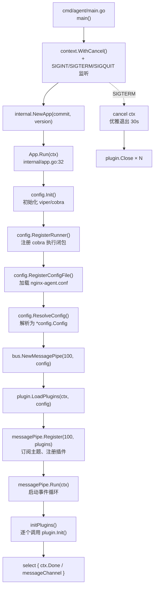
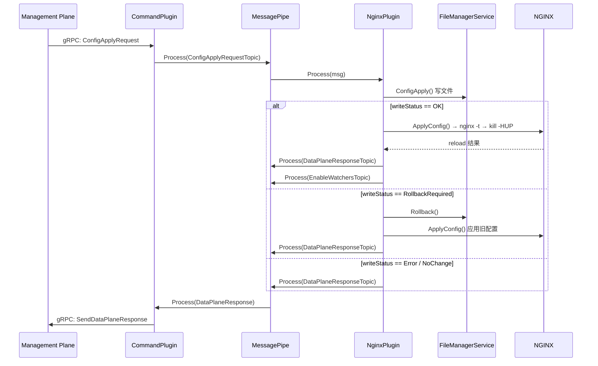
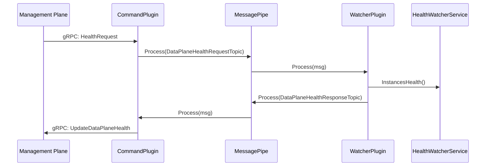
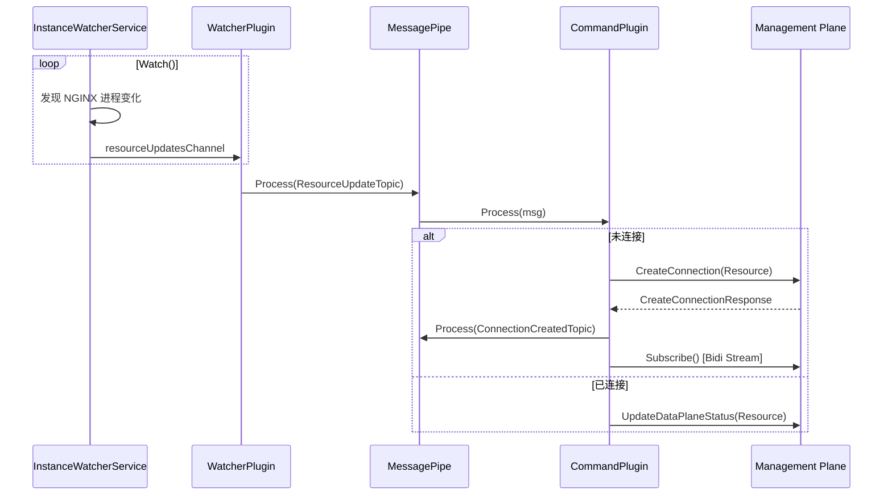
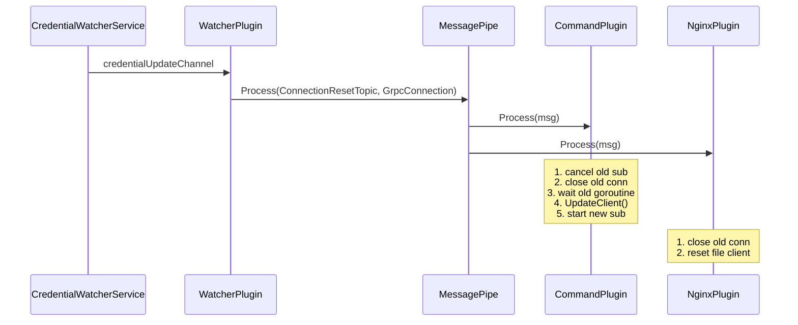
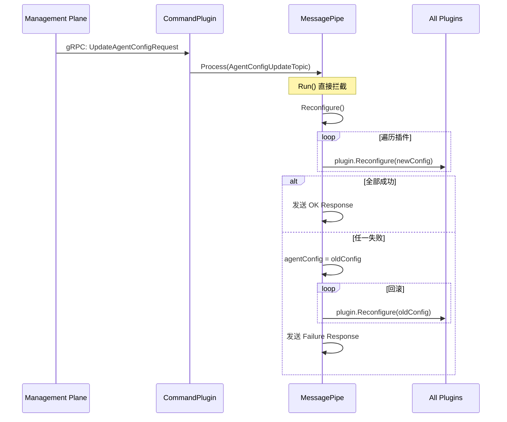

---
tags:
  - nginx-agent
  - architecture
  - startup-flow
  - message-bus
  - plugin-architecture
  - inter-module-communication
aliases:
  - Agent 启动流程
  - Agent 模块间通信
date: 2026-06-28
---

# NGINX Agent v3 启动流程与模块间通信架构

> [!abstract] 核心结论
> NGINX Agent v3 是一个基于 **消息总线（Message Bus）+ 插件（Plugin）** 架构的 Go 应用。启动时遵循 **配置初始化 → 总线构建 → 插件注册 → 消息循环启动** 四阶段。所有功能模块（`command`、`nginx`、`collector`、`watcher`）均实现 `bus.Plugin` 接口，模块间**严禁直接导入调用**，全部通过 `MessagePipe` 基于 Topic 的发布/订阅进行通信，从而实现彻底的解耦。

---

## 1. 启动时序与核心对象创建

启动链路从 `cmd/agent/main.go` 到 `internal/app.go` 的 `Run()` 方法。



### 1.1 入口与信号处理

> [!note] 代码位置：`cmd/agent/main.go:27`

```go
func main() {
    ctx, cancel := context.WithCancel(context.Background())
    sigChan := make(chan os.Signal, 1)
    signal.Notify(sigChan, syscall.SIGINT, syscall.SIGTERM, syscall.SIGQUIT)
    go func() {
        select {
        case <-sigChan:
            cancel()
            time.Sleep(config.DefGracefulShutdownPeriod) // 30s
            os.Exit(1)
        case <-ctx.Done():
        }
    }()
    app := internal.NewApp(commit, version)
    err := app.Run(ctx)
}
```

**设计要点**：`commit`/`version` 通过 `-ldflags` 在 `make build` 时注入。信号触发 `cancel` 后，消息总线的事件循环会进入 `ctx.Done()` 分支，逐个调用 `plugin.Close`。

### 1.2 App.Run：配置 → 总线 → 插件 → 运行

> [!note] 代码位置：`internal/app.go:32`

```go
func (a *App) Run(ctx context.Context) error {
    config.Init(a.version, a.commit)
    config.RegisterRunner(func(_ *cobra.Command, _ []string) {
        config.RegisterConfigFile()              // 加载配置文件
        agentConfig, _ := config.ResolveConfig() // 合并环境变量
        messagePipe := bus.NewMessagePipe(100, agentConfig)
        messagePipe.Register(100, plugin.LoadPlugins(ctx, agentConfig))
        messagePipe.Run(ctx)
    })
    return config.Execute(ctx)
}
```

**关键设计**：`app.Run()` 本身不是长阻塞的，它通过 `cobra` 的 `RegisterRunner`/`Execute` 模式将真正的业务逻辑封装在闭包里。这种设计让配置解析和命令行框架（cobra）天然集成，同时把业务生命周期（MessagePipe）与 CLI 生命周期解耦。

启动链路（按顺序）：

| 步骤 | 文件:行号 | 说明 |
|------|-----------|------|
| 1 | `cmd/agent/main.go:27` | 创建 ctx + 信号监听 |
| 2 | `internal/app.go:33` | `config.Init` 注册 cobra 根命令 |
| 3 | `internal/app.go:36` | `RegisterConfigFile` viper 读 YAML |
| 4 | `internal/app.go:42` | `ResolveConfig` 合并 env（前缀 `NGINX_AGENT_`） |
| 5 | `internal/app.go:53` | `bus.NewMessagePipe(100, cfg)` |
| 6 | `internal/app.go:54` | `plugin.LoadPlugins` 装配插件切片 |
| 7 | `internal/app.go:60` | `messagePipe.Run(ctx)` 阻塞事件循环 |

---

## 2. 架构核心：消息总线 + 插件模式

Agent v3 采用 **Message Bus + Plugin** 架构。所有功能模块被实现为 `bus.Plugin`，它们之间**禁止直接导入调用**，全部通过 `MessagePipe` 进行基于主题的发布/订阅通信。

### 2.1 核心接口契约

> [!note] 代码位置：`internal/bus/message_pipe.go:48`

```go
type Plugin interface {
    Init(ctx context.Context, messagePipe MessagePipeInterface) error
    Close(ctx context.Context) error
    Info() *Info
    Process(ctx context.Context, msg *Message)
    Subscriptions() []string
    Reconfigure(ctx context.Context, agentConfig *config.Config) error
}
```

| 方法 | 职责 |
|------|------|
| `Init` | 插件初始化，可启动后台 goroutine（如 gRPC Subscribe、文件监听） |
| `Process` | **同步回调**，当订阅的主题有消息时，由 MessagePipe 调用 |
| `Subscriptions` | 声明本插件关心哪些 Topic |
| `Reconfigure` | 响应远程配置更新，原子性替换内部配置引用 |
| `Close` | 优雅关闭，释放连接、停止 goroutine |

### 2.2 MessagePipe 的实现

`MessagePipe` 是系统的“中央调度器”，内部结构非常清晰：

> [!note] 代码位置：`internal/bus/message_pipe.go:57`

```go
type MessagePipe struct {
    agentConfig    *config.Config
    bus            messagebus.MessageBus        // github.com/vardius/message-bus
    messageChannel chan *MessageWithContext     // 缓冲通道（默认 100）
    plugins        []Plugin
    pluginsMutex   sync.Mutex
    configMutex    sync.Mutex
}
```

**消息分发机制**：
- `Process()` 将消息写入 `messageChannel` 缓冲通道
- `Run()` 内部是一个 `for { select { ... } }` 循环，从通道取出消息后：
  - **特殊主题**（`AgentConfigUpdateTopic`、`ConnectionAgentConfigUpdateTopic`）由 `MessagePipe` **直接处理**，调用 `Reconfigure()` 遍历所有插件
  - **普通主题** 通过底层 `messagebus.MessageBus.Publish()` 广播给所有订阅者

这种设计将“配置更新”提升为框架级一等公民，确保配置变更的**原子性**和**可回滚性**（若任一插件 `Reconfigure` 失败，会回滚到旧配置并通知管理平面）。

---

## 3. 插件加载顺序与职责

`internal/plugin/plugin_manager.go` 的 `LoadPlugins()` 按严格顺序组装插件：

| 顺序 | 插件 | 条件 | 核心职责 |
|------|------|------|----------|
| 1 | `command` | `IsCommandGrpcClientConfigured()` | 主管理平面 gRPC 客户端：建立连接、订阅管理平面指令、上报状态 |
| 2 | `nginx` | 同上（共享连接） | NGINX 实例管理：配置应用/上传/回滚、API 操作、Reload |
| 3 | `auxiliary-command` | `IsAuxiliaryCommandGrpcClientConfigured()` | 辅助管理平面（只读），用于高可用或分区场景 |
| 4 | `auxiliary-nginx` | 同上 | 辅助 NGINX 插件，仅处理读请求 |
| 5 | `collector` | `FeatureMetrics` 启用且有 Exporter | 嵌入 OpenTelemetry Collector，采集指标/日志 |
| 6 | `watcher` | 无条件 | 本地监控中枢：实例发现、健康检查、文件变更、凭证轮换 |

**加载顺序的隐含意义**：虽然插件间无直接调用，但注册顺序决定了 `Init()` 的调用顺序。`watcher` 最后初始化，确保当它开始产出 `ResourceUpdateTopic` 等消息时，上游的 `command` 和 `nginx` 插件已就绪。

---

## 4. 模块间通信：端到端流程分析

### 4.1 配置应用（Config Apply）—— 最复杂的跨模块协作

此流程展示了管理平面指令如何通过总线驱动 NGINX 配置变更：



**关键观察**：
- `nginx` 插件内部持有 `fileManagerService` 和 `nginxService`，负责“写文件 → 校验 → reload”的完整事务。若 reload 失败，会自动回滚文件并再次 reload。
- 配置应用期间，`watcher` 插件会收到 `EnableWatchersTopic`，重新启用文件监控，避免自己监控到自己写入的文件变更。

### 4.2 健康检查（Health Check）



### 4.3 资源更新（Resource Update）—— 推模式的上报

这是 Agent **主动上报** 的典型路径，由 `watcher` 驱动：



### 4.4 连接重置（Connection Reset）—— 凭证轮换场景

当 TLS 证书或连接凭证更新时，`watcher` 检测到后通知 `command` 和 `nginx` 插件重建连接：



**设计亮点**：`serverType`（Command vs Auxiliary）的上下文值被注入到消息处理的 `context` 中，确保主/辅连接的事件不会互相干扰。

### 4.5 Agent 远程配置更新

这是唯一**不经过底层 message-bus 库**的主题，由 `MessagePipe.Run()` 直接拦截处理：



---

## 5. 并发模型与同步设计

### 5.1 Goroutine 拓扑

```
main goroutine
    │
    ├──► messagePipe.Run()              // 单 goroutine，select 循环
    │       │
    │       ├──► plugin.Init()          // 串行调用，但插件内部可启动 goroutine
    │       │       ├──► command: monitorSubscribeChannel()
    │       │       ├──► nginx:   (无长期 goroutine，事件驱动)
    │       │       ├──► collector: bootup() → otelcol.Run()
    │       │       └──► watcher: instance/health/credential/file Watch() + monitorWatchers()
    │       │
    │       └──► for-select: 处理 messageChannel + ctx.Done()
    │
    └──► signal handler goroutine        // 监听 SIGINT/SIGTERM
```

### 5.2 关键同步原语

| 位置 | 原语 | 保护对象 |
|------|------|----------|
| `MessagePipe` | `pluginsMutex` | 插件列表的注册/注销/遍历 |
| `MessagePipe` | `configMutex` | 配置更新与 Reconfigure 的原子性 |
| `CommandPlugin` | `subscribeMutex` + `subscribeWg` | gRPC Subscribe goroutine 的生命周期（防止旧 goroutine 未退出就创建新连接） |
| `NginxPlugin` | `agentConfigMutex` | 配置引用的并发读/写 |
| `Watcher` | `watcherMutex` | `instancesWithConfigApplyInProgress` 列表，避免配置应用期间发送配置变更消息 |
| `Collector` | `mu` + `restartMutex` | OTel Collector 状态与重启操作的互斥 |

---

## 6. 架构设计总结

1. **彻底解耦**：插件之间通过 `MessagePipe` 和 Topic 通信，不存在直接导入。这使得 `command`、`nginx`、`collector`、`watcher` 可以独立开发、测试和替换。
2. **配置更新原子化**：`AgentConfigUpdateTopic` 被 MessagePipe 框架直接拦截，实现了“全成功提交，任一失败回滚”的分布式事务语义。
3. **生命周期管理清晰**：`Init` → `Run`（消息循环）→ `Close` 的三阶段生命周期，配合 `context.Context` 传播，确保信号到来时能从顶向下优雅关闭。
4. **主/辅连接隔离**：通过 `serverType` 上下文标记和 `command`/`auxiliary-command` 双插件设计，支持同一个 Agent 同时连接主管理平面和辅助管理平面，且行为隔离（辅助平面禁止 config apply 和 agent config update）。
5. **Watcher 作为本地事件源**：`watcher` 插件是唯一的“生产者型”插件，它将 OS 层面的进程、文件、凭证变化转换为标准化的总线消息，驱动整个 Agent 运转。

---

## 7. 关键 Topic 速查

| Topic | 发布者 | 订阅者 | 用途 |
|-------|--------|--------|------|
| `ResourceUpdateTopic` | Watcher | Command, Nginx, Collector | 资源/实例变更 |
| `ConnectionCreatedTopic` | CommandPlugin | Nginx | 连接建立通知 |
| `ConnectionResetTopic` | Watcher (凭据变更) | Command, Nginx | TLS 重连 |
| `ConfigApplyRequestTopic` | CommandPlugin | Nginx, Watcher | 配置下发 |
| `ConfigUploadRequestTopic` | CommandPlugin | Nginx | 文件上传 |
| `DataPlaneResponseTopic` | Nginx, Command | Command | 回传控制面 |
| `EnableWatchersTopic` | Nginx | Watcher | reload 后重启用监控 |
| `NginxConfigUpdateTopic` | Watcher | Nginx, Collector | 配置文件变更 |
| `AgentConfigUpdateTopic` | CommandPlugin | MessagePipe (直接处理) | Agent 配置热更新 |

---

## 8. 相关文档

- [[layout]] — 项目布局
- [[config_apply]] — Config Apply 流程图
- [[config_apply_state]] — Config Apply 状态机
- [[nginx-agent-startup-and-control-plane-analysis]] — 控制面协同与 K8s 场景实证分析

**上游文档**：
- [NGINX Agent v3 官方文档](https://docs.nginx.com/nginx-one-console/agent/)
