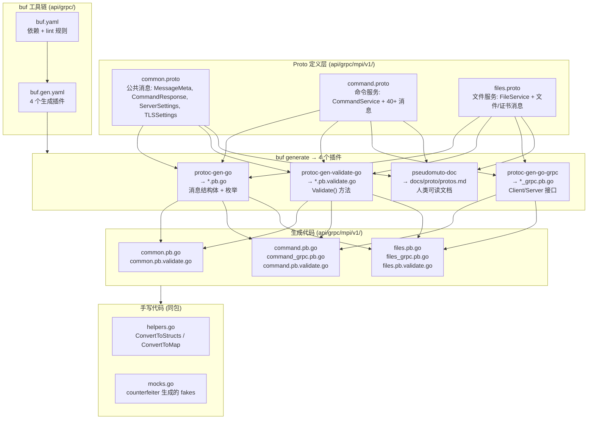
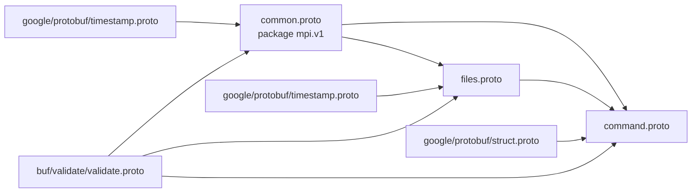
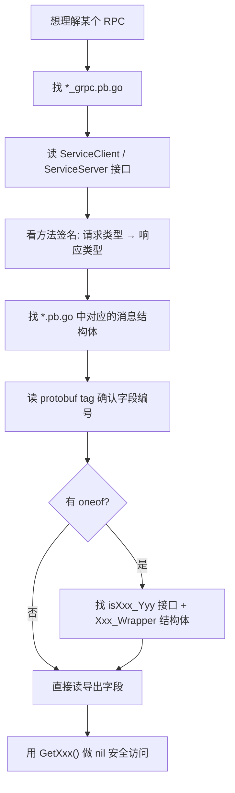

# NGINX Agent gRPC Proto 与生成代码深度分析

## 核心结论

> [!summary]
> NGINX Agent v3 通过 **3 个 proto 文件** 定义了 Management Plane Interface (MPI) 的 gRPC 契约：`common.proto`（公共消息）、`command.proto`（命令控制服务）、`files.proto`（文件传输服务）。使用 **buf** 工具链通过 **4 个插件** 生成 Go 代码：`protoc-gen-go`（消息/枚举结构体）、`protoc-gen-go-grpc`（服务接口）、`protoc-gen-validate`（字段校验）、`pseudomuto-doc`（Markdown 文档）。每个生成的 Go 结构体包含 **3 个内部字段**（`state`、`unknownFields`、`sizeCache`）和若干**业务字段**（与 proto 定义一一对应）。`oneof` 在 Go 中被映射为**接口 + 包装结构体**模式。

---

## 架构总览



---

## 代码生成流水线

### 触发命令

```bash
# Makefile 第 309-313 行
make generate   # 等价于:
# 1. nginx-metadata-gen + nginxplus-metadata-gen  (OTel receiver 元数据, 与 proto 无关)
# 2. cd api/grpc && go run github.com/bufbuild/buf/cmd/buf generate
# 3. go generate ./...  (counterfeiter mocks 等)
```

### buf.gen.yaml — 四个插件配置

> [!info] 文件位置：`api/grpc/buf.gen.yaml`

| 插件 | 输出位置 | 选项 | 产物 | 作用 |
|------|---------|------|------|------|
| `buf.build/protocolbuffers/go` | `.` | `paths=source_relative` | `*.pb.go` | 消息结构体、枚举、反射支持 |
| `buf.build/grpc/go` | `.` | `paths=source_relative, require_unimplementation_servers=false` | `*_grpc.pb.go` | gRPC Client/Server 接口、ServiceDesc |
| `buf.build/bufbuild/validate-go` | `.` | (无) | `*.pb.validate.go` | `Validate()` / `ValidateAll()` 方法 |
| `buf.build/community/pseudomuto-doc` | `../../docs/proto` | `markdown,protos.md` | `protos.md` | 人类可读的 proto 文档 |

> [!tip] `paths=source_relative`
> 生成的 Go 文件路径与 proto 文件路径一致（而非按 `go_package` 重新组织目录），所以 `mpi/v1/common.proto` → `mpi/v1/common.pb.go`。

> [!warning] `require_unimplementation_servers=false`
> 不强制服务端实现嵌入 `UnimplementedXxxServer`。这允许更灵活的实现方式，但意味着新增 RPC 方法时，旧的实现不会自动获得默认 `Unimplemented` 响应——需要在编译时检查。

### buf.yaml — lint 与依赖

> [!info] 文件位置：`api/grpc/buf.yaml`

```yaml
version: v1
deps:
  - buf.build/bufbuild/protovalidate    # 提供 buf.validate.field 扩展
lint:
  use: [DEFAULT]
  except: [FILE_LOWER_SNAKE_CASE]       # 允许文件名非全小写下划线
  enum_zero_value_suffix: _UNSPECIFIED  # 枚举零值必须以 _UNSPECIFIED 结尾
  rpc_allow_same_request_response: false
  rpc_allow_google_protobuf_empty_requests: false
  rpc_allow_google_protobuf_empty_responses: false  # 禁止用 Empty 做请求/响应
  service_suffix: Service               # 服务名必须以 Service 结尾
  allow_comment_ignores: true           # 允许 buf:lint:ignore 注释
```

---

## Proto 文件结构与字段含义

### 文件关系图



所有三个 proto 文件共享 `package mpi.v1` 和 `option go_package = "mpi/v1"`，生成的 Go 代码全部属于 `package v1`（导入路径 `mpi/v1`）。

---

### 1. common.proto — 公共消息

> [!info] 文件位置：`api/grpc/mpi/v1/common.proto` · 81 行

定义了被 command.proto 和 files.proto 共享引用的基础消息类型。

| 消息 | 字段 | 类型 | 含义 |
|------|------|------|------|
| **MessageMeta** | `message_id` | `string` | 消息唯一标识，UUID v7 单调递增 |
| | `correlation_id` | `string` | 关联同一工作流的多个消息 |
| | `timestamp` | `google.protobuf.Timestamp` | UTC 时间戳 |
| **CommandResponse** | `status` | `CommandStatus` (enum) | 命令执行状态 |
| | `message` | `string` | 用户友好的响应描述 |
| | `error` | `string` | 失败原因（仅 `COMMAND_STATUS_ERROR` 时填充） |
| **ServerSettings** | `host` | `string` | 服务器主机 |
| | `port` | `int32` | 端口 (验证: 1-65535) |
| | `type` | `ServerType` (enum) | 服务器类型 (gRPC / HTTP) |
| **AuthSettings** | (空) | — | 认证配置占位（预留扩展） |
| **TLSSettings** | `cert` | `string` | TLS 证书路径 |
| | `key` | `string` | TLS 私钥路径 |
| | `ca` | `string` | CA 证书路径 |
| | `skip_verify` | `bool` | 是否跳过证书验证 |
| | `server_name` | `string` | TLS Server Name |

**枚举定义：**

| 枚举 | 值 |
|------|-----|
| `CommandResponse.CommandStatus` | `UNSPECIFIED=0, OK=1, ERROR=2, IN_PROGRESS=3, FAILURE=4` |
| `ServerSettings.ServerType` | `UNDEFINED=0, GRPC=1, HTTP=2` |

> [!note] 嵌套枚举
> `CommandStatus` 定义在 `CommandResponse` 消息内部，`ServerType` 定义在 `ServerSettings` 内部。在 Go 中会被命名为 `CommandResponse_CommandStatus` 和 `ServerSettings_ServerType`。

---

### 2. command.proto — 命令控制服务

> [!info] 文件位置：`api/grpc/mpi/v1/command.proto` · 456 行

定义了 `CommandService` gRPC 服务和所有命令控制相关的消息。

#### CommandService 服务定义

| RPC 方法 | 请求类型 | 响应类型 | 类型 |
|----------|---------|---------|------|
| `CreateConnection` | `CreateConnectionRequest` | `CreateConnectionResponse` | Unary |
| `UpdateDataPlaneStatus` | `UpdateDataPlaneStatusRequest` | `UpdateDataPlaneStatusResponse` | Unary |
| `UpdateDataPlaneHealth` | `UpdateDataPlaneHealthRequest` | `UpdateDataPlaneHealthResponse` | Unary |
| `Subscribe` | `stream DataPlaneResponse` | `stream ManagementPlaneRequest` | **双向流** |

> [!important] Subscribe 双向流
> 这是 Agent 与 Management Plane 的核心通信通道。Agent 通过流发送 `DataPlaneResponse`（命令执行结果），Management Plane 通过流发送 `ManagementPlaneRequest`（触发各种操作）。消息必须 FIFO 排序，索引单调递增。

#### 核心消息字段含义

**CreateConnectionRequest** — 初始握手

| 字段 | 类型 | 含义 |
|------|------|------|
| `message_meta` | `MessageMeta` | 消息元信息 |
| `resource` | `Resource` | 实例和基础设施信息 |

**Resource** — 资源表示（含 oneof）

| 字段 | 类型 | 含义 |
|------|------|------|
| `resource_id` | `string` | 资源标识 (UUID, 验证) |
| `instances` | `repeated Instance` | 关联实例列表 |
| `info` (oneof) | `HostInfo` \| `ContainerInfo` | 运行环境信息 |

**ManagementPlaneRequest** — 管理平面请求（含 7 选 oneof）

| 字段 | 类型 | 含义 |
|------|------|------|
| `message_meta` | `MessageMeta` | 消息元信息 |
| `request` (oneof) | 见下表 | 触发不同的 Data Plane 操作 |

| oneof 选项 | 触发的操作 |
|------------|-----------|
| `status_request` | 触发 DataPlaneStatus RPC |
| `health_request` | 触发 DataPlaneHealth RPC |
| `config_apply_request` | 触发 GetFile (配置应用) |
| `config_upload_request` | 触发 UpdateFile 系列 |
| `action_request` | 触发 API 动作 (如 NGINX Plus API) |
| `command_status_request` | 查询特定命令状态 |
| `update_agent_config_request` | 更新 Agent 配置 |

**DataPlaneResponse** — 数据平面响应

| 字段 | 类型 | 含义 |
|------|------|------|
| `message_meta` | `MessageMeta` | 消息元信息 |
| `command_response` | `CommandResponse` | 命令执行结果 |
| `instance_id` | `string` | 关联实例 ID |
| `request_type` | `RequestType` (enum) | 响应的请求类型 |

**Instance** — 实例表示

| 字段 | 类型 | 含义 |
|------|------|------|
| `instance_meta` | `InstanceMeta` | 实例元信息 (ID, 类型, 版本) |
| `instance_config` | `InstanceConfig` | 读写配置 |
| `instance_runtime` | `InstanceRuntime` | 只读运行时信息 |

**InstanceRuntime** — 运行时信息（含 oneof `details`）

| 字段 | 类型 | 含义 |
|------|------|------|
| `process_id` | `int32` | 进程 ID |
| `binary_path` | `string` | 二进制路径 (验证: `/` 开头) |
| `config_path` | `string` | 配置路径 (验证: `/` 开头) |
| `details` (oneof) | `NGINXRuntimeInfo` \| `NGINXPlusRuntimeInfo` \| `NGINXAppProtectRuntimeInfo` | 详细运行时信息 |
| `instance_children` | `repeated InstanceChild` | Worker 进程列表 |

**AgentConfig** — Agent 配置

| 字段 | 类型 | 含义 |
|------|------|------|
| `command` | `CommandServer` | 命令服务器设置 |
| `metrics` | `MetricsServer` | 指标服务器设置 |
| `file` | `FileServer` | 文件服务器设置 |
| `labels` | `repeated google.protobuf.Struct` | 键值对标签 |
| `features` | `repeated string` | 功能列表 |
| `message_buffer_size` | `string` | 消息缓冲区大小 |
| `auxiliary_command` | `AuxiliaryCommandServer` | 辅助命令服务器 |
| `log` | `Log` | 日志设置 |

<details>
<summary>📋 其他消息字段一览（点击展开）</summary>

| 消息 | 字段 | 含义 |
|------|------|------|
| **HostInfo** | `host_id`, `hostname`, `release_info` | 主机标识、名称、发行版信息 |
| **ReleaseInfo** | `codename`, `id`, `name`, `version_id`, `version` | OS 发行版详细信息 |
| **ContainerInfo** | `container_id`, `hostname`, `release_info` | 容器标识、主机名、发行版 |
| **InstanceMeta** | `instance_id` (UUID), `instance_type` (enum), `version` | 实例标识、类型、版本 |
| **InstanceConfig** | `actions`, `config` (oneof: `agent_config`) | 实例动作列表、配置 |
| **NGINXRuntimeInfo** | `stub_status`, `access_logs`, `error_logs`, `loadable_modules`, `dynamic_modules` | NGINX OSS 运行时 |
| **NGINXPlusRuntimeInfo** | 同上 + `plus_api` | NGINX Plus 运行时 |
| **APIDetails** | `location`, `listen`, `Ca` | API location/listen/CA |
| **NGINXAppProtectRuntimeInfo** | `release`, `attack_signature_version`, `threat_campaign_version`, `enforcer_engine_version` | NAP 运行时 |
| **APIActionRequest** | `instance_id`, `action` (oneof: `nginx_plus_action`) | API 动作请求 |
| **NGINXPlusAction** | `action` (oneof: 5 种 upstream 操作) | NGINX Plus API 动作 |
| **Log** | `log_level` (enum), `log_path` | 日志级别和路径 |
| **CommandServer** | `server`, `auth`, `tls` | 命令服务器配置 |
| **UpdateAgentConfigRequest** | `message_meta`, `agent_config` | 更新 Agent 配置请求 |
| **InstanceHealth** | `instance_id`, `instance_health_status` (enum), `description` | 实例健康状态 |

**NGINX Plus Action oneof 选项：**
- `update_http_upstream_servers` — 更新 HTTP upstream 服务器
- `get_http_upstream_servers` — 获取 HTTP upstream 服务器
- `update_stream_servers` — 更新 Stream upstream 服务器
- `get_upstreams` — 获取所有 upstreams
- `get_stream_upstreams` — 获取 Stream upstreams

**InstanceType 枚举：** `UNSPECIFIED=0, AGENT=1, NGINX=2, NGINX_PLUS=3, UNIT=4, NGINX_APP_PROTECT=5`

**InstanceHealthStatus 枚举：** `UNSPECIFIED=0, HEALTHY=1, UNHEALTHY=2, DEGRADED=3`

**RequestType 枚举：** `UNSPECIFIED=0, CONFIG_APPLY=1, CONFIG_UPLOAD=2, HEALTH=3, STATUS=4, API_ACTION=5, COMMAND_STATUS=6, UPDATE_AGENT_CONFIG=7`

**LogLevel 枚举：** `INFO=0, ERROR=1, WARN=2, DEBUG=3`

</details>

---

### 3. files.proto — 文件传输服务

> [!info] 文件位置：`api/grpc/mpi/v1/files.proto` · 338 行

定义了 `FileService` gRPC 服务和文件/证书相关的消息。

#### FileService 服务定义

| RPC 方法 | 请求类型 | 响应类型 | 类型 |
|----------|---------|---------|------|
| `GetOverview` | `GetOverviewRequest` | `GetOverviewResponse` | Unary |
| `UpdateOverview` | `UpdateOverviewRequest` | `UpdateOverviewResponse` | Unary |
| `GetFile` | `GetFileRequest` | `GetFileResponse` | Unary |
| `UpdateFile` | `UpdateFileRequest` | `UpdateFileResponse` | Unary |
| `GetFileStream` | `GetFileRequest` | `stream FileDataChunk` | **服务端流** |
| `UpdateFileStream` | `stream FileDataChunk` | `UpdateFileResponse` | **客户端流** |

#### 核心消息字段含义

**FileMeta** — 文件元数据

| 字段 | 类型 | 含义 |
|------|------|------|
| `name` | `string` | 完整路径 (验证: `/` 前缀) |
| `hash` | `string` | 文件内容 SHA256 哈希 (hex) |
| `modified_time` | `google.protobuf.Timestamp` | 最后修改时间 |
| `permissions` | `string` | 权限 (验证: `0[0-7]{3}` 格式) |
| `size` | `int64` | 文件大小 (字节) |
| `file_type` (oneof) | `CertificateMeta` | 文件类型扩展信息 |

**FileDataChunk** — 流式传输数据块（含 oneof）

| 字段 | 类型 | 含义 |
|------|------|------|
| `meta` | `MessageMeta` | 传输请求元信息 |
| `chunk` (oneof) | `FileDataChunkHeader` \| `FileDataChunkContent` | 块头或块内容 |

**FileDataChunkHeader** — 块头

| 字段 | 类型 | 含义 |
|------|------|------|
| `file_meta` | `FileMeta` | 文件元数据 (接收方验证哈希) |
| `chunks` | `uint32` | 预期总块数 (验证: >0) |
| `chunk_size` | `uint32` | 单块最大大小 (验证: >0) |

**FileDataChunkContent** — 块内容

| 字段 | 类型 | 含义 |
|------|------|------|
| `chunk_id` | `uint32` | 块序号 (零索引, x of y) |
| `data` | `bytes` | 块数据 (≤ chunk_size) |

<details>
<summary>📋 证书相关消息字段（点击展开）</summary>

**CertificateMeta** — 证书元数据（基于 `crypto/x509.Certificate`）

| 字段 | 类型 | 含义 |
|------|------|------|
| `serial_number` | `string` | 证书序列号 |
| `issuer` | `X509Name` | 颁发者 |
| `subject` | `X509Name` | 主体 |
| `sans` | `SubjectAlternativeNames` | SAN 扩展 |
| `dates` | `CertificateDates` | 有效期 |
| `signature_algorithm` | `SignatureAlgorithm` (enum) | 签名算法 |
| `public_key_algorithm` | `string` | 公钥算法 |

**X509Name** — X.509 名称（基于 `crypto/x509/pkix.Name`）

| 字段 | 类型 | 含义 |
|------|------|------|
| `country` | `repeated string` | 国家代码 (验证: 2 字符) |
| `organization` | `repeated string` | 组织名 |
| `organizational_unit` | `repeated string` | 组织单元 |
| `locality` | `repeated string` | 地区/城市 |
| `province` | `repeated string` | 州/省 |
| `street_address` | `repeated string` | 街道地址 |
| `postal_code` | `repeated string` | 邮编 |
| `serial_number` | `string` | 序列号 |
| `common_name` | `string` | 通用名 (CN) |
| `names` | `repeated AttributeTypeAndValue` | 解析的属性 (RFC 2253) |
| `extra_names` | `repeated AttributeTypeAndValue` | 额外属性 (覆盖同名 OID) |

**SignatureAlgorithm 枚举** (17 个值): `UNKNOWN=0, MD2_WITH_RSA=1, ... PURE_ED25519=16`

</details>

> [!note] 流式传输约束
> proto 注释中定义了 9 条流式传输不变量：必须恰好一个 header、content 不能先于 header、content 数量必须匹配 header.chunks、chunk_id 不能重复、content 不能为空、合并哈希必须匹配、合并大小必须匹配、chunk_size 必须小于 gRPC 最大消息大小。

---

## Proto 字段 → Go 结构体映射

### 类型映射总表

| Proto 类型 | Go 类型 | 示例 |
|-----------|---------|------|
| `string` | `string` | `message_id → MessageId string` |
| `int32` | `int32` | `port → Port int32` |
| `int64` | `int64` | `size → Size int64` |
| `uint32` | `uint32` | `chunks → Chunks uint32` |
| `bool` | `bool` | `skip_verify → SkipVerify bool` |
| `bytes` | `[]byte` | `data → Data []byte` |
| `google.protobuf.Timestamp` | `*timestamppb.Timestamp` | `timestamp → Timestamp *timestamppb.Timestamp` |
| `google.protobuf.Struct` | `*structpb.Struct` | `labels → Labels []*structpb.Struct` |
| `message Foo` (引用) | `*Foo` (指针) | `resource → Resource *Resource` |
| `repeated Foo` | `[]*Foo` (切片) | `instances → Instances []*Instance` |
| `repeated string` | `[]string` | `access_logs → AccessLogs []string` |
| `optional Foo` | `*Foo` (指针) | `external_data_source → ExternalDataSource *ExternalDataSource` |
| `enum` | 自定义 `int32` 类型 | `status → Status CommandResponse_CommandStatus` |
| `oneof` | 接口 + 包装结构体 | 见下文 |

### 命名转换规则

| Proto 命名 | Go 命名 | 规则 |
|-----------|---------|------|
| `snake_case` 字段名 | `CamelCase` | `message_id` → `MessageId` |
| `message_id` JSON 名 | `messageId` (json tag) | 保留 proto json 名 |
| `CommandStatus` 枚举 | `CommandResponse_CommandStatus` | 嵌套枚举 = `父消息_枚举名` |
| `COMMAND_STATUS_OK` | `CommandResponse_COMMAND_STATUS_OK` | 嵌套枚举值 = `父消息_原值` |

### oneof 的 Go 表示模式

> [!important] oneof 是 protobuf → Go 中最复杂的映射

以 `Resource.info` oneof 为例：

**Proto 定义：**
```protobuf
message Resource {
    string resource_id = 1;
    repeated Instance instances = 2;
    oneof info {
        HostInfo host_info = 3;
        ContainerInfo container_info = 4;
    }
}
```

**Go 生成代码（3 个部分）：**

**① 主结构体中的接口字段：**
```go
type Resource struct {
    state         protoimpl.MessageState `protogen:"open.v1"`
    ResourceId    string                 `protobuf:"bytes,1,opt,..."`
    Instances     []*Instance            `protobuf:"bytes,2,rep,..."`
    Info          isResource_Info        `protobuf_oneof:"info"`  // ← 接口类型
    unknownFields protoimpl.UnknownFields
    sizeCache     protoimpl.SizeCache
}
```

**② 标记接口（sealed interface 模式）：**
```go
type isResource_Info interface {
    isResource_Info()  // 未导出方法，外部无法实现
}
```

**③ 每个 oneof 选项一个包装结构体：**
```go
type Resource_HostInfo struct {
    HostInfo *HostInfo `protobuf:"bytes,3,opt,name=host_info,...,oneof"`
}

type Resource_ContainerInfo struct {
    ContainerInfo *ContainerInfo `protobuf:"bytes,4,opt,name=container_info,...,oneof"`
}

func (*Resource_HostInfo) isResource_Info() {}
func (*Resource_ContainerInfo) isResource_Info() {}
```

**④ 便捷 Getter（类型断言）：**
```go
// 获取 oneof 接口
func (x *Resource) GetInfo() isResource_Info { ... }

// 获取具体类型（内部做类型断言，不匹配返回 nil）
func (x *Resource) GetHostInfo() *HostInfo {
    if x, ok := x.Info.(*Resource_HostInfo); ok {
        return x.HostInfo
    }
    return nil
}
```

> [!tip] 如何设置 oneof 值
> ```go
> // 设置 HostInfo
> resource.Info = &Resource_HostInfo{HostInfo: hostInfo}
> // 设置 ContainerInfo
> resource.Info = &Resource_ContainerInfo{ContainerInfo: containerInfo}
> // 类型判断
> switch v := resource.Info.(type) {
> case *Resource_HostInfo:    // ...
> case *Resource_ContainerInfo: // ...
> }
> ```

### protobuf struct tag 解读

每个业务字段都有一个 `protobuf` tag，格式为：

```
protobuf:"bytes,1,opt,name=message_id,json=messageId,proto3"
```

| 部分 | 含义 |
|------|------|
| `bytes` | wire type（`bytes`=长度前缀, `varint`=变长整数） |
| `1` | 字段编号（proto 定义中的 `= 1`） |
| `opt` | 可选性（`opt`=可选, `req`=必填, `rep`=重复） |
| `name=message_id` | proto 字段名 |
| `json=messageId` | JSON 序列化名 |
| `proto3` | proto3 语义 |
| `enum=mpi.v1.CommandResponse_CommandStatus` | (仅枚举) 枚举全限定名 |
| `oneof` | (仅 oneof 成员) 标记属于 oneof |

---

## pb 内部字段 vs 业务字段

> [!important] 每个生成的消息结构体都包含 **3 个未导出的内部字段**，它们不属于 proto 定义，而是 protobuf 运行时基础设施。

### 内部字段（每个消息结构体都有）

| 字段 | 类型 | 作用 | 可见性 |
|------|------|------|--------|
| `state` | `protoimpl.MessageState` | 缓存消息反射信息（MessageInfo），加速 `ProtoReflect()` | 未导出 |
| `unknownFields` | `protoimpl.UnknownFields` | 存储 proto schema 中未定义的字段（前向兼容：旧版本解析新版本消息时，未知字段保存在这里） | 未导出 |
| `sizeCache` | `protoimpl.SizeCache` | 缓存 `ProtoMessage()` 序列化后的字节大小，避免重复计算 | 未导出 |

```go
// 每个 struct 的骨架
type MessageMeta struct {
    state         protoimpl.MessageState `protogen:"open.v1"`  // ← 内部
    MessageId     string                 `protobuf:"..."`        // ← 业务
    CorrelationId string                 `protobuf:"..."`        // ← 业务
    Timestamp     *timestamppb.Timestamp `protobuf:"..."`        // ← 业务
    unknownFields protoimpl.UnknownFields                        // ← 内部
    sizeCache     protoimpl.SizeCache                            // ← 内部
}
```

> [!note] `protogen:"open.v1"` tag
> `state` 字段上的 `protogen:"open.v1"` tag 告诉 protobuf 运行时这个结构体使用 "open struct" 模式（v1），即字段可以通过反射动态访问。这是 protobuf-go v2 API 的内部标记。

### 业务字段

所有在 proto 文件中明确定义的字段都是业务字段：

- **普通字段**：直接映射为 Go 字段（如 `MessageId string`）
- **消息引用**：映射为指针（如 `Timestamp *timestamppb.Timestamp`）
- **repeated**：映射为切片（如 `Instances []*Instance`）
- **oneof**：映射为接口字段（如 `Info isResource_Info`）
- **optional**：映射为指针（如 `ExternalDataSource *ExternalDataSource`）
- **enum**：映射为自定义 int32 类型（如 `Status CommandResponse_CommandStatus`）

### 区分方法

| 判断方式 | 内部字段 | 业务字段 |
|---------|---------|---------|
| 是否在 proto 中定义 | ❌ 否 | ✅ 是 |
| 是否有 `protobuf:` tag | ❌ 有 `protogen:` tag | ✅ 有 `protobuf:` tag |
| 是否导出（大写开头） | ❌ 小写 | ✅ 大写 |
| 是否有 Getter 方法 | ❌ 无 | ✅ 有 `GetXxx()` |
| 是否可序列化 | 间接（通过反射） | ✅ 直接 |

---

## 生成的接口与方法详解

### 每个消息结构体的方法

以 `MessageMeta` 为例，每个生成的消息结构体都获得以下方法：

| 方法 | 签名 | 作用 |
|------|------|------|
| `Reset()` | `func (x *MessageMeta) Reset()` | 重置为零值，保留 MessageInfo |
| `String()` | `func (x *MessageMeta) String() string` | 返回 proto 文本格式字符串 |
| `ProtoMessage()` | `func (*MessageMeta) ProtoMessage()` | 标记方法（空实现），标识此类型是 proto 消息 |
| `ProtoReflect()` | `func (x *MessageMeta) ProtoReflect() protoreflect.Message` | 返回反射接口（v2 API 核心） |
| `Descriptor()` | `func (*MessageMeta) Descriptor() ([]byte, []int)` | **已废弃**，返回原始描述符的 GZIP 压缩字节和索引路径 |
| `GetXxx()` | `func (x *MessageMeta) GetMessageId() string` | **nil 安全的 getter**，每个业务字段一个 |

> [!tip] Getter 的 nil 安全性
> ```go
> func (x *MessageMeta) GetMessageId() string {
>     if x != nil {       // ← 即使 receiver 为 nil 也不会 panic
>         return x.MessageId
>     }
>     return ""           // ← 返回零值
> }
> ```
> 这意味着 `var m *MessageMeta; m.GetMessageId()` 返回 `""` 而非 panic。

### 枚举类型的方法

每个枚举生成一个 `int32` 类型别名，附带：

| 方法/变量 | 作用 |
|-----------|------|
| `Enum() *Type` | 返回值的指针（用于 proto 字段赋值） |
| `String() string` | 枚举名转字符串 |
| `Descriptor() protoreflect.EnumDescriptor` | 枚举描述符 |
| `Type() protoreflect.EnumType` | 枚举类型信息 |
| `Number() protoreflect.EnumNumber` | 数值 |
| `EnumDescriptor()` (废弃) | 原始描述符字节 |
| `xxx_name` map | `int32 → string` 映射 |
| `xxx_value` map | `string → int32` 映射 |

### gRPC 服务生成物（以 CommandService 为例）

`command_grpc.pb.go` 为每个 `service` 生成以下产物：

#### ① 全方法名常量

```go
const (
    CommandService_CreateConnection_FullMethodName      = "/mpi.v1.CommandService/CreateConnection"
    CommandService_UpdateDataPlaneStatus_FullMethodName = "/mpi.v1.CommandService/UpdateDataPlaneStatus"
    CommandService_UpdateDataPlaneHealth_FullMethodName = "/mpi.v1.CommandService/UpdateDataPlaneHealth"
    CommandService_Subscribe_FullMethodName             = "/mpi.v1.CommandService/Subscribe"
)
```

格式：`/{package}.{ServiceName}/{MethodName}`

#### ② Client 接口 + 实现

| 生成物 | 作用 |
|--------|------|
| `CommandServiceClient` (interface) | 客户端接口，业务代码依赖此接口 |
| `commandServiceClient` (struct, 未导出) | 接口实现，持有 `grpc.ClientConnInterface` |
| `NewCommandServiceClient(cc)` | 构造函数 |
| 各方法的 client 实现 | 调用 `cc.Invoke()` (Unary) 或 `cc.NewStream()` (Stream) |

> [!note] 泛型流类型
> ```go
> // Subscribe 是双向流，使用泛型 BidiStreamingClient
> Subscribe(ctx, opts...) (grpc.BidiStreamingClient[DataPlaneResponse, ManagementPlaneRequest], error)
> // 向后兼容别名
> type CommandService_SubscribeClient = grpc.BidiStreamingClient[DataPlaneResponse, ManagementPlaneRequest]
> ```

#### ③ Server 接口 + 实现

| 生成物 | 作用 |
|--------|------|
| `CommandServiceServer` (interface) | 服务端接口，业务实现此接口 |
| `UnimplementedCommandServiceServer` (struct) | 前向兼容桩，返回 `Unimplemented` 错误 |
| `UnsafeCommandServiceServer` (interface) | 选择退出前向兼容（不推荐） |
| `RegisterCommandServiceServer(s, srv)` | 注册服务到 gRPC Server |

> [!warning] `require_unimplementation_servers=false`
> 由于 buf.gen.yaml 设置了此选项，业务实现**不必**嵌入 `UnimplementedCommandServiceServer`。但新增 RPC 方法时，未嵌入的实现会编译失败而非运行时返回 Unimplemented。

#### ④ 方法处理器 (Handlers)

每个 RPC 方法生成一个 `_Handler` 函数：

```go
func _CommandService_CreateConnection_Handler(srv interface{}, ctx context.Context,
    dec func(interface{}) error, interceptor grpc.UnaryServerInterceptor) (interface{}, error) {
    in := new(CreateConnectionRequest)
    if err := dec(in); err != nil { return nil, err }  // 反序列化请求
    if interceptor == nil {
        return srv.(CommandServiceServer).CreateConnection(ctx, in)  // 直接调用
    }
    // 经过拦截器
    info := &grpc.UnaryServerInfo{Server: srv, FullMethod: ...}
    handler := func(ctx context.Context, req interface{}) (interface{}, error) {
        return srv.(CommandServiceServer).CreateConnection(ctx, req.(*CreateConnectionRequest))
    }
    return interceptor(ctx, in, info, handler)
}
```

#### ⑤ ServiceDesc

```go
var CommandService_ServiceDesc = grpc.ServiceDesc{
    ServiceName: "mpi.v1.CommandService",
    HandlerType: (*CommandServiceServer)(nil),  // 类型断言用
    Methods: []grpc.MethodDesc{                 // Unary 方法
        {MethodName: "CreateConnection", Handler: _CommandService_CreateConnection_Handler},
        // ...
    },
    Streams: []grpc.StreamDesc{                 // 流式方法
        {StreamName: "Subscribe", Handler: _CommandService_Subscribe_Handler,
         ServerStreams: true, ClientStreams: true},
    },
    Metadata: "mpi/v1/command.proto",
}
```

> [!tip] ServiceDesc 是 gRPC 注册的核心
> `RegisterCommandServiceServer` 本质就是 `s.RegisterService(&CommandService_ServiceDesc, srv)`。gRPC 运行时通过 ServiceDesc 知道有哪些方法、每个方法的处理器函数、以及如何做类型断言验证实现。

### 校验方法 (.pb.validate.go)

每个带有 `buf.validate.field` 扩展的消息生成校验代码：

| 方法 | 作用 |
|------|------|
| `Validate() error` | 校验所有字段，返回第一个错误 |
| `ValidateAll() error` | 校验所有字段，返回所有错误（`MultiError`） |

```go
// proto: int32 port = 2 [(buf.validate.field).int32 = {gte: 1, lte: 65535}]
// 生成的校验:
if m.GetPort() < 1 || m.GetPort() > 65535 {
    return ServerSettingsValidationError{
        field: "Port", reason: "value must be between 1 and 65535 inclusive",
    }
}
```

---

## 文件产物总览

| 文件 | 生成者 | 来源 proto | 内容 |
|------|--------|-----------|------|
| `common.pb.go` | protoc-gen-go | common.proto | 5 个消息结构体 + 2 个枚举 |
| `common.pb.validate.go` | protoc-gen-validate | common.proto | 校验方法 |
| `command.pb.go` | protoc-gen-go | command.proto | 40+ 消息结构体 + 多个枚举 + oneof 包装 |
| `command_grpc.pb.go` | protoc-gen-go-grpc | command.proto | CommandService Client/Server/ServiceDesc |
| `command.pb.validate.go` | protoc-gen-validate | command.proto | 校验方法 |
| `files.pb.go` | protoc-gen-go | files.proto | 文件/证书消息结构体 + SignatureAlgorithm 枚举 |
| `files_grpc.pb.go` | protoc-gen-go-grpc | files.proto | FileService Client/Server/ServiceDesc |
| `files.pb.validate.go` | protoc-gen-validate | files.proto | 校验方法 |
| `helpers.go` | **手写** | — | `ConvertToStructs` / `ConvertToMap` 工具函数 |
| `mocks.go` | counterfeiter | 接口 `//go:generate` | Mock fakes |
| `helpers_test.go` | **手写** | — | helpers 测试 |
| `docs/proto/protos.md` | pseudomuto-doc | 全部 proto | 人类可读文档 |

---

## 如何阅读生成的 pb 代码

### 阅读策略



### 快速定位技巧

| 你想找... | 方法 |
|-----------|------|
| 某消息的 Go 结构体 | `grep "type MessageName struct" *.pb.go` |
| 某消息的 getter | `grep "func.*GetFieldName" *.pb.go` |
| oneof 的可选项 | `grep "type MessageName_" *.pb.go` |
| 某服务的 Client 接口 | `grep "type ServiceNameClient interface" *_grpc.pb.go` |
| 某服务的 Server 接口 | `grep "type ServiceNameServer interface" *_grpc.pb.go` |
| RPC 全方法名 | `grep "FullMethodName" *_grpc.pb.go` |
| 字段校验逻辑 | `grep "func.*Validate" *.pb.validate.go` |

### 理解 wire type

protobuf tag 中的第一个字段是 wire type，决定了序列化方式：

| Wire type | 名称 | 适用类型 | Go 类型 |
|-----------|------|---------|---------|
| `bytes` | 长度前缀 | string, bytes, 嵌套消息 | `string`, `[]byte`, `*Message` |
| `varint` | 变长整数 | int32, int64, uint32, bool, enum | `int32`, `int64`, `uint32`, `bool`, `EnumType` |

### 理解 rawDesc（原始描述符）

每个 `*.pb.go` 文件底部包含一段看似乱码的字符串：

```go
const file_mpi_v1_common_proto_rawDesc = "" +
    "\n" +
    "\x13mpi/v1/common.proto\x12\x06mpi.v1..."
```

这是 **proto 文件的二进制 FileDescriptorProto 的字符串编码**。它在 `init()` 函数中被 GZIP 压缩并用于运行时构建反射描述符（`File_mpi_v1_common_proto`）。**不要修改它**——它是 proto 定义的精确二进制表示，所有反射功能依赖它。

---

## 设计原因分析

### 为什么用 buf 而非直接 protoc？

**约束**：多 proto 文件有交叉引用、需要 lint 规范、需要多语言插件。

**选择**：buf 提供了依赖管理（`buf.build/bufbuild/protovalidate`）、lint 规则（`_UNSPECIFIED` 后缀、`Service` 后缀）、以及远程插件执行（无需本地安装 protoc 和各插件），统一了 `buf.gen.yaml` 配置。

### 为什么 oneof 用接口而非联合体？

**约束**：Go 没有联合体（sum type），且需要类型安全的 oneof 表示。

**选择**：**标记接口 + 包装结构体** 模式。接口的未导出方法 (`isResource_Info()`) 使外部包无法实现该接口（sealed interface），确保只有生成的包装类型能赋值给 oneof 字段。每个 oneof 选项是一个包装结构体（`Resource_HostInfo`），持有实际值的指针。

**优点**：类型安全（编译时检查）、与 protobuf 反射 API 兼容、Getter 做类型断言后返回具体类型。

### 为什么每个 struct 有 3 个内部字段？

**约束**：protobuf 运行时需要缓存反射信息、保留未知字段（前向兼容）、缓存序列化大小。

**选择**：
- `state`：避免每次 `ProtoReflect()` 都重新构建 MessageInfo
- `unknownFields`：当旧版本 Agent 收到新版本 proto 定义的字段时，未知字段保存在这里，序列化时原样输出，实现前向兼容
- `sizeCache`：`Size()` 方法（序列化前计算大小）的结果缓存，避免重复计算

### 为什么禁用 `require_unimplementation_servers`？

**约束**：Agent 的 gRPC 服务实现可能只实现部分方法，且使用不同的注册策略。

**选择**：设为 `false` 允许实现者自行决定是否嵌入 `UnimplementedXxxServer`，但代价是新增 RPC 方法时不会自动获得默认实现。

---

## 总结

| 角色 | 职责 |
|------|------|
| **proto 文件** | 定义 gRPC 契约：服务、消息、字段、枚举、oneof |
| **buf.yaml** | 管理 proto 依赖、定义 lint 规则 |
| **buf.gen.yaml** | 配置 4 个代码生成插件 |
| **\*.pb.go** | proto 消息 → Go 结构体（业务字段 + 3 个内部字段） |
| **\*_grpc.pb.go** | proto service → Go Client/Server 接口 + ServiceDesc |
| **\*.pb.validate.go** | buf.validate 扩展 → `Validate()` / `ValidateAll()` 方法 |
| **helpers.go** | 手写的类型转换工具（`Struct` ↔ `map`） |
| **mocks.go** | counterfeiter 生成的接口 mock |

> [!success] 阅读心法
> 1. **proto 是源**：所有生成的 Go 代码都是 proto 定义的投影，改 proto 而非改 Go
> 2. **3 个内部字段可忽略**：`state`/`unknownFields`/`sizeCache` 是运行时基础设施，业务逻辑不需要直接操作
> 3. **用 Getter 访问**：`GetXxx()` 是 nil 安全的，永远优先用 getter 而非直接字段访问
> 4. **oneof 用类型断言**：`switch v := x.Field.(type)` 是处理 oneof 的标准模式
> 5. **改 proto 后必须 `make generate`**：然后运行 `make lint && make format`，提交生成的差异
