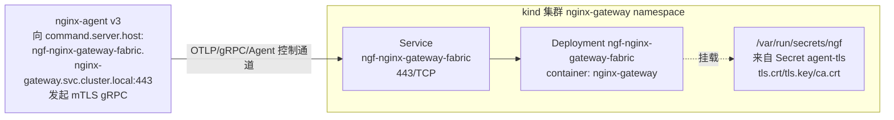
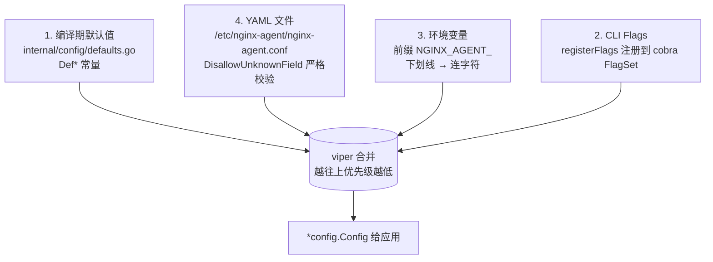
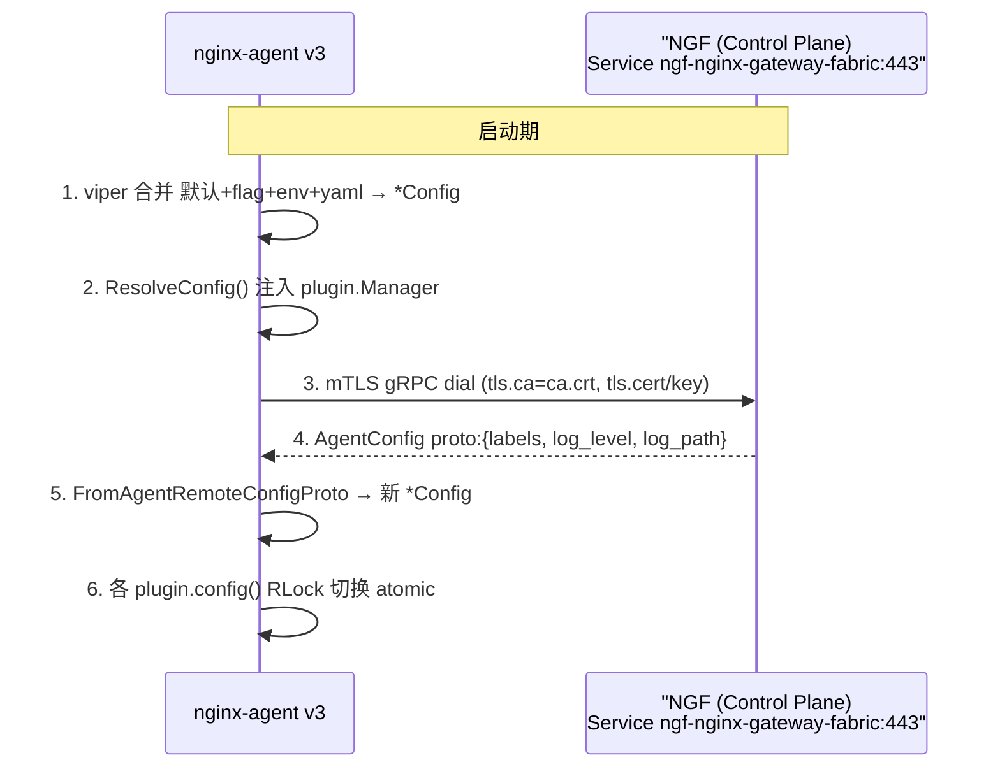
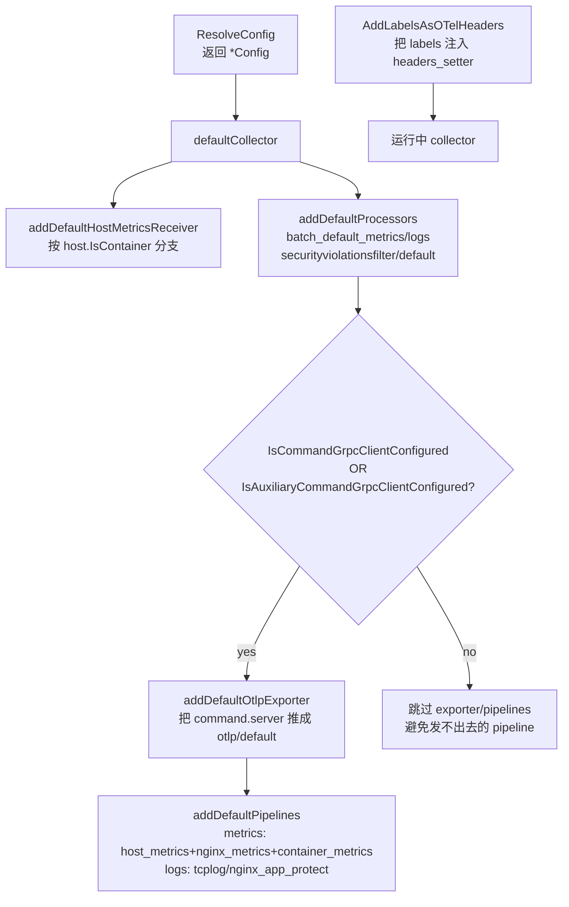

# NGINX Agent v3 配置管理分析

> [!info] 分析目标
> 基于 `kind` 集群中已部署的 NGF (NGINX Gateway Fabric v2.6.5) 与本仓库源码（`github.com/nginx/agent/v3`，Go 1.26），拆解 NGINX Agent v3 的配置管路、设计取舍和可复用的模式。读者可以把这套设计搬到任意"Go 服务 + YAML + K8s + 远程下发"的项目里。

**核心结论**（一句话）：NGINX Agent v3 的配置管理是 **"三层配置源 + 严格 YAML schema + 路径白名单 + 运行时上下文相关默认值 + 远端覆盖"** 的一套架构 —— 用 viper 做 4 源优先级合并，用 `DisallowUnknownField` 在加载阶段就防住打字错误，用 `allowed_directories` 把文件路径风险关进笼子，用 `IsContainer()` 探测运行环境并据此挑选不同的默认 OTel receiver，再通过 gRPC 让管理面在运行时 **覆盖** 标签与日志级别。

---

## 1. 角色与拓扑（结合 kind 环境）



- **NGF（服务端）**：暴露 `agent-grpc` 8443 端口（Service 443→8443）。证书 `agent-tls` 为 `kubernetes.io/tls` 类型，`tls.crt` SAN=`*.cluster.local`，`ca.crt` 自签。这是 NGINX Agent v3 的 `command.server` 目标，也是 OTLP exporter 的默认目标。
- **nginx-agent v3（客户端）**：源码在本仓库。`/etc/nginx-agent/nginx-agent.conf` 是其本地引导配置。Agent 通过该配置连接 NGF，并接收 NGF 下发的 `AgentConfig` proto 覆盖运行时设置。

> [!note] 现场证据
> - `kubectl -n nginx-gateway get deploy ngf-nginx-gateway-fabric -o yaml` → 单容器 `nginx-gateway`，参数含 `--agent-tls-secret=agent-tls`，端口 `8443 name=agent-grpc`，挂载 `/var/run/secrets/ngf`。
> - `kubectl -n nginx-gateway get secret agent-tls -o jsonpath='{.data.ca\.crt}' | base64 -d | openssl x509 -noout -text` → CN=nginx-gateway, issuer=nginx-gateway（自签 CA），`tls.crt` SAN=`*.cluster.local`，3 年有效期。
> - ClusterIP `10.96.224.159`，`443/TCP`。
>
> 因此 NGF 提供给 nginx-agent 的"对接参数"本质上就是：**Service DNS + 443 端口 + ca.crt 信任根 + 客户端 cert/key**。这正是 nginx-agent v3 配置体系里 `command.server` 与 `command.tls.*` 字段的真实承载者。

---

## 2. 三层配置源与优先级



源代码脉络（`internal/config/config.go`）：

```go
// internal/config/config.go:36-39
const (
    ConfigFileName = "nginx-agent.conf"
    EnvPrefix     = "NGINX_AGENT"
    KeyDelimiter  = "_"
)

// internal/config/config.go:70-74
func Init(version, commit string) {
    setVersion(version, commit)
    registerFlags()         // 注册 cobra flags + viper bind
    checkDeprecatedEnvVars() // 警告未知 NGINX_AGENT_ 环境变量
}
```

### 2.1 寻找配置文件的搜索路径

```go
// internal/config/config.go:971-984
func configFilePaths() []string {
    paths := []string{"/etc/nginx-agent/"}
    if pwd, err := os.Getwd(); err == nil { paths = append(paths, pwd) }
    return paths
}
```

**设计点**：
- 固定 `/etc/nginx-agent/` 是 K8s/容器友好的路径（ConfigMap 标准挂载点）。
- 追加当前工作目录方便本地开发 / `make dev` 直接 `./nginx-agent.conf` 起进程。
- 不读 `~/.config/nginx-agent` —— 不做隐式路径，所有显式可述。

### 2.2 严格 YAML 验证（**最具复用价值的一点**）

```go
// internal/config/config.go:1002-1014
func validateYamlFile(filePath string) error {
    fileContents, _ := os.ReadFile(filePath)
    decoder := yaml.NewDecoder(bytes.NewReader(fileContents), yaml.DisallowUnknownField())
    if err := decoder.Decode(&Config{}); err != nil {
        return errors.New(yaml.FormatError(err, false, false))
    }
    return nil
}
```

打开 `DisallowUnknownField` 后，YAML 里多写一个字段（典型：把 `allowed_directories` 拼成 `allowed_directory`，或 `command.host` 而不是 `command.server.host`）就会在启动期失败，并列出哪个 key 错了。

> [!important] 为什么这条特别值得抄
> viper 默认行为是"未知字段忽略"，这意味着一个 YAML 拼写错误会让你以为设了某值实际没生效——**最致命的静默故障**。nginx-agent 用一次额外解码做 schema guard，把静默故障变成启动失败。成本几乎为零，收益是运维睡眠。任何时候你的 Go 服务用 YAML 都该加这一行。

### 2.3 环境变量 → viper 的桥接

```go
// internal/config/config.go:417-419
viperInstance.SetEnvPrefix(EnvPrefix)                        // NGINX_AGENT_
viperInstance.SetEnvKeyReplacer(strings.NewReplacer("-", "_")) // flag 用 -，env 用 _
viperInstance.AutomaticEnv()

// internal/config/config.go:493-501  每个 flag 同时绑定 pflag 与 env
fs.VisitAll(func(flag *flag.Flag) {
    viperInstance.BindPFlag(...)
    viperInstance.BindEnv(flag.Name)
})
```

```go
// internal/config/config.go:76-107  反向检查：环境里有 NGINX_AGENT_ 但 viper 不认识
func checkDeprecatedEnvVars() {
    for _, env := range os.Environ() {
        // ...找出 NGINX_AGENT_X 但不在 viperInstance.AllKeys() 的，warn
    }
}
```

**两层校验闭环**：未知字段报错（YAML）；已知字段被错拼名环境变量也会 warn。任何升级（v2→v3 字段改名）能被早期提示。

### 2.4 flag 名称的归一化

```go
// internal/config/config.go:1016-1024
func normalizeFunc(f *flag.FlagSet, name string) flag.NormalizedName {
    from := []string{"_", "."}
    to := "-"
    for _, sep := range from {
        name = strings.ReplaceAll(name, sep, to)
    }
    return flag.NormalizedName(name)
}
```

让 `--server.host`、`--server_host`、`--server-host` 三种写法等价 → 用户体验友好，且与 `_` 在 env、`.` 在 yaml、`-` 在 CLI 的惯例兼容。

---

## 3. Config 数据结构与字段设计

`internal/config/types.go:38-55`：

```go
type Config struct {
    Command            *Command            `yaml:"command"              ...`
    AuxiliaryCommand   *Command            `yaml:"auxiliary_command"    ...`
    Log                *Log                `yaml:"log"                  ...`
    DataPlaneConfig    *DataPlaneConfig    `yaml:"data_plane_config"    ...`
    Client             *Client             `yaml:"client"               ...`
    Collector          *Collector          `yaml:"collector"            ...`
    Watchers           *Watchers           `yaml:"watchers"             ...`
    ExternalDataSource *ExternalDataSource `yaml:"external_data_source" ...`
    SyslogServer       *SyslogServer       `yaml:"syslog_server"        ...`
    Labels             map[string]any      `yaml:"labels"               ...`
    Version            string              `yaml:"-"`  // 不进 YAML
    Path               string              `yaml:"-"`
    UUID               string              `yaml:"-"`
    LibDir             string              `yaml:"-"`
    AllowedDirectories []string            `yaml:"allowed_directories"  ...`
    Features           []string            `yaml:"features"             ...`
}
```

### 3.1 字段策略一栏

| 字段域 | 出现位置 | 是否可远程覆盖 | 用途 |
|---|---|---|---|
| `command / auxiliary_command` | `command.server.host/port/type`, `command.tls.*`, `command.auth.token/token_path` | 否 | 管理面（NGF）连接信息 |
| `client.grpc.* / backoff.* / file_download_timeout` | `client` | 否 | gRPC 客户端调优 |
| `data_plane_config.nginx.*` | `internal/config/types.go:69-81` | 否 | NGINX 自身的 reload 监控、API URL/socket、reload backoff |
| `collector.*` | `internal/config/types.go:123-132` | 否 | 嵌入式 OTel Collector 全套 |
| `labels` | `internal/config/types.go:48` | **是**（远端 AgentConfig proto 覆盖） | 实例分类标签 |
| `log.level / log.path` | `types.go:57-60` | **是**（远端可调级别/路径） | 运行时日志级别热调 |
| `version/path/uuid/libDir` | `yaml:"-"` | 否 | 进程自描述 |
| `allowed_directories` | `types.go:53` | 否（**安全边界**，禁止远程改） | 文件 IO 白名单 |
| `features` | `types.go:54` | 否 | 功能开关：`certificates/configuration/metrics/file-watcher/api-action/logs-nap` |

### 3.2 `*Command` 用指针而非值：允许"未配置"语义

```go
// internal/config/config.go:1489-1505
if areCommandAuthSettingsSet() {
    command.Auth = &AuthConfig{...}
}
if areCommandTLSSettingsSet() {
    command.TLS = &TLSConfig{...}
}
```

**设计点**：当用户没配 TLS / Auth 时，子结构为 nil → 下游 `IsCommandGrpcClientConfigured()` 之类的判定可走 "完全没启用该路径" 的分支，而不是 "启用了但用空 string 跑起来"。

### 3.3 两条派生判定（影响后续默认值）

```go
// internal/config/types.go:427-441
func (c *Config) IsCommandGrpcClientConfigured() bool {...}      // 主管理面在线？
func (c *Config) IsAuxiliaryCommandGrpcClientConfigured() bool {...} // 副管理面（只读）在线？
```

这两个判定让 `defaultCollector` 等"延迟默认值"逻辑精确触发（见 §4）。

---

## 4. 上下文相关默认值（最具设计含量的部分）

```go
// internal/config/config.go:203-213
func defaultCollector(collector *Collector, config *Config) {
    addDefaultHostMetricsReceiver(collector)  // 自动补 host metrics
    addDefaultProcessors(collector)           // 自动补 batch processors

    // 只有连上了管理面，才补 default OTLP exporter + pipelines
    if config.IsCommandGrpcClientConfigured() ||
       config.IsAuxiliaryCommandGrpcClientConfigured() {
        addDefaultOtlpExporter(collector, config)
        addDefaultPipelines(collector)
    }
}
```

并进一步按运行环境分支：

```go
// internal/config/config.go:342-393  精简版
func addDefaultHostMetricsReceiver(collector *Collector) {
    isContainer, _ := host.NewInfo().IsContainer()
    if isContainer {
        // 仅配 Network scraper（CPU/Mem/Disk 在容器内不可信）
        collector.Receivers.HostMetrics = &HostMetrics{Scrapers: {Network: &NetworkScraper{}}}
        collector.Receivers.ContainerMetrics = &ContainerMetricsReceiver{...}
    } else {
        // VM 上配全套 CPU/Mem/Disk/Filesystem/Network
        collector.Receivers.HostMetrics = &HostMetrics{Scrapers: {CPU, Memory, Disk, Filesystem, Network}}
    }
}
```

> [!important] 设计哲学
> 默认值不是常量；它们是"基于上下文的函数"。
> - **运行环境**（容器 vs VM）决定 scrapers 子集 → 避开容器内不可信指标。
> - **管理面是否在线**决定是否补 OTLP exporter/pipeline → 没连管理面就不用建一个发不出去的 exporter，进一步避免误以为有监控的故障。
>
> 这套"不为不可能的场景生成默认值"的设计，可推广到任何插件化系统：**默认值应当是 lazy + 条件 + 显式触发**，而不是一开始全无脑塞进配置。

---

## 5. 多层校验与安全边界

### 5.1 完整校验清单

| 层 | 时机 | 文件:行 | 校验内容 |
|---|---|---|---|
| YAML schema | 加载文件后 | `config.go:1002-1014` | `DisallowUnknownField` —— 未知字段拒绝 |
| 路径合法性 | `registerFlags` + `resolveAllowedDirectories` | `config.go:183-201` | 非 `/`、绝对路径、不含控制字符；过滤正则 `\s|[[:cntrl:]]|...` |
| 路径白名单 | Collector / NginxReceiver `Validate` | `types.go:383-419` | `cleanedConfPath` 必须在 `allowed_directories` 树下 |
| 标签正则 | `resolveLabels` | `config.go:1092-1103` | `^[a-zA-Z0-9]([a-zA-Z0-9-_.]{0,254}[a-zA-Z0-9])?$`，最长 256 |
| 域名（外源 proxy） | `validateAllowedDomains` | `config.go:1677-1690` | RFC 域名正则 |
| 日志级别 | `resolveLog` | `config.go:1027-1039` | 只接受 debug/info/warn/error，否则回退 info 并 warn |
| OTel pipeline defaults | `defaultCollector` | `config.go:203-248` | 默认 metrics/log pipeline 仅当连接管理面时建 |
| Self-signed cert | `handleSelfSignedCertificates` | `config.go:1341-1388` | 若 receiver 请求 `generate_self_signed_cert`，离线生成证书到 `DefCollectorTLSCert/Key/CAPath` |

### 5.2 `allowed_directories` 模型

**这是一种"显式白名单 + 递归父目录"的安全模型**：

```go
// internal/config/types.go:500-516
func isAllowedDir(path string, allowedDirs []string) bool {
    return checkDirIsAllowed(filepath.Clean(path), allowedDirs)
}
// 沿父目录链上溯，直到根；命中即允许
func checkDirIsAllowed(path string, allowedDirs []string) bool {
    if slices.Contains(allowedDirs, path) { return true }
    if path == "/" || !strings.HasPrefix(path, "/") { return false }
    return checkDirIsAllowed(filepath.Dir(path), allowedDirs)
}
```

**默认白名单**（`internal/config/defaults.go:137-146`）：
```
/etc/nginx, /usr/local/etc/nginx, /usr/share/nginx/modules,
/var/run/nginx, /var/log/nginx, /etc/app_protect
```

同时**强制注入** `/etc/nginx-agent`：

```go
// internal/config/config.go:183-201 精简
func resolveAllowedDirectories(dirs []string) []string {
    allowed := []string{AgentDirName}  // = "/etc/nginx-agent"
    for _, dir := range dirs {
        if dir == "" || dir == "/" || !filepath.IsAbs(dir) || invalidChars {
            continue
        }
        if dir == AgentDirName { continue }
        allowed = append(allowed, filepath.Clean(dir))
    }
    return allowed
}
```

> [!important] 这条格外值得抄
> 任何"agent 要在用户机器上代行写文件或读文件"的架构，都该有一个**显式白名单**而不是默认全开。Agent v3 在这里把：
> - 默认安全网（`/etc/nginx-agent` 总在内）
> - 用户可改不可改（拒绝 `/`、非绝对、含控制字符）
> - 边界用 ConfigMap 易声明
>
> 三件事拼到一起。任何 ConfigMap 漏配的部署，agent 都不会因此用 root 越权读写 `/`。

---

## 6. 远端覆盖：双源配置的真正落地



源码（`internal/config/mapper.go:127-166`）：

```go
func FromAgentRemoteConfigProto(config *mpi.AgentConfig) *Config {
    conf := &Config{}
    if config.GetLabels() != nil {
        conf.Labels = mpi.ConvertToMap(config.GetLabels())
    }
    if config.GetLog() != nil {
        conf.Log = &Log{
            Level: MapConfigLogLevelToSlogLevel(config.GetLog().GetLogLevel()),
            Path:  config.GetLog().GetLogPath(),
        }
    }
    return conf
}
```

并且各 plugin 用 RWMutex 守住 `*Config`：

```go
// internal/command/command_plugin.go:161-166
func (cp *CommandPlugin) config() *config.Config {
    cp.agentConfigMutex.RLock()
    defer cp.agentConfigMutex.RUnlock()
    return cp.agentConfig
}
```

**设计点（这是配置管理的最高形态）**：
- **静态字段**（连接目标、安全白名单）绝不让远端改 → 防止管理面被攻破后篡改 agent 自身连接参数、放宽文件白名单等横向移动。
- **可热改字段**（`labels`、`log.level`、`log.path`）允许远端动态下发，封装为 proto → mapper → 指针替换，下游读者通过 RLock 安全读到新副本。
- **gRPC metadata 透出 label**：`Config.NewContextWithLabels()` (`types.go:480-490`) 把 labels 注入 gRPC outgoing metadata —— 远端可立刻感知实例分组变化。

> [!important] 可复用模式总结
> 把"配置稳定性按安全域划分"这件事拎出来：
> - 不让远端改的字段 = agent 在被攻破环境里的安全网（连接地址、TLS 根、文件白名单、功能开关）。
> - 允许远端改的字段 = 单调偏策略属性（标签、日志详细度、限流值）。
> - 远端下发使用 proto 而非 yaml 重解析 → 二进制兼容、版本协商清晰。

---

## 7. 起点 / 入口 / 全景图

```mermaid
flowchart TB
  M[cmd/agent/main.go] --> N[internal.NewApp cfg]
  N --> Init["config.Init(version,commit)<br/>+ RegisterConfigFile()<br/>+ ResolveConfig()"]
  Init --> APP[internal.App.Run ctx cfg]
  APP --> BUS[bus.NewMessagePipe ctx]
  BUS --> PLUG[plugin.LoadPlugins ctx cfg]
  PLUG --> P1[CommandPlugin]
  PLUG --> P2[FileWatcher]
  PLUG --> P3[InstanceWatcher]
  PLUG --> P4[CollectorPlugin<br/>+ embedded otelcol]
  PLUG --> P5[CertificatesPlugin]
  P1 -->|config() RLock| CS[agentConfig ptr atomic swap]
  N --> CFG[internal/config 包<br/>viperInstance 单例]
  CFG --> SINGLE[(单例 viperInstance<br/>viper.NewWithOptions(...))]
```

> [!note] 单例 vs 传引用
> `internal/config/config.go:59` 是 `var viperInstance = viper.NewWithOptions(...)`，包级单例。这一点略有争议（不利于测试），但 nginx-agent 用了 vendored namespace（`internal`），不会泄漏；优点是 `resolveXxx()` 简洁，不需要把 viper 实例到处传。**复用时建议改成依赖注入**，单例在大型多组件项目里是测试反模式。见 [[#9. 可复用方案落地方案]]。

---

## 8. 关键文件与行号速查

| 阶段 | 文件 | 行 | 说明 |
|---|---|---|---|
| 入口 | `cmd/agent/main.go` | — | `internal.NewApp()` → `App.Run(ctx)` |
| 全局初始化 | `internal/config/config.go` | 70-74 | `Init()` 注册 flag + 反向检查弃用 env |
| 配置文件查找 | `internal/config/config.go` | 109-130 | `RegisterConfigFile()` 顺序为 seek→load→记 path→记 uuid |
| YAML 校验 | `internal/config/config.go` | 1002-1014 | `DisallowUnknownField` 严格 schema |
| flag/env 绑定 | `internal/config/config.go` | 416-502 | viper `BindPFlag` + `BindEnv` |
| 解析为结构体 | `internal/config/config.go` | 132-178 | `ResolveConfig()` 逐项 `resolveXxx` |
| 上下文默认 | `internal/config/config.go` | 203-393 | `defaultCollector` + 容器/VM 分支 |
| 自签证书 | `internal/config/config.go` | 1341-1388 | `handleSelfSignedCertificates` |
| 路径白名单 | `internal/config/types.go` | 500-516 | `isAllowedDir` 递归父目录 |
| 配置类型定义 | `internal/config/types.go` | 37-381 | 全部 `type ... struct` |
| 默认常量集中地 | `internal/config/defaults.go` | 13-124 | 全部 `Def*` 便于审计 |
| 远端 proto 映射 | `internal/config/mapper.go` | 127-179 | `FromAgentRemoteConfigProto` + log 级别互转 |
| 工作目录搜寻 | `internal/config/config.go` | 971-984 | `/etc/nginx-agent/` + `pwd` |
| 启动文档相关 | `docs/nginx-agent-startup-and-architecture-analysis.md` | — | 详见启动序列 |

---

## 9. 可复用方案落地方案

> [!example] 把 nginx-agent v3 的配置设计抽象成可移植清单

### 9.1 必抄两条
1. **严格 YAML schema 校验**：用 `yaml.NewDecoder(..., yaml.DisallowUnknownField())` 在加载预校验一次再交给 viper。Go 服务一行代码，运维 night-and-day 的差别。
2. **配置文件路径白名单**：任何要替用户读写文件的能力，都配一个 `allowed_directories []string`，进入时显式校验 `filepath.Clean(p) in allowed tree`。同代码见 `types.go:500-516`。

### 9.2 推荐抄
3. **统一 `Def*` 常量集中点**：所有 magic 默认值唯一 `defaults.go`，每个常量带注释解释量级。
4. **flag/env/yaml 三源同 key**：用 viper `BindPFlag + BindEnv` 一并绑定，并在 `normalizeFunc` 里把 `_`/`.` 和 `-` 统一。用户怎么写都行。
5. **启动期反查未知 env**：`checkDeprecatedEnvVars()` 升级时立即提示弃用变量，避免"我以为改了" 静默故障。
6. **上下文相关默认**：默认值应在 `default*()` 函数里基于状态（如 `IsContainer()` / `IsXxxConfigured()`）动态生成，而不是无脑 `Def*` 全部 apply。
7. **指针子结构表达"未配置"**：`TLS *TLSConfig`/`Auth *AuthConfig` 用 nil 语义区分"未启用" vs "启用但配置默认"。
8. **按安全域切分远程可改/不可改字段**：
   - 不可改：连接信息、TLS 信任根、文件白名单、功能开关。
   - 可改：标签、日志级别、限流值。
   - 远程发改时走 proto + mapper，绝不让远端直接改文件加载顺序。

### 9.3 可改进（防止照抄 nginx-agent 的痛点）
9. **`viperInstance` 是包级单例** —— 测试需要 reset；可改成 `ConfigLoader` 实例化 + 依赖注入。
10. **`ResolveConfig()` 把校验/默认/拼装混在一起**，一千多行的 `config.go` 函数爆炸。建议拆出 `Loader / Validator / DefaultApplier`。
11. **没有 fsnotify 监听 `nginx-agent.conf` 本身**（只有 NAP 文件用 fsnotify）—— 配置文件改了得重启 agent。如果你的项目要求热加载，加一层 fsnotify + `Unmarshal + 验证 + atomic store`。OTel Collector 端有 `confmap.Watcher` 接口可参考。

### 9.4 落地到新项目的最小骨架

```go
// config/loader.go
type Loader struct {
    envPrefix  string
    filePaths  []string
    flags      *pflag.FlagSet
    viper      *viper.Viper
}

func New(opts ...Option) *Loader { /* functional options */ }

func (l *Loader) Load(target any) error {
    if err := l.validateSchema(target); err != nil { return err }     // DisallowUnknownField
    if err := l.searchAndMerge(); err != nil { return err }            // seek → merge
    l.warnUnknownEnvVars()                                             // 反查
    if err := l.viper.Unmarshal(target); err != nil { return err }
    return nil
}
```

你再加：
- `AllowedDirs` 字段 + `IsAllowedDir()` 复用 nginx-agent 的递归校验。
- `Remote Config` interface：允许上层注入 proto-→-struct mapper 返回新副本。
- `RWMutex`-protected getter（`config()` 模式）让运行时读者零等待。
- `Defaults` 包集中常量。

---

## 10. 总结：配置管理的设计考量表

| 关注点 | nginx-agent v3 怎么做 | 复用建议 |
|---|---|---|
| 配置源优先级 | defaults < yaml < env < flag | 同 |
| YAML 拼写错误 | `DisallowUnknownField` 启动期硬失败 | 抄 |
| 未知 env | 启动期 warn | 抄 |
| 安全白名单 | `allowed_directories` + 递归父目录 | 抄 |
| 默认值策略 | lazy + 上下文相关（容器/VM、连管理面与否） | 抄 |
| 远程覆盖 | proto → mapper → struct 替换；按安全域切可改字段 | 抄并扩展 |
| 重载机制 | 静态字段无 fsnotify（重启）；NAP 文件有 | 加 fsnotify 让 yaml 可热更 |
| 测试友好 | viper 单例、DefaultXxx 函数 | 改 DI，避免单例 |
| 字段未启用 | 指针子结构 + `areXxxSettingsSet()` 判定 | 抄 |
| flag 名称兼容 | `normalizeFunc` 把 `_` `.` `-` 归一 | 抄 |
| 凭据 | 路径优先（`token_path` > `token`）；从文件读再注入 OTel header | 抄 |
| 自签证书 | receiver 可声明 `generate_self_signed_cert: true`，启动期离线生成 | 借鉴 |

---

## 11. 与 kind 真实环境的对应

```yaml
# 推断的最简化 nginx-agent.conf（指向 kind 中的 NGF）
command:
  server:
    host: ngf-nginx-gateway-fabric.nginx-gateway.svc.cluster.local
    port: 443
    type: grpc
  tls:
    cert: /var/run/secrets/ngf/tls.crt   # 来自 agent-tls Secret
    key:  /var/run/secrets/ngf/tls.key
    ca:   /var/run/secrets/ngf/ca.crt
    server_name: ngf-nginx-gateway-fabric.nginx-gateway.svc.cluster.local
allowed_directories:
  - /etc/nginx-agent
  - /etc/nginx
features:
  - configuration
  - metrics
  - certificates
collector:
  exporters:
    otlp:
      default:
        server:
          host: ngf-nginx-gateway-fabric.nginx-gateway.svc.cluster.local
          port: 443
        tls:
          cert: /var/run/secrets/ngf/tls.crt
          key:  /var/run/secrets/ngf/tls.key
          ca:   /var/run/secrets/ngf/ca.crt
```

> [!note] 注意
> - `tls.server_name` 不能省：`tls.crt` SAN=`*.cluster.local`，回包验证如果不显式指定 SNI，viper 默认用 host 部分，进而匹配 `*.cluster.local`。
> - `port: 443` 与 Service 一致；Service 转到 Pod 的 8443 agent-grpc 端口。Agent 不需要知道 Pod 端口，只需 Service。
> - 同一份 `agent-tls` 同时给 `command.tls` 与 `collector.exporters.otlp.default.tls`，因为 NGF 控制面与 OTLP endpoint 共用同一 gRPC server。

---

## 12. 关联阅读

- [[nginx-agent-startup-and-architecture-analysis]] — 启动序列全景
- [[nginx-agent-startup-and-control-plane-analysis]] — 控制面交互细节
- 官方文档：https://docs.nginx.com/nginx-one/agent/
- viper 文档：https://github.com/spf13/viper#reading-config-from-ioreader

---

## 附录 A：Collector 默认 pipeline 自动注入逻辑摘要



> [!important] 容器/VM 分流带来的启发
> 默认接收器集随 **运行环境探测** 而变。任何 plug-in 系统，若默认值与上下文强相关（资源限制、平台差分），都应把"该不该启用某个默认组件"做成 method 而非常量，否则容易在容器里复制了一套永远不准的 VM 指标，浪费内存与传输。