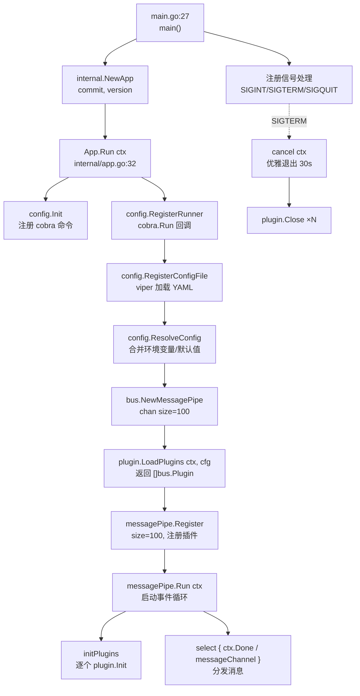
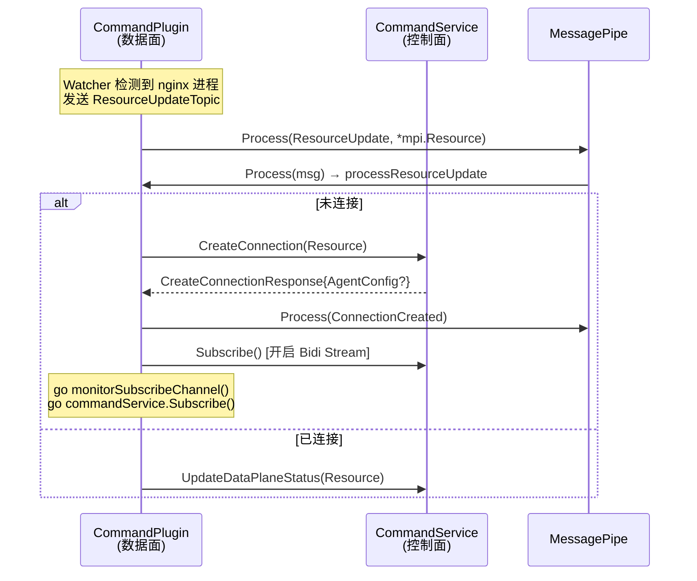
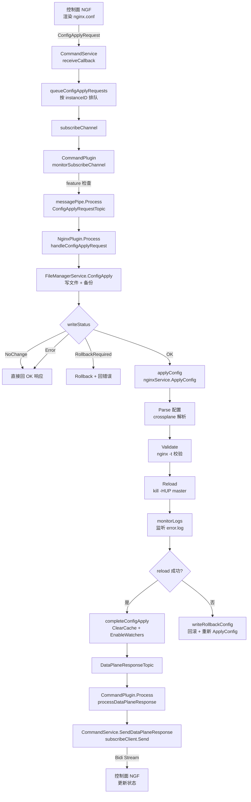
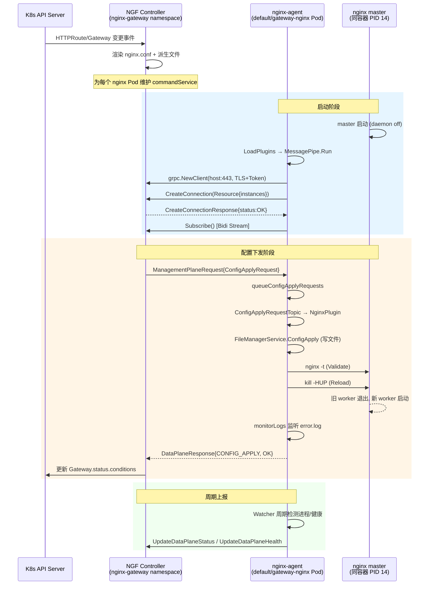

---
tags:
  - nginx-agent
  - source-analysis
  - k8s
  - grpc
  - plugin-architecture
aliases:
  - NGINX Agent 工作原理
  - Agent 与控制面交互
date: 2026-06-26
---

# NGINX Agent v3 启动流程与控制面协同分析

> [!abstract] 核心结论
> NGINX Agent 是一个基于 **消息总线 + 插件模式** 的 Go 应用，以独立进程运行在 NGINX 数据面 Pod 内（与 nginx master 同容器）。它通过 **gRPC 双向流（Bidi Streaming）** 连接到 NGINX Gateway Fabric（NGF）控制面，以 `CreateConnection` 建立连接、`Subscribe` 长连接接收 `ManagementPlaneRequest`，由 `CommandPlugin` 分发到消息总线，`NginxPlugin` 消费 `ConfigApplyRequest` 完成 **写文件 → 校验 → reload → 回响应** 的闭环，从而实现对 NGINX 实例的远程管理。

---

## 1. 环境事实依据

> [!info] 以下结论全部来自当前 kind 集群的实际资源，非推测。

### 1.1 集群拓扑

| 节点 | 角色 | 版本 |
|------|------|------|
| `ngf-demo-control-plane` | control-plane | v1.31.0 / containerd 1.7.18 |

### 1.2 关键命名空间与工作负载

| Namespace | 资源 | 镜像 | 角色 |
|-----------|------|------|------|
| `nginx-gateway` | `deploy/ngf-nginx-gateway-fabric` | `ghcr.io/nginx/nginx-gateway-fabric:2.6.5` | **控制面**（NGF Controller） |
| `default` | `deploy/gateway-nginx` | `ghcr.io/nginx/nginx-gateway-fabric/nginx:2.6.5` | **数据面**（NGINX + Agent） |
| `default` | `deploy/coffee`, `deploy/tea` | — | 后端示例服务（cafe.example.com） |

### 1.3 控制面暴露的 gRPC 服务

```yaml
# kubectl get svc -n nginx-gateway
name: ngf-nginx-gateway-fabric
ports:
  - name: agent-grpc
    port: 443          # 对外端口
    targetPort: 8443   # 容器端口
```

NGF Controller 启动参数（节选）：

```
controller
  --gateway-ctlr-name=gateway.nginx.org/nginx-gateway-controller
  --gatewayclass=nginx
  --agent-tls-secret=agent-tls
  --metrics-port=9113
  --health-port=8081
```

### 1.4 数据面 Pod 进程实证

> [!important] 关键发现：Agent 不是 Sidecar 容器，而是与 NGINX 同容器共存的多进程

`kubectl exec ... -- ps aux` 输出：

```
PID  USER    COMMAND
 1   nginx   {entrypoint.sh} /bin/bash /agent/entrypoint.sh
14   nginx   nginx: master process /usr/sbin/nginx -g daemon off;
24   nginx   nginx-agent                              ← Agent 进程
77-84 nginx   nginx: worker process (×8)
```

`entrypoint.sh` 在启动 nginx master 后拉起 `nginx-agent` 进程，二者共享网络命名空间与文件系统（`/etc/nginx` 等卷）。

### 1.5 Agent 配置文件（实证）

`/etc/nginx-agent/nginx-agent.conf`（来自 init container 从 `/agent/nginx-agent.conf` 拷贝）：

```yaml
command:
  server:
    host: ngf-nginx-gateway-fabric.nginx-gateway.svc   # 控制面 Service DNS
    port: 443
  auth:
    tokenpath: /var/run/secrets/ngf/serviceaccount/token
  tls:
    cert: /var/run/secrets/ngf/tls.crt
    key:  /var/run/secrets/ngf/tls.key
    ca:   /var/run/secrets/ngf/ca.crt
    server_name: ngf-nginx-gateway-fabric.nginx-gateway.svc
allowed_directories:
  - /etc/nginx
  - /usr/share/nginx
  - /var/run/nginx
features: [configuration, certificates, metrics]
labels:
  cluster-id: 55d0f802-6c05-4c70-887a-775ccaf119f5
  control-id: 77889ff5-3dcd-4e41-aaa6-7b2bb8117006
  owner-name: default_gateway-nginx
  product-type: ngf
collector:
  exporters:
    prometheus:
      server: { host: "0.0.0.0", port: 9113 }
  pipelines:
    metrics:
      default:
        receivers: ["host_metrics", "nginx_metrics"]
        exporters: ["prometheus"]
```

### 1.6 运行时日志实证

控制面日志（`kubectl logs deploy/ngf-nginx-gateway-fabric`）：

```
nginxUpdater.commandService: Creating connection for nginx pod: gateway-nginx-5f95f75958-tn9fw
nginxUpdater.commandService: Successfully connected to nginx agent
nginxUpdater.commandService: Sending initial configuration to agent
nginxUpdater.commandService: Successfully configured nginx for new subscription
eventHandler: NGINX configuration was successfully updated
```

Agent 日志（`kubectl logs gateway-nginx-... -c nginx`）：

```
Creating connection to management plane server  server_address=ngf-nginx-gateway-fabric.nginx-gateway.svc:443
Credential watcher has detected changes
Connection created  response=response:{status:COMMAND_STATUS_OK}
Agent connected
Received management plane config apply request
Sending data plane response message  message="Config apply successful, no files to change"  status=COMMAND_STATUS_OK
```

---

## 2. 完整启动流程



### 2.1 入口与信号处理

> [!note] 代码位置：`cmd/agent/main.go:27`

```go
func main() {
    ctx, cancel := context.WithCancel(context.Background())
    sigChan := make(chan os.Signal, 1)
    signal.Notify(sigChan, syscall.SIGINT, syscall.SIGTERM, syscall.SIGQUIT)
    go func() {
        select {
        case <-sigChan:
            cancel()
            time.Sleep(config.DefGracefulShutdownPeriod) // 30s 优雅期
            os.Exit(1)
        case <-ctx.Done():
        }
    }()
    app := internal.NewApp(commit, version)
    err := app.Run(ctx)
}
```

**设计要点**：`commit`/`version` 通过 `-ldflags` 在 `make build` 时注入；信号触发 cancel 后，消息总线的事件循环会走 `ctx.Done()` 分支，逐个调用 `plugin.Close`。

### 2.2 App.Run：配置 → 总线 → 插件 → 运行

> [!note] 代码位置：`internal/app.go:32`

```go
func (a *App) Run(ctx context.Context) error {
    config.Init(a.version, a.commit)
    config.RegisterRunner(func(_ *cobra.Command, _ []string) {
        config.RegisterConfigFile()              // 加载 nginx-agent.conf
        agentConfig, _ := config.ResolveConfig() // 合并配置
        messagePipe := bus.NewMessagePipe(100, agentConfig)
        messagePipe.Register(100, plugin.LoadPlugins(ctx, agentConfig))
        messagePipe.Run(ctx)
    })
    return config.Execute(ctx)
}
```

启动链路（按顺序）：

| 步骤 | 文件:行号 | 说明 |
|------|-----------|------|
| 1 | `cmd/agent/main.go:27` | 创建 ctx + 信号监听 |
| 2 | `internal/app.go:33` | `config.Init` 注册 cobra 根命令 |
| 3 | `internal/app.go:36` | `RegisterConfigFile` viper 读 YAML |
| 4 | `internal/app.go:42` | `ResolveConfig` 合并 env（前缀 `NGINX_AGENT_`） |
| 5 | `internal/app.go:53` | `bus.NewMessagePipe(100, cfg)` |
| 6 | `internal/app.go:54` | `plugin.LoadPlugins` 装配插件切片 |
| 7 | `internal/app.go:60` | `messagePipe.Run(ctx)` 阻塞事件循环 |

---

## 3. 消息总线 + 插件架构

### 3.1 核心抽象

> [!note] 代码位置：`internal/bus/message_pipe.go:22-65`

```go
type Plugin interface {
    Init(ctx context.Context, messagePipe MessagePipeInterface) error
    Close(ctx context.Context) error
    Info() *Info
    Process(ctx context.Context, msg *Message)
    Subscriptions() []string
    Reconfigure(ctx context.Context, agentConfig *config.Config) error
}

type MessagePipe struct {
    agentConfig    *config.Config
    bus            messagebus.MessageBus   // 三方库的发布订阅
    messageChannel chan *MessageWithContext // 带缓冲通道 size=100
    plugins        []Plugin
    pluginsMutex   sync.Mutex
    configMutex    sync.Mutex
}
```

`Message` = `{Topic string, Data Payload{}}`，所有跨插件协作通过 Topic 路由。

### 3.2 插件装载

> [!note] 代码位置：`internal/plugin/plugin_manager.go:28`

```go
func LoadPlugins(ctx, cfg) []bus.Plugin {
    plugins := make([]bus.Plugin, 0)
    manifestLock := &sync.RWMutex{}
    plugins = addCommandAndNginxPlugins(...)   // ① Command + Nginx（主控制面）
    plugins = addAuxiliaryCommandAndNginxPlugins(...) // ② 可选辅助控制面
    plugins = addCollectorPlugin(...)          // ③ OTel Collector
    plugins = addWatcherPlugin(...)            // ④ 文件/进程/健康监控
    return plugins
}
```

本环境实际加载的插件（依据配置 `features: [configuration, certificates, metrics]`）：

| 插件 | Info().Name | 订阅 Topic | 职责 |
|------|-------------|-----------|------|
| `CommandPlugin` | `command` | `ConnectionReset`, `ResourceUpdate`, `InstanceHealth`, `DataPlaneHealthResponse`, `DataPlaneResponse` | gRPC 控制面客户端 |
| `NginxPlugin` | `nginx` | `APIAction`, `ConnectionReset`, `ConnectionCreated`, `NginxConfigUpdate`, `ConfigUpload`, `ResourceUpdate`, `ConfigApplyRequest` | NGINX 实例管理 |
| `Collector` | `otel-collector` | `ResourceUpdate`, `NginxConfigUpdate` | OTel 指标采集 |
| `Watcher` | `watcher` | `ConfigApplyRequest`, `DataPlaneHealthRequest`, `EnableWatchers`, `AgentConfigUpdate` | 进程/文件/健康/凭据监控 |

### 3.3 事件循环

> [!note] 代码位置：`internal/bus/message_pipe.go:124`

```go
func (p *MessagePipe) Run(ctx context.Context) {
    p.initPlugins(ctx)   // 调用每个 Plugin.Init
    for {
        select {
        case <-ctx.Done():
            for _, r := range p.plugins { r.Close(ctx) }
            return
        case m := <-p.messageChannel:
            switch m.message.Topic {
            case AgentConfigUpdateTopic:          // 特殊话题：配置热更新
                p.handleAgentConfigUpdateTopic(...)
            case ConnectionAgentConfigUpdateTopic:
                p.handleConnectionAgentConfigUpdateTopic(...)
            default:
                p.bus.Publish(m.message.Topic, m.ctx, m.message) // 发布到订阅者
            }
        }
    }
}
```

> [!tip] 两种消息路径
> - **普通 Topic**：`Process()` → `messageChannel` → `bus.Publish` → 各订阅者 `Plugin.Process`
> - **配置更新 Topic**：由 `MessagePipe` 直接处理，遍历插件调用 `Reconfigure`，失败则回滚到旧配置并发送失败响应

---

## 4. gRPC 控制面交互（MPI 协议）

### 4.1 连接建立

> [!note] 代码位置：`internal/grpc/grpc.go:73`

```go
func NewGrpcConnection(ctx, cfg, commandConfig) (*GrpcConnection, error) {
    serverAddr := serverAddress(ctx, commandConfig) // host:port
    grpcConnection.conn, err = grpc.NewClient(serverAddr,
        DialOptions(agentConfig, commandConfig, resourceID)...)
}
```

实证地址：`ngf-nginx-gateway-fabric.nginx-gateway.svc:443`，使用 TLS（`tls.crt`/`tls.key`/`ca.crt` 来自 Secret `agent-tls`）+ ServiceAccount Token 认证。

`GrpcConnection` 暴露两个 gRPC 客户端：
- `CommandServiceClient()` → `mpi.CommandServiceClient`（命令通道）
- `FileServiceClient()` → `mpi.FileServiceClient`（文件通道）

### 4.2 MPI gRPC 服务定义

> [!note] 代码位置：`api/grpc/mpi/v1/command_grpc.pb.go`

```protobuf
service CommandService {
  rpc CreateConnection(CreateConnectionRequest) returns (CreateConnectionResponse);
  rpc UpdateDataPlaneStatus(UpdateDataPlaneStatusRequest) returns (UpdateDataPlaneStatusResponse);
  rpc UpdateDataPlaneHealth(UpdateDataPlaneHealthRequest) returns (UpdateDataPlaneHealthResponse);
  rpc Subscribe(stream DataPlaneResponse) returns (stream ManagementPlaneRequest); // Bidi
}
```

### 4.3 连接 + 订阅时序



### 4.4 双向流的两个方向

> [!note] 代码位置：`internal/command/command_service.go:197` & `internal/command/command_plugin.go:328`

**① 下行（控制面 → Agent）**：`Subscribe` 流的 `Recv()`

```go
func (cs *CommandService) receiveCallback(ctx) func() error {
    return func() error {
        request, _ := cs.subscribeClient.Recv()
        if cs.isValidRequest(ctx, request) {
            switch request.GetRequest().(type) {
            case *mpi.ManagementPlaneRequest_ConfigApplyRequest:
                cs.queueConfigApplyRequests(ctx, request) // 串行化排队
            default:
                cs.subscribeChannel <- request            // 直接入 channel
            }
        }
    }
}
```

`monitorSubscribeChannel` goroutine 从 channel 取出请求，按类型分发：

| ManagementPlaneRequest 类型 | 处理 | 转发的 Topic |
|----------------------------|------|--------------|
| `ConfigApplyRequest` | `handleConfigApplyRequest` | `ConfigApplyRequestTopic` |
| `ConfigUploadRequest` | `handleConfigUploadRequest` | `ConfigUploadRequestTopic` |
| `HealthRequest` | `handleHealthRequest` | `DataPlaneHealthRequestTopic` |
| `ActionRequest` | `handleAPIActionRequest` | `APIActionRequestTopic` |
| `UpdateAgentConfigRequest` | 直接发 | `AgentConfigUpdateTopic` |

**② 上行（Agent → 控制面）**：`Subscribe` 流的 `Send()`

```go
func (cs *CommandService) sendDataPlaneResponseCallback(ctx, response) func() error {
    return func() error {
        return cs.subscribeClient.Send(response) // 通过同一 Bidi Stream 回传
    }
}
```

> [!important] ConfigApply 串行化机制
> `configApplyRequestQueue` 按 instanceID 维护请求队列。同一实例的并发 ConfigApply 请求会被排队，前一个完成（收到响应）后才把下一个塞入 `subscribeChannel`，避免并发写配置导致文件冲突。见 `command_service.go:325` `handleConfigApplyResponse`。

---

## 5. NGINX 实例管理流程（ConfigApply 闭环）

### 5.1 端到端流程图



### 5.2 关键代码路径

#### 5.2.1 文件写入（FileManagerService.ConfigApply）

> [!note] 代码位置：`internal/file/file_manager_service.go:162`

```go
func (fms *FileManagerService) ConfigApply(ctx, req) (model.WriteStatus, error) {
    // 1. 校验文件是否在 allowed_directories 内
    fms.checkAllowedDirectory(fileOverview.GetFiles())
    // 2. 校验并更新文件权限
    fms.validateAndUpdateFilePermissions(...)
    // 3. 对比内存中的 currentFilesOnDisk，计算 diff
    diffFiles, _ := fms.DetermineFileActions(...)
    if len(diffFiles) == 0 { return model.NoChange, nil }
    // 4. 备份现有文件（用于回滚）
    fms.backupFiles(ctx)
    // 5. 执行文件操作（写入/删除/覆盖）
    fms.executeFileActions(ctx)
    // 6. 更新磁盘文件缓存
    fms.UpdateCurrentFilesOnDisk(...)
    return model.OK, nil
}
```

**安全约束**：只允许写 `allowed_directories`（实证配置为 `/etc/nginx`、`/usr/share/nginx`、`/var/run/nginx`），防止越权写文件。

#### 5.2.2 配置校验 + Reload（NginxService.ApplyConfig）

> [!note] 代码位置：`internal/nginx/nginx_service.go:138`

```go
func (n *NginxService) ApplyConfig(ctx, instanceID) (*model.NginxConfigContext, error) {
    instance := findInstance(instanceID)
    nginxConfigContext, _ := n.nginxConfigParser.Parse(ctx, instance) // crossplane 解析
    datasource.UpdateNginxInstanceRuntime(instance, nginxConfigContext)
    n.instanceOperator.Validate(ctx, instance)   // 等价 nginx -t
    n.instanceOperator.Reload(ctx, instance)     // 发 HUP 信号
    // reload 后重新查找 StubStatus / PlusAPI
    return nginxConfigContext, nil
}
```

#### 5.2.3 Reload 实现细节

> [!note] 代码位置：`internal/nginx/nginx_instance_operator.go:65`

```go
func (i *NginxInstanceOperator) Reload(ctx, instance) error {
    pid := instance.GetInstanceRuntime().GetProcessId()
    workers := i.nginxProcessOperator.NginxWorkerProcesses(ctx, pid)
    createdTime := workers[0].Created          // 记录旧 worker 创建时间
    errorLogs := i.errorLogs(instance)
    go i.monitorLogs(ctx, errorLogs, logErrorChannel) // goroutine tail error.log
    i.executer.KillProcess(pid)                // 实为 kill -HUP
    processes, _ := i.nginxProcessOperator.FindNginxProcesses(ctx)
    i.checkWorkers(ctx, instanceID, createdTime, processes) // 验证 worker 重启
    // 等待 logErrorChannel 的结果
}
```

**Reload 机制**：向 master 发送 `SIGHUP`，nginx 会优雅 reload（旧 worker 处理完当前连接后退出，新 worker 用新配置启动）。Agent 通过对比 worker 进程的 `Created` 时间戳判断是否成功重启，同时 tail error.log 捕获 reload 期间的报错。

#### 5.2.4 完成与响应（completeConfigApply）

> [!note] 代码位置：`internal/nginx/nginx_plugin.go:624`

```go
func (n *NginxPlugin) completeConfigApply(ctx, configContext, dpResponse) {
    n.fileManagerService.ClearCache()
    n.enableWatchers(ctx, configContext, dpResponse.GetInstanceId()) // 通知 Watcher 重新启用
    n.messagePipe.Process(ctx, &bus.Message{
        Topic: bus.DataPlaneResponseTopic, Data: dpResponse,         // 回响应
    })
}
```

`DataPlaneResponseTopic` 被 `CommandPlugin` 订阅，最终通过 `subscribeClient.Send()` 经 gRPC Bidi Stream 回传控制面。

### 5.3 回滚机制

`WriteStatus` 有四种：

| 状态 | 含义 | 处理 |
|------|------|------|
| `OK` | 文件写入成功 | 进入 `applyConfig` → reload |
| `NoChange` | 无文件差异 | 直接回 OK（实证日志常见："Config apply successful, no files to change"） |
| `Error` | 写入前失败 | 直接回 FAILURE，不 reload |
| `RollbackRequired` | 写入后/校验失败 | 调 `Rollback` 恢复备份文件 → 再 `ApplyConfig` 应用旧配置 |

---

## 6. 控制面协同全景

### 6.1 双向职责划分

| 维度 | 控制面（NGF Controller） | 数据面（NGINX Agent） |
|------|--------------------------|----------------------|
| **职责** | 监听 K8s Gateway API 资源（Gateway/HTTPRoute/Policy），渲染 nginx.conf | 执行配置下发、reload、上报状态 |
| **进程** | `nginx-gateway` 容器 | `nginx-agent` 进程（同 Pod 内 nginx 容器） |
| **gRPC 角色** | Server（实现 `CommandService`） | Client（调用 `CreateConnection`/`Subscribe`） |
| **配置来源** | K8s API Server | 控制面通过 `ConfigApplyRequest` 下发 |
| **触发频率** | 资源变更时 | 收到请求时；Watcher 周期上报状态 |

### 6.2 完整协同时序



---

## 7. 设计原因分析

### 7.1 为什么 Agent 与 NGINX 同容器而非 Sidecar？

> [!question]- 约束与选择
> **约束**：Agent 需要（1）直接读 `/etc/nginx` 配置文件做 crossplane 解析；（2）通过信号控制 nginx master 进程；（3）tail error.log。
>
> **方案对比**：
> 1. **Sidecar 容器** → 需共享 PID namespace 和 emptyDir 卷，且 `kill -HUP` 跨容器不可行（除非共享 process namespace，有安全顾虑）
> 2. **同容器多进程**（当前选择） → 共享文件系统 + PID 命名空间天然满足，卷挂载简单
>
> **选择原因**：NGF 场景下 Agent 与 NGINX 强耦合（配置/进程/日志），同容器最简洁。代价是镜像需同时包含 nginx 和 nginx-agent 二进制。

### 7.2 为什么用消息总线而非直接调用？

> [!question]- 约束与选择
> **约束**：需要支持（1）插件可插拔（auxiliary 控制面、metrics、watcher 等可选）；（2）配置热更新不影响连接；（3）多插件对同一事件的响应。
>
> **方案对比**：
> 1. **直接 import 调用** → 强耦合，新增功能需改核心，测试困难
> 2. **消息总线 + 订阅**（当前选择） → 插件只依赖 `bus.MessagePipeInterface`，通过 Topic 解耦
>
> **选择原因**：`internal/` 插件互相不 import，只依赖 `internal/bus`。`CommandPlugin` 不知道 `NginxPlugin` 存在，只发 `ConfigApplyRequestTopic`。新增插件零改动核心。代价是调试链路较长（需追踪 Topic 流转）。

### 7.3 为什么 ConfigApply 要串行化排队？

> [!question]- 约束与选择
> **约束**：`FileManagerService` 在内存维护 `currentFilesOnDisk` 缓存和 `fileActions`，并发写会导致缓存不一致和文件覆盖冲突。
>
> **选择**：`configApplyRequestQueue` 按 `instanceID` 维护 FIFO 队列，同一实例的请求只有前一个 `DataPlaneResponse` 回传后才把下一个塞入 `subscribeChannel`。见 `command_service.go:509`。
>
> **代价**：高并发下延迟累积，但 NGF 场景每 Pod 单实例，串行化是正确权衡。

### 7.4 为什么用 Bidi Streaming 而非单向 RPC？

> [!question]- 约束与选择
> **约束**：控制面需要（1）主动推送配置到 Agent；（2）接收 Agent 的响应/状态上报；（3）保持长连接减少重连开销。
>
> **方案对比**：
> 1. **多个单向 RPC** → 控制面无法主动推，需 Agent 轮询
> 2. **Bidi Streaming**（当前选择） → 一条流双向传，控制面可随时推 `ManagementPlaneRequest`，Agent 可随时回 `DataPlaneResponse`
>
> **选择原因**：`Subscribe` 一个 RPC 满足双向需求，配合 `backoff.Retry` 实现断线重连。`CreateConnection` 单独 RPC 用于初始握手（因为 Subscribe 需要 Resource 已就绪）。

---

## 8. 总结

### 角色职责矩阵

| 角色 | 职责 | 关键代码 |
|------|------|---------|
| `main.go` | 入口、信号处理、优雅退出 | `cmd/agent/main.go:27` |
| `App.Run` | 装配配置 → 总线 → 插件 → 运行 | `internal/app.go:32` |
| `MessagePipe` | 事件循环、Topic 路由、配置热更新 | `internal/bus/message_pipe.go:124` |
| `plugin.LoadPlugins` | 按配置装配 4 类插件 | `internal/plugin/plugin_manager.go:28` |
| `CommandPlugin` | gRPC 客户端、请求分发、响应回传 | `internal/command/command_plugin.go` |
| `CommandService` | CreateConnection、Subscribe Bidi、请求排队 | `internal/command/command_service.go` |
| `NginxPlugin` | ConfigApply 协调、回滚、enableWatchers | `internal/nginx/nginx_plugin.go:106` |
| `NginxService` | 配置解析、Validate、Reload | `internal/nginx/nginx_service.go:138` |
| `NginxInstanceOperator` | `nginx -t`、`kill -HUP`、log 监控 | `internal/nginx/nginx_instance_operator.go:65` |
| `FileManagerService` | 文件 diff、备份、写入、回滚 | `internal/file/file_manager_service.go:162` |
| `Watcher` | 进程/文件/健康/凭据周期监控 | `internal/watcher/watcher_plugin.go:96` |
| `Collector` | OTel 指标采集（Prometheus 9113） | `internal/collector/otel_collector_plugin.go:121` |
| `GrpcConnection` | TLS 拨号、Client 工厂 | `internal/grpc/grpc.go:73` |

### 关键 Topic 速查

| Topic | 发布者 | 订阅者 | 用途 |
|-------|--------|--------|------|
| `ResourceUpdateTopic` | Watcher | Command, Nginx, Collector | 资源/实例变更 |
| `ConnectionCreatedTopic` | CommandPlugin | Nginx | 连接建立通知 |
| `ConnectionResetTopic` | Watcher(凭据变更) | Command, Nginx | TLS 重连 |
| `ConfigApplyRequestTopic` | CommandPlugin | Nginx, Watcher | 配置下发 |
| `ConfigUploadRequestTopic` | CommandPlugin | Nginx | 文件上传 |
| `DataPlaneResponseTopic` | Nginx, Command | Command | 回传控制面 |
| `EnableWatchersTopic` | Nginx | Watcher | reload 后重启用监控 |
| `NginxConfigUpdateTopic` | Watcher | Nginx, Collector | 配置文件变更 |
| `AgentConfigUpdateTopic` | CommandPlugin | MessagePipe(直接处理) | Agent 配置热更新 |

---

## 9. 验证方法

> [!tip] 可复现的验证命令

```bash
# 1. 查看数据面 Pod 进程（确认 agent 与 nginx 同容器）
kubectl exec -n default gateway-nginx-5f95f75958-tn9fw -c nginx -- ps aux

# 2. 查看 Agent 配置（确认控制面地址）
kubectl exec -n default gateway-nginx-5f95f75958-tn9fw -c nginx -- cat /etc/nginx-agent/nginx-agent.conf

# 3. 实时观察 Agent 日志（看 CreateConnection + ConfigApply）
kubectl logs -n default gateway-nginx-5f95f75958-tn9fw -c nginx -f

# 4. 实时观察控制面日志（看 nginxUpdater.commandService）
kubectl logs -n nginx-gateway deploy/ngf-nginx-gateway-fabric -f

# 5. 触发一次配置变更（创建/修改 HTTPRoute）观察闭环
kubectl apply -f - <<EOF
apiVersion: gateway.networking.k8s.io/v1
kind: HTTPRoute
metadata:
  name: test-trigger
  namespace: default
spec:
  parentRefs:
    - name: gateway
  hostnames: ["test.example.com"]
  rules:
    - backendRefs:
        - name: coffee
          port: 8080
EOF
```

---

## 10. 相关文档

- [[architecture]] — 项目自带架构文档目录
- [[features]] — 功能特性文档
- [[proto]] — MPI gRPC 协议定义

**上游文档**：
- [NGINX Agent v3 官方文档](https://docs.nginx.com/nginx-one-console/agent/)
- [NGINX Gateway Fabric](https://docs.nginx.com/nginx-gateway-fabric/)
