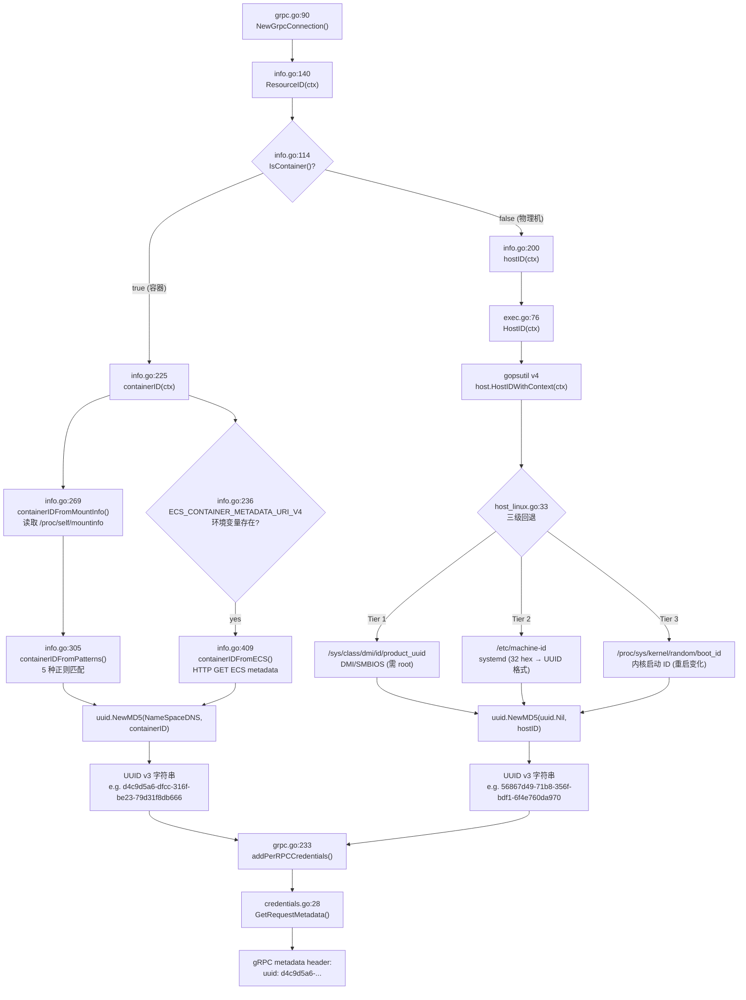

---
tags:
  - nginx-agent
  - source-analysis
  - linux
  - container
  - golang
  - grpc
  - kubernetes
aliases:
  - ResourceID 分析
  - 资源 ID 生成机制
created: 2026-06-30
---

# ResourceID 资源标识生成机制分析

> [!info] 分析对象
> `pkg/host/info.go:140` — `Info.ResourceID(ctx context.Context) (string, error)`
> 以 kind 部署的 NGINX Gateway Fabric (ngf) 为真实案例。

## 核心结论

**`ResourceID` 是 NGINX Agent 向管理面标识自身唯一性的"身份证号"**：它先判断自己运行在物理机还是容器中，在容器里通过解析 `/proc/self/mountinfo` 的 cgroup 挂载路径提取 container ID，在物理机上通过 gopsutil 读取 `/sys/class/dmi/id/product_uuid` → `/etc/machine-id` → `/proc/sys/kernel/random/boot_id` 三级回退拿到 host ID，最终用 UUID v3 (MD5) 算法将原始 ID 哈希为一个稳定的 UUID 字符串，作为 gRPC 每次调用的 `uuid` metadata 头发送给管理面。

---

## 完整调用链



---

## 关键代码位置

| 阶段 | 文件 | 行号 | 说明 |
|------|------|------|------|
| 调用入口 | `internal/grpc/grpc.go` | 90 | `info.ResourceID(ctx)` 获取资源 ID |
| 核心分支 | `pkg/host/info.go` | 140 | `ResourceID` 容器/物理机二选一 |
| 容器检测 | `pkg/host/info.go` | 114 | `IsContainer()` 通过文件 + cgroup 判断 |
| 容器 ID 提取 | `pkg/host/info.go` | 225 | `containerID` 主入口 |
| mountinfo 解析 | `pkg/host/info.go` | 269 | `containerIDFromMountInfo` 读 `/proc/self/mountinfo` |
| 正则匹配 | `pkg/host/info.go` | 305 | `containerIDFromPatterns` 5 种模式 |
| ECS metadata | `pkg/host/info.go` | 409 | `containerIDFromECS` AWS Fargate 兜底 |
| 物理 ID 获取 | `pkg/host/info.go` | 200 | `hostID` 调用 exec 层 |
| exec 层委托 | `pkg/host/exec/exec.go` | 76 | `HostID` 委托给 gopsutil |
| gopsutil Linux 实现 | `gopsutil/v4/host/host_linux.go` | 33 | `HostIDWithContext` 三级回退 |
| UUID 包装 | `pkg/host/info.go` | 206, 230, 238 | `uuid.NewMD5` 生成 UUID v3 |
| gRPC 凭证 | `internal/grpc/grpc.go` | 233 | `addPerRPCCredentials` |
| metadata 发送 | `internal/grpc/credentials.go` | 28 | `GetRequestMetadata` → `uuid` header |

---

## 详细分析

### 1. 入口：`ResourceID` 的二选一策略

```go
// pkg/host/info.go:140
func (i *Info) ResourceID(ctx context.Context) (string, error) {
    isContainer, _ := i.IsContainer()
    if isContainer {
        return i.containerID(ctx)
    }
    return i.hostID(ctx)
}
```

设计意图：**一个 Agent 实例只对应一个资源 ID**。在容器编排环境中，Agent 进程跑在 Pod 里，资源粒度是容器而非节点；在裸金属上，资源粒度是主机。`IsContainer()` 的结果决定走哪条路。

> [!note] 注意
> `IsContainer()` 的 error 被显式忽略 (`isContainer, _ :=`)。即使检测出错，默认走 `hostID` 路径——宁可返回主机 ID 也不阻断启动。

### 2. 容器检测：`IsContainer` 的三重证据

```go
// pkg/host/info.go:114
func (i *Info) IsContainer() (bool, error) {
    // 证据 1: 容器特有文件存在
    for _, filename := range i.containerSpecificFiles {
        if _, err := os.Stat(filename); err == nil {
            return true, nil
        }
    }
    // 证据 2: cgroup 文件包含容器运行时关键字
    ref, err := containsContainerReference(i.selfCgroupLocation)
    if ref {
        return true, nil
    }
    // 证据 3: AWS ECS metadata 环境变量
    if os.Getenv(ecsMetadataEnvV4) != "" {
        return true, nil
    }
    ...
    return false, nil
}
```

#### 证据 1：容器特征文件

| 文件路径 | 常量 | 由谁创建 | 含义 |
|----------|------|----------|------|
| `/.dockerenv` | `dockerEnvLocation` | Docker runtime | Docker 创建容器时写入的空文件 |
| `/run/.containerenv` | `containerEnvLocation` | Podman/CRI-O | Podman 创建容器时写入 |
| `/var/run/secrets/kubernetes.io/serviceaccount` | `k8sServiceAcctLocation` | kubelet | K8s 自动投影的 ServiceAccount 卷 |

> [!tip] Linux 文件系统隔离原理
> 容器的根文件系统 (rootfs) 是一个独立的挂载命名空间 (mount namespace)。但容器使用的是**联合文件系统** (OverlayFS) 的隔离层——宿主机上的 `/.dockerenv` 不会出现在容器里，Docker 在容器 rootfs 顶层专门创建这个文件作为"我在容器里"的标记。`os.Stat` 使用 `stat` 系统调用，穿越 Go 运行时 → glibc → 内核 VFS，只看到当前 mount namespace 的视图。

#### 证据 2：cgroup 文件关键字

```go
// pkg/host/info.go:248
func containsContainerReference(cgroupFile string) (bool, error) {
    data, err := os.ReadFile(cgroupFile)  // /proc/self/cgroup
    ...
    for scanner.Scan() {
        line := strings.TrimSpace(scanner.Text())
        if strings.Contains(line, k8sKind) || strings.Contains(line, docker) ||
           strings.Contains(line, containerd) || strings.Contains(line, ecsPrefix) ||
           strings.Contains(line, fargate) {
            return true, nil
        }
    }
    return false, nil
}
```

匹配的关键字：`kubepods`、`docker`、`containerd`、`ecs`、`fargate`。

> [!info] /proc/self/cgroup 的含义
> Linux cgroup (control group) 是内核机制，用于限制和隔离进程组的资源 (CPU、内存、IO 等)。`/proc/self/cgroup` 列出当前进程所属的 cgroup 层级路径。容器运行时 (containerd/CRI-O/Docker) 会为每个容器创建特定路径格式的 cgroup，路径中包含运行时名称和容器 ID，因此 cgroup 路径天然携带"我在容器里"的证据。
>
> **cgroup v1 vs v2**：
> - v1：多行，每行一个子系统 (`cpu`, `memory`, `blkio`...)，路径格式如 `/docker/<containerID>`
> - v2 (unified)：单行，格式 `0::/<path>`，路径格式如 `/kubelet.slice/.../cri-containerd-<containerID>.scope`

### 3. 容器 ID 提取：`containerID` 的双重来源

```go
// pkg/host/info.go:225
func (i *Info) containerID(ctx context.Context) (string, error) {
    var errs error
    // 来源 1: /proc/self/mountinfo (主要)
    if containerIDMount, err := containerIDFromMountInfo(i.mountInfoLocation); err == nil && containerIDMount != "" {
        return uuid.NewMD5(uuid.NameSpaceDNS, []byte(containerIDMount)).String(), nil
    } else if err != nil {
        errs = errors.Join(errs, err)
    }
    // 来源 2: AWS ECS metadata endpoint (兜底)
    if metadataURI := os.Getenv(ecsMetadataEnvV4); metadataURI != "" {
        if cid, err := i.containerIDFromECS(ctx, metadataURI); err == nil && cid != "" {
            return uuid.NewMD5(uuid.NameSpaceDNS, []byte(cid)).String(), nil
        } else if err != nil {
            errs = errors.Join(errs, err)
        }
    }
    return "", errs
}
```

#### 来源 1：`/proc/self/mountinfo` 正则解析

`/proc/self/mountinfo` 是 Linux procfs 提供的当前进程挂载信息表，每行描述一个挂载点。容器运行时会将 cgroup、hostname、resolv.conf 等以 bind mount 方式挂入容器，这些挂载路径中往往包含 container ID。

**5 种正则模式** (`pkg/host/info.go:54-69`)：

| 模式 | 正则 | 示例匹配 | 运行时 |
|------|------|----------|--------|
| `scopePattern` | `` /.+-(.+?).scope$ `` | `cri-containerd-aaac5e95...c12.scope` | containerd (cgroup v2) |
| `basePattern` | `/([a-f0-9]{64})$` | `/docker/f244832c...c8` | Docker (cgroup v1) |
| `colonPattern` | `:([a-f0-9]{64})$` | `:cri-containerd:d4e8e05a...f80` | containerd (cgroup v1) |
| `containersPattern` | `containers/([a-f0-9]{64})` | `containers/ba0be900...b7e` | Podman/CRI-O |
| `containerdPattern` | `sandboxes/([a-f0-9]{64})` | `sandboxes/d7cb24ec...aec` | containerd sandbox |

> [!warning] container ID 长度校验
> `containsContainerID` 检查 `len(slices[1]) == 64`。64 字符是 SHA-256 哈希的十六进制表示长度——这是 containerd/CRI-O 生成的 container ID 格式。Docker 的 container ID 也是 64 字符十六进制。这起到了"长度即校验"的作用，避免误匹配短字符串。

> [!warning] 潜在的顺序依赖问题
> `containerIDFromMountInfo` 逐行扫描，返回**第一个**匹配。如果 sandbox (pause container) 的挂载行出现在应用容器的 cgroup 挂载行之前，`containerdPattern` 可能先匹配到 sandbox ID 而非应用容器 ID。在 kind/containerd 环境中，cgroup 挂载行通常先出现，因此实际能正确返回应用容器 ID，但这依赖于 mountinfo 行序——一个实现上的脆弱点。

#### 来源 2：AWS ECS Metadata Endpoint

```go
// pkg/host/info.go:409
func (i *Info) containerIDFromECS(ctx context.Context, uri string) (string, error) {
    req, err := http.NewRequestWithContext(ctx, http.MethodGet, uri, nil)
    ...
    var metadata struct {
        DockerId string `json:"DockerId"`
    }
    json.NewDecoder(resp.Body).Decode(&metadata)
    return metadata.DockerId, nil
}
```

AWS ECS Fargate 环境下，`ECS_CONTAINER_METADATA_URI_V4` 环境变量指向一个 HTTP endpoint，返回容器元数据 JSON。这是 Fargate 的特殊机制——Fargate 不一定有标准 cgroup/mountinfo 结构，需要通过 metadata API 获取容器 ID。

### 4. 物理 ID 获取：gopsutil 的三级回退

```go
// pkg/host/info.go:200
func (i *Info) hostID(ctx context.Context) (string, error) {
    hostID, err := i.exec.HostID(ctx)
    if err != nil {
        return "", err
    }
    return uuid.NewMD5(uuid.Nil, []byte(hostID)).String(), err
}
```

`exec.HostID` 直接委托给 `gopsutil/v4/host.HostIDWithContext(ctx)`：

```go
// pkg/host/exec/exec.go:76
func (*Exec) HostID(ctx context.Context) (string, error) {
    return host.HostIDWithContext(ctx)
}
```

gopsutil 在 Linux 上的实现 (`host_linux.go:33-63`) 采用**三级回退策略**：

```go
func HostIDWithContext(ctx context.Context) (string, error) {
    sysProductUUID := common.HostSysWithContext(ctx, "class/dmi/id/product_uuid")
    machineID := common.HostEtcWithContext(ctx, "machine-id")
    procSysKernelRandomBootID := common.HostProcWithContext(ctx, "sys/kernel/random/boot_id")
    switch {
    // Tier 1: DMI/SMBIOS 产品 UUID (需 root + 硬件支持)
    case common.PathExists(sysProductUUID):
        lines, _ := common.ReadLines(sysProductUUID)
        if err == nil && len(lines) > 0 && lines[0] != "" {
            return strings.ToLower(lines[0]), nil
        }
        fallthrough
    // Tier 2: systemd machine-id (32 hex → UUID 格式)
    case common.PathExists(machineID):
        lines, _ := common.ReadLines(machineID)
        if err == nil && len(lines) > 0 && len(lines[0]) == 32 {
            st := lines[0]
            return fmt.Sprintf("%s-%s-%s-%s-%s", st[0:8], st[8:12], st[12:16], st[16:20], st[20:32]), nil
        }
        fallthrough
    // Tier 3: 内核 boot_id (重启后变化)
    default:
        lines, _ := common.ReadLines(procSysKernelRandomBootID)
        if err == nil && len(lines) > 0 && lines[0] != "" {
            return strings.ToLower(lines[0]), nil
        }
    }
    return "", nil
}
```

#### Tier 1：`/sys/class/dmi/id/product_uuid` — DMI/SMBIOS UUID

| 属性 | 说明 |
|------|------|
| 路径 | `/sys/class/dmi/id/product_uuid` |
| 来源 | 内核 DMI (Desktop Management Interface) 驱动从 SMBIOS 表读取 |
| SMBIOS Type | Type 1 (System Information) → UUID 字段 |
| 权限 | 仅 root 可读 (`-r--------`) |
| 稳定性 | 硬件级别唯一，跨重启稳定，跨系统安装稳定 |
| 虚拟化 | VM 供应商设置 (如 VMware 的 `bios.uuid`、KVM 的 SMBIOS UUID) |

> [!info] SMBIOS / DMI 原理
> SMBIOS (System Management BIOS) 是主板固件 (BIOS/UEFI) 提供的结构化硬件信息表。内核通过 `dmi-sysfs` 驱动将其导出到 sysfs。Type 1 结构包含系统 UUID——由厂商写入，用于唯一标识一台物理或虚拟机器。在虚拟化环境中，Hypervisor 负责设置这个 UUID (如 KVM 通过 `-smbios type=1,uuid=...` 传递)。

#### Tier 2：`/etc/machine-id` — systemd 机器标识

| 属性 | 说明 |
|------|------|
| 路径 | `/etc/machine-id` (回退: `/var/lib/dbus/machine-id`) |
| 格式 | 32 字符十六进制 (无连字符) → gopsutil 格式化为 `8-4-4-4-12` UUID |
| 生成时机 | 首次启动时由 systemd 随机生成并持久化 |
| 权限 | 全局可读 (`-r--r--r--`) |
| 稳定性 | 跨重启稳定，但重装系统或删除文件后会重新生成 |

> [!info] systemd machine-id 原理
> `machine-id` 是 systemd 引入的机器唯一标识。系统首次启动时，`systemd-machine-id-setup` 生成一个 128 位随机数，写入 `/etc/machine-id` 并永久保存。它替代了旧的 `/var/lib/dbus/machine-id` (由 D-Bus 创建)。两者格式相同：32 个十六进制字符，本质就是一个 UUID 去掉连字符。
>
> gopsutil 将 32 字符重新格式化为标准 UUID 格式 `xxxxxxxx-xxxx-xxxx-xxxx-xxxxxxxxxxxx`——但这**不是**真正的 UUID v4，只是一个随机 128 位数的 UUID 表示。

#### Tier 3：`/proc/sys/kernel/random/boot_id` — 内核启动 ID

| 属性 | 说明 |
|------|------|
| 路径 | `/proc/sys/kernel/random/boot_id` |
| 格式 | 标准 UUID 格式 `xxxxxxxx-xxxx-xxxx-xxxx-xxxxxxxxxxxx` |
| 生成时机 | 每次内核启动时随机生成 |
| 稳定性 | **仅单次启动内稳定**，重启后变化 |

> [!warning] Tier 3 是"最后手段"
> 注释明确写道 `// Not stable between reboot, but better than nothing`。使用 boot_id 意味着 Agent 每次宿主机重启后 resource ID 都会变化，管理面会认为是一个"新" agent。这在生产中是不理想的——说明 Tier 1 和 Tier 2 都不可用的环境 (如某些嵌入式 Linux、非 systemd 发行版、无 DMI 支持的架构)。

### 5. UUID v3 包装：为什么要再哈希一次？

```go
// 容器路径
uuid.NewMD5(uuid.NameSpaceDNS, []byte(containerID)).String()
// 物理路径
uuid.NewMD5(uuid.Nil, []byte(hostID)).String()
```

`uuid.NewMD5` 实现 RFC 4122 的 **UUID v3** (MD5 哈希 + 命名空间)：

1. 将命名空间 UUID (NameSpaceDNS 或 Nil) 和名称 (container ID 或 host ID) 拼接
2. 计算 MD5 哈希 (128 位)
3. 按 RFC 4122 格式化为 UUID 字符串

> [!note] 为什么用 UUID v3 而非直接返回原始 ID？
> 1. **格式统一**：无论原始 ID 是 64 字符 hex (container) 还是 UUID 格式 (host)，输出都是 `xxxxxxxx-xxxx-xxxx-xxxx-xxxxxxxxxxxx` 格式，管理面无需区分类型
> 2. **不可逆**：MD5 哈希隐藏了原始 container ID / machine-id，防止管理面数据库泄露后反推宿主机标识
> 3. **确定性**：相同输入永远产生相同输出，agent 重启后 resource ID 不变 (前提是底层 ID 不变)
> 4. **命名空间隔离**：容器用 `NameSpaceDNS`，物理机用 `Nil`——即使容器和物理机的原始 ID 相同 (理论上不可能)，生成的 UUID 也不同

> [!note] 命名空间选择差异
> - 容器路径：`uuid.NameSpaceDNS` (`6ba7b810-9dad-11d1-80b4-00c04fd430c8`)
> - 物理路径：`uuid.Nil` (`00000000-0000-0000-0000-000000000000`)
>
> 两个路径使用不同命名空间，确保即使原始 ID 碰巧相同，生成的 UUID 也不会碰撞。这是一个有意的设计选择。

### 6. gRPC 传输：resource ID 如何到达管理面

```go
// internal/grpc/grpc.go:90
info := host.NewInfo()
resourceID, err := info.ResourceID(ctx)
...
grpcConnection.conn, err = grpc.NewClient(serverAddr, DialOptions(agentConfig, commandConfig, resourceID)...)
```

```go
// internal/grpc/grpc.go:233
if commandConfig.Auth != nil {
    opts = addPerRPCCredentials(commandConfig, resourceID, opts)
}
```

```go
// internal/grpc/credentials.go:22
type PerRPCCredentials struct {
    Token string
    ID    string  // resourceID
}

func (t *PerRPCCredentials) GetRequestMetadata(ctx context.Context, uri ...string) (map[string]string, error) {
    return map[string]string{
        TokenKey: t.Token,        // "authorization"
        UUID:     t.ID,           // "uuid"
    }, nil
}

func (t *PerRPCCredentials) RequireTransportSecurity() bool {
    return true  // 强制 TLS
}
```

**每次 gRPC RPC 调用**都会携带 metadata header：
```
authorization: <token>
uuid: d4c9d5a6-dfcc-316f-be23-79d31f8db666
```

管理面通过 `uuid` header 识别"这个请求来自哪个 agent 实例"——这是 agent 注册、心跳、配置下发等所有操作的身份基础。

---

## 真实案例：kind 部署的 ngf

> [!example] 环境信息
> - **K8s 集群**: kind v1.31.0
> - **节点**: `ngf-demo-control-plane` (Debian 12 bookworm, kernel 5.14.0-601.el9)
> - **容器运行时**: containerd 1.7.18
> - **ngf Pod**: `ngf-nginx-gateway-fabric-647df8fcfd-kffz4` (namespace: nginx-gateway)
> - **容器名**: `nginx-gateway`
> - **容器类型**: distroless (无 shell, 无 `ls`/`cat`)

### 实测数据

#### 容器 ID (来自 kubelet)
```
aaac5e952418d5f3a97fff92fd31a623d9efdc5517e1c776200f7d75fdfb9c12
```

#### `/proc/self/cgroup` (cgroup v2, 容器内视图)
```
0::/kubelet.slice/kubelet-kubepods.slice/kubelet-kubepods-besteffort.slice/kubelet-kubepods-besteffort-pod8b6a59d0_730a_4f51_b11c_825bea3e1157.slice/cri-containerd-aaac5e952418d5f3a97fff92fd31a623d9efdc5517e1c776200f7d75fdfb9c12.scope
```
→ 包含 `kubepods` → `IsContainer()` 返回 `true` ✓
→ 包含完整 container ID `aaac5e952418...c12`

#### `/proc/self/mountinfo` (关键行)
```
# 行 546: cgroup 挂载 (scopePattern 匹配)
546 545 0:25 /kubelet.slice/.../cri-containerd-aaac5e952418d5f3a97fff92fd31a623d9efdc5517e1c776200f7d75fdfb9c12.scope /sys/fs/cgroup ro,nosuid,nodev,noexec,relatime - cgroup2 cgroup rw

# 行 549: hostname 挂载 (containerdPattern 匹配, 但因行序在后不会被选中)
549 540 8:17 /var/lib/containerd/.../sandboxes/8bd6ccbde11c2c2cd0d878e86225d8da04be777bf9b4a177820a6b00f049704a/hostname /etc/hostname ro,relatime - xfs /dev/sdb1 rw
```

#### 容器特征文件检测

| 文件 | 存在? | 说明 |
|------|-------|------|
| `/.dockerenv` | ❌ | containerd 不创建此文件 |
| `/run/.containerenv` | ❌ | 非 Podman |
| `/var/run/secrets/kubernetes.io/serviceaccount/` | ✅ | kubelet 自动投影 SA 卷 (含 `ca.crt`, `namespace`, `token`) |
| `/etc/machine-id` | ❌ | distroless 镜像不含此文件 |

→ `IsContainer()` 通过 **证据 1 (k8s SA 文件)** 和 **证据 2 (cgroup 含 `kubepods`)** 均返回 `true`

#### 宿主机标识 (kind 节点, 供对比)

| 来源 | 值 |
|------|-----|
| `/sys/class/dmi/id/product_uuid` | `55e5b3f3-794b-4873-9736-8fdced8591db` |
| `/etc/machine-id` | `9d5007d4e1fc42e1b834f4024f537a39` |
| `/proc/sys/kernel/random/boot_id` | `eeddd677-b9b9-4cba-a54c-6bc69814819e` |

### ResourceID 计算过程

#### 1. `IsContainer()` → `true`

通过 k8s SA 文件 + cgroup `kubepods` 关键字双重确认。

#### 2. `containerID(ctx)` → 解析 mountinfo

`containerIDFromMountInfo` 扫描 `/proc/self/mountinfo`：
- 行 546 的 cgroup 挂载路径匹配 `scopePattern` = `` /.+-(.+?).scope$ ``
- 提取 `slices[1]` = `aaac5e952418d5f3a97fff92fd31a623d9efdc5517e1c776200f7d75fdfb9c12` (64 字符) ✓

#### 3. UUID v3 包装

```
uuid.NewMD5(uuid.NameSpaceDNS, []byte("aaac5e952418d5f3a97fff92fd31a623d9efdc5517e1c776200f7d75fdfb9c12"))
= d4c9d5a6-dfcc-316f-be23-79d31f8db666
```

> [!success] 最终 ResourceID
> `d4c9d5a6-dfcc-316f-be23-79d31f8db666`
>
> 这个 UUID 会作为 `uuid` metadata header 发送给管理面，作为此 ngf agent 实例的唯一标识。

#### 对比：若走物理机路径 (假想)

如果 Agent 直接运行在 kind 节点上 (非容器内)：
1. `IsContainer()` → `false` (无 k8s SA 文件, cgroup 不含 `kubepods`)
2. `hostID()` → gopsutil 读取 `/sys/class/dmi/id/product_uuid` = `55e5b3f3-794b-4873-9736-8fdced8591db` (Tier 1 命中)
3. `uuid.NewMD5(uuid.Nil, []byte("55e5b3f3-794b-4873-9736-8fdced8591db"))`

---

## 设计原因

### 为什么不直接用 container ID 作为 resource ID？

| 约束 | 直接用 container ID | UUID v3 包装 |
|------|---------------------|-------------|
| 格式 | 64 字符 hex，过长且无结构 | 标准 UUID 格式，统一 |
| 隐私 | 暴露原始 container ID | MD5 不可逆 |
| 与物理 ID 格式统一 | 不统一 (64 hex vs UUID) | 统一 (都是 UUID) |
| 确定性 | ✅ | ✅ (MD5 + 固定 namespace) |

### 为什么容器和物理机用不同命名空间？

**约束**：container ID 和 host ID 理论上不会相同 (格式不同)，但设计上需要防御性隔离。
**选择**：容器用 `NameSpaceDNS`，物理机用 `Nil`，确保输出空间完全隔离，即使输入相同也不会碰撞。

### 为什么 `IsContainer()` 的 error 被忽略？

**约束**：Agent 启动时必须获取 resource ID，即使容器检测失败也不应阻断。
**选择**：`isContainer, _ := i.IsContainer()` — 检测出错时默认走 `hostID` 路径。这是"宁可降级也不失败"的策略，因为 host ID 总能从某个 fallback 拿到值。

### 为什么用 gopsutil 而非直接读 `/etc/machine-id`？

**约束**：Agent 需要跨平台 (Linux, macOS, Windows) 且在 Linux 上需要适应不同发行版 (有无 systemd、有无 DMI)。
**选择**：gopsutil 封装了三级回退 + 跨平台逻辑，避免重复造轮子。`pkg/host/exec` 层用接口包装，便于测试 mock。

### 为什么 ECS Fargate 需要特殊处理？

**约束**：AWS Fargate 是 serverless 容器运行时，不暴露标准 cgroup/mountinfo 结构。
**选择**：通过 `ECS_CONTAINER_METADATA_URI_V4` 环境变量检测 Fargate 环境，调用 AWS 提供的 metadata HTTP API 获取 `DockerId`。这是 Fargate 下唯一可靠的 container ID 来源。

---

## 涉及的操作系统知识

### Linux procfs

| 路径 | 内容 | 与 ResourceID 的关系 |
|------|------|---------------------|
| `/proc/self/cgroup` | 当前进程的 cgroup 归属 | 容器检测 (证据 2) |
| `/proc/self/mountinfo` | 当前进程的挂载信息表 | 容器 ID 提取 (主要来源) |
| `/proc/sys/kernel/random/boot_id` | 内核启动随机 UUID | host ID Tier 3 回退 |
| `/proc/<pid>/root/` | 其他进程的 rootfs 视口 | 调试时从宿主机查看容器文件系统 |

### Linux sysfs

| 路径 | 内容 | 与 ResourceID 的关系 |
|------|------|---------------------|
| `/sys/class/dmi/id/product_uuid` | SMBIOS Type 1 UUID | host ID Tier 1 (首选) |

### Linux cgroup

| 概念 | 说明 |
|------|------|
| cgroup v1 | 多层级、多子系统，路径格式 `/docker/<id>` 或 `/kubepods/<id>` |
| cgroup v2 (unified) | 单层级，路径格式 `0::/<path>`，scope 单位 `xxx.scope` |
| kubelet cgroup 驱动 | `kubepods` (或 `kubepods-besteffort`/`kubepods-burstable`) |
| containerd cgroup scope | `cri-containerd-<containerID>.scope` |

### Linux namespace 与容器隔离

| Namespace | 隔离资源 | 与 ResourceID 的关系 |
|-----------|----------|---------------------|
| mount | 文件系统挂载点视图 | 容器内看到的 `/proc/self/mountinfo` 仅含容器挂载 |
| pid | 进程 ID 空间 | 容器内 PID 1 是入口进程 |
| network | 网络栈 | (与 ResourceID 无直接关系) |
| uts | hostname | 容器有独立 hostname (从 sandbox 挂载) |
| ipc | System V / POSIX 消息队列 | (与 ResourceID 无直接关系) |
| user | UID/GID 映射 | (与 ResourceID 无直接关系) |

### K8s 容器特征

| 特征 | 说明 |
|------|------|
| `/.dockerenv` | K8s + containerd 不创建此文件 (仅 Docker 创建) |
| `/var/run/secrets/kubernetes.io/serviceaccount/` | kubelet 自动投影 SA 卷 (含 `ca.crt`, `namespace`, `token`)，所有非 `automountServiceAccountToken: false` 的 Pod 都有 |
| distroless 镜像 | 无 shell、无 `ls`/`cat`，但 Go 程序使用 `os.Stat` 系统调用检测文件不依赖 shell |

### UUID v3 (MD5)

| 属性 | 值 |
|------|-----|
| RFC | RFC 4122 §4.3 |
| 算法 | MD5(namespace_uuid + name) |
| 版本位 | version = 3 (高位 nibble of time_hi_and_version) |
| variant | RFC 4122 (10xx in clock_seq_hi_and_variant) |
| 确定性 | 相同 (namespace, name) → 相同 UUID |
| 不可逆 | MD5 单向哈希 |

---

## 总结

| 角色 | 职责 |
|------|------|
| `ResourceID` (info.go:140) | 总调度：容器/物理机二选一 |
| `IsContainer` (info.go:114) | 容器检测：特征文件 + cgroup 关键字 + ECS 环境变量 |
| `containerID` (info.go:225) | 容器 ID 提取：mountinfo 正则 + ECS metadata API |
| `containerIDFromMountInfo` (info.go:269) | 解析 `/proc/self/mountinfo`，5 种正则匹配 container ID |
| `hostID` (info.go:200) | 物理 ID 提取：委托 gopsutil + UUID v3 包装 |
| `gopsutil HostIDWithContext` (host_linux.go:33) | Linux 三级回退：DMI UUID → machine-id → boot_id |
| `uuid.NewMD5` (info.go:206/230/238) | UUID v3 包装：格式统一 + 不可逆 + 命名空间隔离 |
| `addPerRPCCredentials` (grpc.go:233) | 将 resourceID 注入 gRPC per-RPC 凭证 |
| `PerRPCCredentials` (credentials.go:22) | 每次调用携带 `uuid` metadata header |

> [!quote] 一句话总结
> ResourceID 是 NGINX Agent 的"身份证"——它从 Linux 内核的 cgroup、mountinfo、DMI、systemd machine-id 等底层机制中提取容器或主机的唯一标识，用 UUID v3 哈希包装后，作为 gRPC metadata 中 `uuid` 字段发送给管理面，成为 Agent 注册、心跳、配置下发的身份基础。

---

## 相关文档

- [[nginx-agent-startup-and-architecture-analysis]]
- [[nginx-agent-config-management-analysis]]
- [[nginx-agent-startup-and-control-plane-analysis]]

## 参考链接

- [RFC 4122 - UUID URN](https://tools.ietf.org/html/rfc4122)
- [systemd machine-id](https://www.freedesktop.org/software/systemd/man/machine-id.html)
- [Linux kernel cgroup v2 docs](https://www.kernel.org/doc/html/latest/admin-guide/cgroup-v2.html)
- [SMBIOS Specification](https://www.dmtf.org/standards/smbios)
- [gopsutil](https://github.com/shirou/gopsutil)
- [containerd cgroup paths](https://github.com/containerd/containerd/blob/main/docs/hosts.md)
