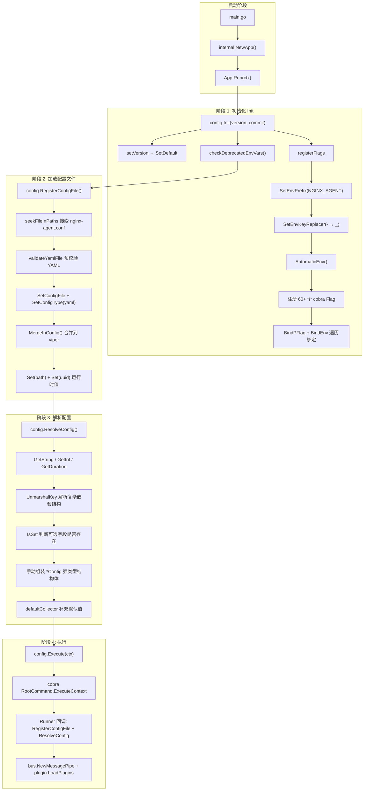
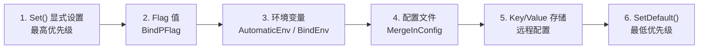

# Viper 配置管理模式分析

> [!abstract] 核心结论
> **Viper** 是 Go 生态中最强大的配置管理库，支持 **文件、命令行参数、环境变量、远程 KV** 等多源合并。本项目（NGINX Agent v3）展示了一套**工业级实践模式**：以 `cobra` 命令行框架注册 flags → 将 flags 绑定到 viper → 加载 YAML 配置文件 → 通过 viper 的类型安全 getter 手动组装强类型 `Config` 结构体。核心设计思想是 **"viper 作为配置总线，手动组装作为类型安全层"**。

---

## 完整流程



---

## 关键代码位置

| 阶段 | 文件 | 行号 | 说明 |
|------|------|------|------|
| Viper 实例创建 | `internal/config/config.go` | 59 | `viper.NewWithOptions(viper.KeyDelimiter("_"))` |
| 环境变量前缀 | `internal/config/config.go` | 417 | `SetEnvPrefix("NGINX_AGENT")` |
| 环境变量替换 | `internal/config/config.go` | 418 | `SetEnvKeyReplacer(strings.NewReplacer("-", "_"))` |
| 自动环境变量 | `internal/config/config.go` | 419 | `AutomaticEnv()` |
| Flag 绑定 | `internal/config/config.go` | 493-501 | `BindPFlag` + `BindEnv` 遍历 |
| 配置文件加载 | `internal/config/config.go` | 992-994 | `SetConfigFile` + `SetConfigType` + `MergeInConfig` |
| YAML 预校验 | `internal/config/config.go` | 1002-1014 | `DisallowUnknownField` 阻止未知字段 |
| 默认值设置 | `internal/config/config.go` | 413 | `SetDefault(VersionKey, version)` |
| 类型安全读取 | `internal/config/config.go` | 151-168 | `GetString` / `GetInt` / `GetStringSlice` |
| 嵌套结构解析 | `internal/config/config.go` | 1605-1612 | `UnmarshalKey` + `mapstructure` |
| 条件存在检查 | `internal/config/config.go` | 1257/1270 | `IsSet` 判断 pipeline 是否配置 |
| 废弃变量检测 | `internal/config/config.go` | 76-107 | 遍历 `os.Environ()` 对比 `AllKeys()` |
| 入口编排 | `internal/app.go` | 33-62 | `Init → RegisterRunner → Execute` |

---

## 详细分析

### 1. Viper 实例创建与分隔符配置

> [!important] 设计决策
> 项目使用 **独立 Viper 实例**（非全局 `viper.Get()`），并通过 `KeyDelimiter("_")` 自定义键分隔符。这避免了与其他库的全局 viper 冲突，且让嵌套键名与 YAML 中的 `snake_case` 自然对应。

```go
// internal/config/config.go:59
var viperInstance = viper.NewWithOptions(viper.KeyDelimiter(KeyDelimiter))

// internal/config/config.go:38-39
const (
    ConfigFileName = "nginx-agent.conf"
    EnvPrefix      = "NGINX_AGENT"
    KeyDelimiter   = "_"
)
```

> [!tip] 为什么要自定义 KeyDelimiter？
> Viper 默认用 `.` 作为键分隔符。但在 YAML 中，嵌套键通常用 `snake_case`（如 `client.grpc.timeout`）。用 `_` 作分隔符后，`client_grpc_timeout` 就能正确映射到 YAML 中的 `client.grpc.timeout` 嵌套结构。这与环境变量 `NGINX_AGENT_CLIENT_GRPC_TIMEOUT` 的命名也保持一致。

---

### 2. 环境变量绑定三件套

这是 viper 最强大的特性之一 —— **自动将环境变量映射到配置键**。

```go
// internal/config/config.go:417-419
func registerFlags() {
    viperInstance.SetEnvPrefix(EnvPrefix)                        // ① 前缀: NGINX_AGENT
    viperInstance.SetEnvKeyReplacer(strings.NewReplacer("-", "_")) // ② - → _ 替换
    viperInstance.AutomaticEnv()                                  // ③ 开启自动环境变量
    // ...
}
```

> [!example] 环境变量映射规则
> 设置 `SetEnvPrefix("NGINX_AGENT")` + `AutomaticEnv()` 后：
>
> | 配置键 | 环境变量名 |
> |--------|-----------|
> | `log_level` | `NGINX_AGENT_LOG_LEVEL` |
> | `client_grpc_keepalive_timeout` | `NGINX_AGENT_CLIENT_GRPC_KEEPALIVE_TIMEOUT` |
> | `command_server_host` | `NGINX_AGENT_COMMAND_SERVER_HOST` |
>
> 规则：`{PREFIX}_{KEY_WITH_UNDERSCORES}`，全部大写。

> [!note] SetEnvKeyReplacer 的作用
> 当命令行 flag 名包含 `-`（如 `log-level`），viper 需要将其映射到环境变量。`strings.NewReplacer("-", "_")` 确保 `log-level` → `log_level` → 环境变量 `NGINX_AGENT_LOG_LEVEL`。

---

### 3. 命令行 Flag 绑定

项目使用 `cobra` + `pflag` 注册命令行参数，然后**批量绑定到 viper**。

```go
// internal/config/config.go:421-501 (简化)
func registerFlags() {
    fs := RootCommand.Flags()

    // 注册 60+ 个 flag，涵盖日志、客户端、gRPC、TLS、Collector 等
    fs.String(LogLevelKey, "info", "The desired verbosity level for logging...")
    fs.Duration(ClientKeepAliveTimeoutKey, DefGRPCKeepAliveTimeout, "...")
    fs.StringSlice(AllowedDirectoriesKey, DefaultAllowedDirectories(), "...")
    // ... 更多 flag 注册

    // 设置 flag 名称规范化函数：将 _ 和 . 统一为 -
    fs.SetNormalizeFunc(normalizeFunc)

    // ★ 核心：遍历所有 flag，绑定到 viper
    fs.VisitAll(func(flag *flag.Flag) {
        // 将 flag 名中的 - 替换为 _ 以匹配 viper 键分隔符
        if err := viperInstance.BindPFlag(
            strings.ReplaceAll(flag.Name, "-", "_"),
            fs.Lookup(flag.Name),
        ); err != nil {
            return
        }
        // 同时绑定环境变量
        err := viperInstance.BindEnv(flag.Name)
        if err != nil {
            slog.Warn("Error occurred binding env", "env", flag.Name, "error", err)
        }
    })
}
```

> [!tip] 批量绑定的设计精妙之处
> `fs.VisitAll` 遍历所有注册的 flag，自动完成 `BindPFlag` + `BindEnv`。这意味着**新增一个 flag 就自动获得环境变量和配置文件支持**，无需手动写三遍。这是可借鉴的核心模式。

#### Flag 名称规范化

```go
// internal/config/config.go:1016-1024
func normalizeFunc(f *flag.FlagSet, name string) flag.NormalizedName {
    from := []string{"_", "."}
    to := "-"
    for _, sep := range from {
        name = strings.ReplaceAll(name, sep, to)
    }
    return flag.NormalizedName(name)
}
```

> [!note] 三种命名空间的统一
> - **YAML 键**: `snake_case`（如 `log_level`）
> - **Flag 名**: `kebab-case`（如 `log-level`）
> - **环境变量**: `UPPER_SNAKE_CASE`（如 `NGINX_AGENT_LOG_LEVEL`）
>
> `normalizeFunc` + `SetEnvKeyReplacer` 在三者之间建立了映射桥梁。

---

### 4. 配置文件加载与预校验

> [!warning] 两阶段校验模式
> 项目在 viper 加载前**额外做了一次 YAML 严格校验**。这是因为 viper 的 `MergeInConfig` 对未知字段是宽容的（直接忽略），而项目要求对未知字段**报错**以防止配置拼写错误。

```go
// internal/config/config.go:986-1000
func loadPropertiesFromFile(cfg string) error {
    // ★ 阶段 1: 使用 go-yaml 严格校验（DisallowUnknownField）
    validationError := validateYamlFile(cfg)
    if validationError != nil {
        return validationError
    }

    // ★ 阶段 2: 使用 viper 加载并合并
    viperInstance.SetConfigFile(cfg)
    viperInstance.SetConfigType("yaml")
    err := viperInstance.MergeInConfig()  // 注意是 Merge 而非 ReadIn
    if err != nil {
        return fmt.Errorf("error loading config file %s: %w", cfg, err)
    }

    return nil
}
```

```go
// internal/config/config.go:1002-1014
func validateYamlFile(filePath string) error {
    fileContents, readError := os.ReadFile(filePath)
    if readError != nil {
        return fmt.Errorf("failed to read file %s: %w", filePath, readError)
    }

    decoder := yaml.NewDecoder(
        bytes.NewReader(fileContents),
        yaml.DisallowUnknownField(),  // ★ 严格模式：未知字段报错
    )
    if err := decoder.Decode(&Config{}); err != nil {
        return errors.New(yaml.FormatError(err, false, false))
    }

    return nil
}
```

> [!tip] MergeInConfig vs ReadInConfig
> - `ReadInConfig`: **替换**当前配置
> - `MergeInConfig`: **合并**到现有配置（已注册的 flag 默认值不会被清空）
>
> 项目选择 `MergeInConfig` 是因为 flag 默认值已经在 `registerFlags` 中通过 `BindPFlag` 注入 viper，如果用 `ReadInConfig` 会丢失这些默认值。

---

### 5. 配置文件搜索策略

```go
// internal/config/config.go:109-130
func RegisterConfigFile() error {
    // 在多个路径中搜索配置文件
    configPath, err := seekFileInPaths(ConfigFileName, configFilePaths()...)
    if err != nil {
        return err
    }

    if err = loadPropertiesFromFile(configPath); err != nil {
        return err
    }

    // 将配置文件路径和生成的 UUID 存入 viper
    viperInstance.Set(ConfigPathKey, configPath)
    viperInstance.Set(UUIDKey, uuidLibrary.Generate(exePath, configPath))

    return nil
}

// internal/config/config.go:960-968
func seekFileInPaths(fileName string, directories ...string) (string, error) {
    for _, directory := range directories {
        f := filepath.Join(directory, fileName)
        if _, err := os.Stat(f); err == nil {
            return f, nil
        }
    }
    return "", errors.New("a valid configuration has not been found in any of the search paths")
}

// internal/config/config.go:971-984
func configFilePaths() []string {
    paths := []string{"/etc/nginx-agent/"}
    if path, err := os.Getwd(); err == nil {
        paths = append(paths, path)  // 当前工作目录作为备选
    }
    return paths
}
```

> [!note] 可借鉴模式
> 不使用 viper 内置的 `AddConfigPath` + `SetConfigName` + `ReadInConfig` 组合，而是**自己实现搜索逻辑**。好处是可以在搜索后注入额外元数据（如基于 exe 路径 + config 路径生成的 UUID）。

---

### 6. 运行时值注入：Set 与 SetDefault

```go
// internal/config/config.go:411-414
func setVersion(version, commit string) {
    RootCommand.Version = version + "-" + commit
    viperInstance.SetDefault(VersionKey, version)  // ★ 默认值（可被覆盖）
}

// internal/config/config.go:120-127
viperInstance.Set(ConfigPathKey, configPath)  // ★ 运行时强制设置（最高优先级）
viperInstance.Set(UUIDKey, uuidLibrary.Generate(exePath, configPath))
```

> [!info] Set vs SetDefault 优先级
> 在 Viper 的优先级链中：
> 1. `Set()` 设置的值 —— **最高优先级**（override）
> 2. flag 值（通过 `BindPFlag`）
> 3. 环境变量（通过 `AutomaticEnv` / `BindEnv`）
> 4. 配置文件值
> 5. `SetDefault()` 设置的默认值 —— **最低优先级**
>
> `Set` 用于运行时计算出的值（如 UUID、配置文件路径），`SetDefault` 用于可被覆盖的编译时默认值（如版本号）。

---

### 7. 类型安全的值读取

项目大量使用 viper 的类型化 getter，而非一次性 `Unmarshal`。

```go
// internal/config/config.go:151-168 (简化)
func ResolveConfig() (*Config, error) {
    config := &Config{
        UUID:               viperInstance.GetString(UUIDKey),
        Version:            viperInstance.GetString(VersionKey),
        Path:               viperInstance.GetString(ConfigPathKey),
        Features:           viperInstance.GetStringSlice(FeaturesKey),
        Labels:             resolveLabels(),
        LibDir:             viperInstance.GetString(LibDirPathKey),
        AllowedDirectories: viperInstance.GetStringSlice(AllowedDirectoriesKey),
        Log:                resolveLog(),
        DataPlaneConfig:    resolveDataPlaneConfig(),
        Client:             resolveClient(),
        Collector:          collector,
        Command:            resolveCommand(),
        // ...
    }
    return config, nil
}
```

#### 各类型 getter 使用示例

```go
// 字符串
viperInstance.GetString(LogLevelKey)           // → string
viperInstance.GetString(CommandServerHostKey)  // → string

// 整数
viperInstance.GetInt(CommandServerPortKey)     // → int
viperInstance.GetInt32(CommandServerPortKey)   // → int32
viperInstance.GetUint32(ClientGRPCMaxFileSizeKey) // → uint32
viperInstance.GetInt64(ExternalDataSourceMaxBytesKey) // → int64

// 布尔
viperInstance.GetBool(NginxTreatWarningsAsErrorsKey) // → bool
viperInstance.GetBool(CommandTLSSkipVerifyKey)       // → bool

// 时间间隔
viperInstance.GetDuration(ClientKeepAliveTimeoutKey)   // → time.Duration
viperInstance.GetDuration(InstanceWatcherMonitoringFrequencyKey)

// 浮点数
viperInstance.GetFloat64(ClientBackoffRandomizationFactorKey) // → float64

// 切片
viperInstance.GetStringSlice(AllowedDirectoriesKey)  // → []string
viperInstance.GetStringSlice(FeaturesKey)            // → []string

// Map
viperInstance.GetStringMapString(LabelsRootKey)      // → map[string]string
```

> [!question] 为什么不直接用 Unmarshal？
> 手动组装虽然代码量大，但有三个优势：
> 1. **灵活的类型转换**：`resolveLabels()` 需要将字符串解析为 `int/float/bool/JSON`，标准 `Unmarshal` 做不到这种多态解析
> 2. **条件性组装**：`resolveCommand()` 中的 TLS/Auth 只有在 `IsSet` 为 true 时才初始化，`Unmarshal` 会无条件填充零值
> 3. **后处理逻辑**：如 `resolveCollectorLog()` 中 collector log level 默认继承 agent log level，需要在读取后做 fallback 逻辑

---

### 8. 嵌套结构解析：UnmarshalKey + mapstructure

对于 OTel Collector 这类复杂嵌套结构，项目使用 `UnmarshalKey`。

```go
// internal/config/config.go:1605-1612
func resolveMapStructure(key string, object any) error {
    err := viperInstance.UnmarshalKey(key, &object)
    if err != nil {
        return fmt.Errorf("resolve config %s: %w", key, err)
    }
    return nil
}
```

```go
// internal/config/config.go:1216-1222 (使用示例)
func resolveCollector(allowedDirs []string) (*Collector, error) {
    var receivers Receivers
    err := resolveMapStructure(CollectorReceiversKey, &receivers)
    // ...
}
```

#### 结构体 tag 定义

```go
// internal/config/types.go:38-55
type (
    Config struct {
        Command            *Command            `yaml:"command"            mapstructure:"command"`
        AuxiliaryCommand   *Command            `yaml:"auxiliary_command"  mapstructure:"auxiliary_command"`
        Log                *Log                `yaml:"log"                mapstructure:"log"`
        DataPlaneConfig    *DataPlaneConfig    `yaml:"data_plane_config"  mapstructure:"data_plane_config"`
        Client             *Client             `yaml:"client"             mapstructure:"client"`
        Collector          *Collector          `yaml:"collector"          mapstructure:"collector"`
        Watchers           *Watchers           `yaml:"watchers"           mapstructure:"watchers"`
        Labels             map[string]any      `yaml:"labels"             mapstructure:"labels"`
        // ...
    }
)
```

> [!tip] yaml + mapstructure 双 tag 模式
> - `yaml` tag：用于预校验阶段的 `go-yaml` 解码
> - `mapstructure` tag：用于 viper 的 `UnmarshalKey` 解码
>
> 两者必须保持一致，否则校验通过但 viper 解析失败（或反之）。

---

### 9. 条件性配置：IsSet 模式

```go
// internal/config/config.go:1254-1281
func resolvePipelines() Pipelines {
    var metricsPipelines map[string]*Pipeline

    // ★ 只有在配置中明确设置了才解析
    if viperInstance.IsSet(CollectorMetricsPipelinesKey) {
        err := resolveMapStructure(CollectorMetricsPipelinesKey, &metricsPipelines)
        if err != nil {
            metricsPipelines = nil
        }
    }
    // ... 同理处理 logsPipelines
    return Pipelines{Metrics: metricsPipelines, Logs: logsPipelines}
}
```

```go
// internal/config/config.go:1547-1549
func areCommandAuthSettingsSet() bool {
    return viperInstance.IsSet(CommandAuthTokenKey) ||
        viperInstance.IsSet(CommandAuthTokenPathKey)
}

// internal/config/config.go:1557-1563
func areCommandTLSSettingsSet() bool {
    return viperInstance.IsSet(CommandTLSCertKey) ||
        viperInstance.IsSet(CommandTLSKeyKey) ||
        viperInstance.IsSet(CommandTLSCaKey) ||
        viperInstance.IsSet(CommandTLSSkipVerifyKey) ||
        viperInstance.IsSet(CommandTLSServerNameKey)
}
```

> [!tip] IsSet vs 零值判断
> `IsSet` 区分 "用户未设置" 和 "用户设置为零值"。例如 TLS 配置中 `skip_verify: false` 是明确设置，而未写 `tls` 段则是未设置。`IsSet` 让代码能正确区分这两种情况，避免对 nil TLS 做无意义的初始化。

---

### 10. 键名层次化管理：pre() 前缀辅助函数

```go
// internal/config/flags.go:158-161
func pre(prefixes ...string) string {
    joined := strings.Join(prefixes, KeyDelimiter)
    return joined + KeyDelimiter
}
```

```go
// internal/config/flags.go:33-36 (使用示例)
var (
    GrpcKeepAlive                         = pre(ClientRootKey) + "grpc_keepalive"
    ClientKeepAlivePermitWithoutStreamKey = pre(GrpcKeepAlive) + "permit_without_stream"
    ClientKeepAliveTimeKey                = pre(GrpcKeepAlive) + "time"
    ClientKeepAliveTimeoutKey             = pre(GrpcKeepAlive) + "timeout"
)
```

> [!example] 键名展开示例
> ```
> ClientRootKey = "client"
> GrpcKeepAlive = pre("client") + "grpc_keepalive"
>              = "client_" + "grpc_keepalive"
>              = "client_grpc_keepalive"
> ClientKeepAliveTimeoutKey = pre("client_grpc_keepalive") + "timeout"
>                          = "client_grpc_keepalive_" + "timeout"
>                          = "client_grpc_keepalive_timeout"
> ```
>
> 对应 YAML：
> ```yaml
> client:
>   grpc_keepalive:
>     timeout: 10s
> ```
>
> 对应环境变量：`NGINX_AGENT_CLIENT_GRPC_KEEPALIVE_TIMEOUT`

> [!tip] 可借鉴的键管理模式
> 用 `pre()` 辅助函数构建层次化键名，避免硬编码长字符串。好处：
> 1. 重命名父节点只需改一处
> 2. 编译期就能发现键名拼写错误
> 3. 代码自动补全可以探索整个键树

---

### 11. 废弃环境变量检测

> [!warning] 运维友好性设计
> 当配置项改名后，用户可能还在使用旧的环境变量名。项目实现了自动检测并告警的机制。

```go
// internal/config/config.go:76-107
func checkDeprecatedEnvVars() {
    // 收集 viper 已知的所有键
    allViperKeys := make(map[string]struct{})
    for _, key := range viperInstance.AllKeys() {
        allViperKeys[key] = struct{}{}
    }

    const v3Prefix = EnvPrefix + KeyDelimiter  // "NGINX_AGENT_"

    for _, env := range os.Environ() {
        parts := strings.SplitN(env, "=", KeyValueNumber)
        if len(parts) != KeyValueNumber {
            continue
        }
        envKey := parts[0]

        // 只检查 NGINX_AGENT_ 前缀的环境变量
        if !strings.HasPrefix(envKey, v3Prefix) {
            continue
        }

        // 去掉前缀，转小写，得到 viper 键名
        viperKey := strings.TrimPrefix(envKey, v3Prefix)
        viperKey = strings.ToLower(viperKey)

        // 如果 viper 不认识这个键 → 废弃变量
        if _, exists := allViperKeys[viperKey]; !exists {
            slog.Warn("Detected deprecated or unknown environment variables. "+
                "Please update to use the latest environment variables...",
                "deprecated_env_var", envKey,
            )
        }
    }
}
```

> [!tip] 可借鉴的运维友好模式
> 利用 `viper.AllKeys()` 获取所有已知键，对比 `os.Environ()` 中的环境变量，找出"用户设置了但 viper 不认识"的变量。这在配置项迁移、版本升级时极其有用。

---

### 12. 默认值集中管理

```go
// internal/config/defaults.go (节选)
const (
    DefHTTPTimeout                         = 10 * time.Second
    DefGRPCKeepAliveTimeout                = 10 * time.Second
    DefGRPCKeepAliveTime                   = 20 * time.Second
    DefGRPCKeepAlivePermitWithoutStream    = true
    DefBackoffInitialInterval              = 1 * time.Second
    DefBackoffMaxInterval                  = 20 * time.Second
    DefBackoffMaxElapsedTime               = 1 * time.Minute
    DefCollectorConfigPath                 = "/etc/nginx-agent/opentelemetry-collector-agent.yaml"
    DefCollectorLogLevel                   = "INFO"
    DefCollectorLogPath                    = "/var/log/nginx-agent/opentelemetry-collector-agent.log"
    DefMaxMessageRecieveSize               = 4194304 // 4 MB
    DefFileChunkSize              uint32    = 524288  // 0.5MB
    // ...
)
```

> [!note] 双层默认值策略
> 项目有两层默认值：
> 1. **Flag 默认值**：在 `registerFlags()` 中通过 `fs.String(key, defaultValue, desc)` 注册，自动通过 `BindPFlag` 进入 viper
> 2. **Collector 后处理默认值**：在 `defaultCollector()` 中检查 collector 结构体字段是否为空，为空则填充默认值
>
> 第一层覆盖"用户没配置"的场景，第二层覆盖"用户配置了但部分子字段缺失"的场景。

---

## Viper 优先级链

> [!important] Viper 的核心设计：多源合并优先级
> Viper 按以下顺序查找键值（**高优先级覆盖低优先级**）：



在本项目中的具体表现：

| 优先级 | 来源 | 代码位置 | 示例 |
|--------|------|---------|------|
| 1 (最高) | `Set()` | `config.go:120-127` | `Set(ConfigPathKey, configPath)` |
| 2 | Flag | `config.go:493-496` | `BindPFlag(key, flag)` |
| 3 | 环境变量 | `config.go:419` | `AutomaticEnv()` |
| 4 | YAML 文件 | `config.go:994` | `MergeInConfig()` |
| 5 (最低) | `SetDefault()` | `config.go:413` | `SetDefault(VersionKey, version)` |

> [!example] 优先级实战场景
> 以 `log_level` 为例：
> 1. 如果代码中调用了 `viperInstance.Set("log_level", "error")` → 用 `"error"`
> 2. 如果命令行传了 `--log-level=debug` → 用 `"debug"`
> 3. 如果环境变量 `NGINX_AGENT_LOG_LEVEL=warn` → 用 `"warn"`
> 4. 如果 YAML 文件中 `log.level: info` → 用 `"info"`
> 5. 如果以上都没有 → 用 `SetDefault("log_level", "info")` 的值

---

## 设计原因

### 为什么用独立 Viper 实例而非全局实例？

**约束**: 项目是开源库，可能被其他项目导入
**选择**: `viper.NewWithOptions()` 创建独立实例

```go
// ✅ 本项目做法
var viperInstance = viper.NewWithOptions(viper.KeyDelimiter(KeyDelimiter))

// ❌ 不推荐：全局实例会污染其他使用 viper 的库
viper.Set("key", "value")
viper.GetString("key")
```

全局 `viper` 实例是单例，如果项目被其他项目作为依赖导入，配置会互相污染。独立实例隔离了配置状态。

---

### 为什么手动组装 Config 而不用 Unmarshal？

**约束**: 需要灵活的类型推断、条件性组装、后处理逻辑
**选择**: `GetString` / `GetInt` / `GetDuration` + 手动构造结构体

| 方案 | 优点 | 缺点 |
|------|------|------|
| `Unmarshal` 到结构体 | 代码简洁 | 无法做多态解析、条件组装 |
| 手动 `GetXxx` 组装 | 灵活、可控 | 代码量大 |
| 混合模式（本项目） | 兼顾灵活与简洁 | 需要理解何时用哪种 |

> [!tip] 可借鉴的混合策略
> - **简单平铺字段** → 用 `GetXxx()` 手动读取
> - **复杂嵌套 map** → 用 `UnmarshalKey()` 解析子树
> - **条件性字段** → 用 `IsSet()` 判断后再读取
> - **多态类型** → 手动解析字符串为 `int/float/bool/JSON`

---

### 为什么在 viper 加载前做 YAML 预校验？

**约束**: 配置拼写错误必须被检测（运维安全要求）
**选择**: `go-yaml` + `DisallowUnknownField()` 先于 viper 校验

Viper 的 `MergeInConfig` 对未知字段是**静默忽略**的。如果用户写了 `lgo:` 而非 `log:`，viper 不会报错，但配置完全不生效。预校验用 `go-yaml` 的严格模式确保所有字段都对应到 `Config` 结构体。

---

### 为什么用 `MergeInConfig` 而非 `ReadInConfig`？

**约束**: Flag 默认值已在 `registerFlags` 中注入 viper
**选择**: `MergeInConfig` 合并而非替换

`ReadInConfig` 会清空当前配置再加载文件，导致 `BindPFlag` 注入的 flag 默认值丢失。`MergeInConfig` 保留现有值，仅用文件值覆盖同名键。

---

## 可借鉴的设计模式总结

> [!success] 6 个可复用的 Viper 实践模式

### 模式 1: 三阶段配置生命周期

```
Init (注册 flags + 绑定) → Load (加载文件 + 校验) → Resolve (类型安全组装)
```

```go
// 阶段 1: 注册
config.Init(version, commit)  // 注册 flags，绑定 env

// 阶段 2: 加载
config.RegisterConfigFile()   // 搜索 + 校验 + MergeInConfig

// 阶段 3: 解析
config.ResolveConfig()        // GetXxx + UnmarshalKey → *Config
```

### 模式 2: 批量 Flag 绑定

```go
fs.VisitAll(func(flag *flag.Flag) {
    viperInstance.BindPFlag(strings.ReplaceAll(flag.Name, "-", "_"), fs.Lookup(flag.Name))
    viperInstance.BindEnv(flag.Name)
})
```

新增 flag = 自动获得环境变量 + 配置文件支持。

### 模式 3: 键名前缀辅助函数

```go
func pre(prefixes ...string) string {
    return strings.Join(prefixes, KeyDelimiter) + KeyDelimiter
}
// pre("client") + "grpc" → "client_grpc"
```

### 模式 4: 预校验 + 宽松加载

```go
// 严格校验（拒绝未知字段）
yaml.NewDecoder(reader, yaml.DisallowUnknownField()).Decode(&Config{})

// 宽松加载（合并到现有配置）
viperInstance.SetConfigFile(cfg)
viperInstance.MergeInConfig()
```

### 模式 5: 废弃环境变量检测

```go
allKeys := make(map[string]struct{})
for _, k := range viperInstance.AllKeys() { allKeys[k] = struct{}{} }
for _, env := range os.Environ() {
    // 检查 NGINX_AGENT_ 前缀的变量是否在 allKeys 中
}
```

### 模式 6: 混合解析策略

```go
// 简单字段 → GetXxx
viperInstance.GetString(LogLevelKey)
viperInstance.GetDuration(ClientKeepAliveTimeoutKey)

// 复杂嵌套 → UnmarshalKey
viperInstance.UnmarshalKey(CollectorReceiversKey, &receivers)

// 条件字段 → IsSet + GetXxx
if viperInstance.IsSet(CommandTLSCertKey) {
    tls.Cert = viperInstance.GetString(CommandTLSCertKey)
}
```

---

## Viper 核心 API 速查

| API | 用途 | 本项目使用位置 |
|-----|------|---------------|
| `viper.NewWithOptions(opts)` | 创建独立实例 | `config.go:59` |
| `SetEnvPrefix(prefix)` | 环境变量前缀 | `config.go:417` |
| `SetEnvKeyReplacer(r)` | 键名替换规则 | `config.go:418` |
| `AutomaticEnv()` | 自动环境变量绑定 | `config.go:419` |
| `BindPFlag(key, flag)` | 绑定命令行 flag | `config.go:494` |
| `BindEnv(key)` | 绑定环境变量 | `config.go:497` |
| `SetConfigFile(path)` | 指定配置文件路径 | `config.go:992` |
| `SetConfigType("yaml")` | 指定配置格式 | `config.go:993` |
| `MergeInConfig()` | 合并配置文件 | `config.go:994` |
| `SetDefault(key, val)` | 设置默认值 | `config.go:413` |
| `Set(key, val)` | 设置运行时值 | `config.go:120,127` |
| `GetString(key)` | 读取字符串 | `config.go:152-165` |
| `GetInt(key)` | 读取整数 | `config.go:1483` |
| `GetDuration(key)` | 读取时间间隔 | `config.go:1189` |
| `GetBool(key)` | 读取布尔值 | `config.go:1162` |
| `GetStringSlice(key)` | 读取字符串切片 | `config.go:138,163` |
| `GetStringMapString(key)` | 读取字符串 map | `config.go:1048` |
| `GetFloat64(key)` | 读取浮点数 | `config.go:1173` |
| `GetUint32(key)` | 读取 uint32 | `config.go:1200` |
| `GetInt64(key)` | 读取 int64 | `config.go:1666` |
| `UnmarshalKey(key, &obj)` | 解析子树到结构体 | `config.go:1606` |
| `IsSet(key)` | 检查键是否存在 | `config.go:1257,1270` |
| `AllKeys()` | 获取所有键 | `config.go:78` |

---

## YAML 配置文件示例

> [!example] 完整配置示例
> ```yaml
> # /etc/nginx-agent/nginx-agent.conf
> log:
>   level: info
>   path: /var/log/nginx-agent/
>
> allowed_directories:
>   - /etc/nginx
>   - /usr/local/etc/nginx
>
> labels:
>   label1: label-1
>   label3: 123
>
> features:
>   - certificates
>   - file-watcher
>   - metrics
>
> command:
>   server:
>     host: "127.0.0.1"
>     port: 8888
>   auth:
>     token: "1234"
>   tls:
>     cert: "some.cert"
>     key: "some.key"
>     skip_verify: false
>
> client:
>   http:
>     timeout: 15s
>   grpc:
>     keepalive:
>       timeout: 15s
>       time: 10s
>     max_message_size: 1048575
>   backoff:
>     initial_interval: 200ms
>     max_interval: 10s
>
> collector:
>   config_path: "/etc/nginx-agent/nginx-agent-otelcol.yaml"
>   receivers:
>     otlp:
>       default:
>         server:
>           host: "127.0.0.1"
>           port: 4317
>   processors:
>     batch:
>       default:
>         send_batch_size: 1000
>         timeout: 30s
>   exporters:
>     otlp:
>       default:
>         server:
>           host: "127.0.0.1"
>           port: 5643
> ```

---

## 测试策略

> [!tip] 可借鉴的测试隔离模式
> 每个测试函数开头都重新创建 viper 实例，确保测试间互不影响。

```go
// internal/config/config_test.go (每个测试的模式)
func TestResolveConfig(t *testing.T) {
    // ★ 创建全新的 viper 实例，隔离测试状态
    viperInstance = viper.NewWithOptions(viper.KeyDelimiter(KeyDelimiter))

    err := loadPropertiesFromFile("./testdata/nginx-agent.conf")
    require.NoError(t, err)

    // 验证 viper 已正确加载
    assert.True(t, viperInstance.IsSet(CollectorRootKey))

    actual, err := ResolveConfig()
    require.NoError(t, err)
    assert.Equal(t, createConfig(), actual)
}

func TestRegisterFlags(t *testing.T) {
    viperInstance = viper.NewWithOptions(viper.KeyDelimiter(KeyDelimiter))

    // ★ 通过 t.Setenv 设置环境变量
    t.Setenv("NGINX_AGENT_LOG_LEVEL", "warn")
    t.Setenv("NGINX_AGENT_LOG_PATH", "/var/log/test/agent.log")

    registerFlags()

    // 验证环境变量已被 viper 读取
    assert.Equal(t, "warn", viperInstance.GetString(LogLevelKey))
    assert.Equal(t, 10*time.Second, viperInstance.GetDuration(ClientKeepAliveTimeoutKey))
}
```

---

## 相关文档

- [[nginx-agent-config-management-analysis]] — NGINX Agent 配置管理整体分析
- [[nginx-agent-startup-and-architecture-analysis]] — 启动流程与架构分析
- [Viper 官方文档](https://github.com/spf13/viper)
- [Cobra 命令行框架](https://github.com/spf13/cobra)
- [mapstructure 库](https://github.com/mitchellh/mapstructure)

---

#go #viper #configuration #design-pattern #source-analysis
